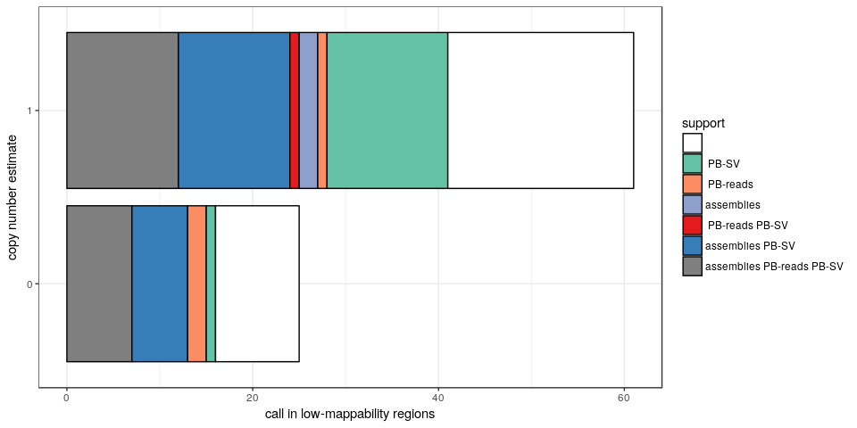
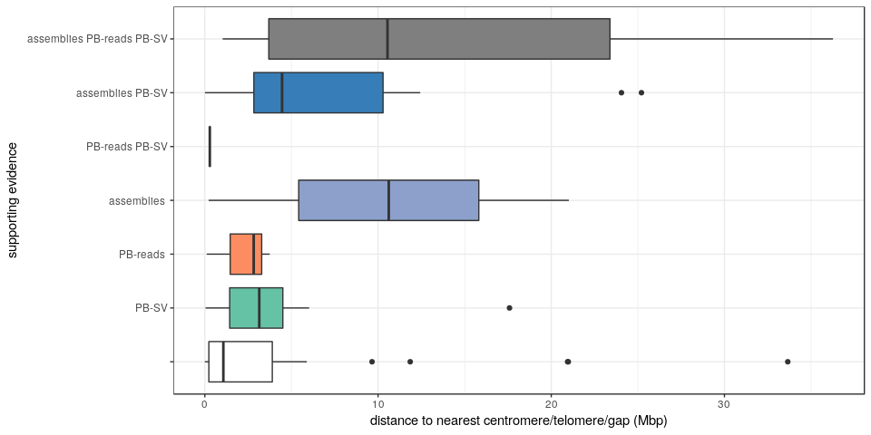

NA12878 comparison with public assemblies, SV calls and PacBio reads
====================================================================

Load packages, functions and data
---------------------------------

``` r
library(dplyr)
library(magrittr)
library(ggplot2)
library(GenomicRanges)
library(knitr)
library(RColorBrewer)

winsor <- function(x, u = Inf, l = -Inf) {
    if (any(x > u)) 
        x[x > u] = u
    if (any(x < l)) 
        x[x < l] = l
    x
}

## Low-mappability calls in the population
load("../data/twins-coverage-tracks-5kbp.RData")
lowmap.gr = ns.df %>% filter(cov.class == "low") %>% makeGRangesFromDataFrame(keep.extra.columns = TRUE)

## NA12878 CNVs
load("../data/cnvs-1KGP-5kbp-PopSV.RData")
popsv.df = res.df %>% filter(grepl("NA12878", sample))
```

Annotate calls in low-mappability regions
-----------------------------------------

``` r
olProp <- function(qgr, sgr) {
    sgr = reduce(sgr)
    ol = findOverlaps(qgr, sgr) %>% as.data.frame %>% mutate(qw = width(qgr)[queryHits], 
        qsw = width(pintersect(qgr[queryHits], sgr[subjectHits]))) %>% group_by(queryHits) %>% 
        summarize(prop = sum(qsw/qw))
    res = rep(0, length(qgr))
    res[ol$queryHits] = ol$prop
    res
}
popsv.df$lowmap.prop = popsv.df %>% makeGRangesFromDataFrame %>% olProp(lowmap.gr)
```

Deletions in low-mappability regions
------------------------------------

``` r
del.lm = popsv.df %>% filter(fc < 1, lowmap.prop > 0.9)
del.lm %>% arrange(chr, start) %>% select(chr, start, end, fc, mean.cov) %>% 
    mutate(fc = round(fc, 3), mean.cov = round(mean.cov, 3)) %>% write.table(file = "../data/PopSV-deletion-lowmap-NA12878.tsv", 
    quote = FALSE, sep = "\t", row.names = FALSE)
```

Public assemblies
-----------------

For each variant to validate, we retrieve the two flanking sequences in the reference genome and blast them against the following public assemblies of NA12878:

-   [Pendleton et al. (Nature Methods 2015)](http://www.nature.com/nmeth/journal/v12/n8/full/nmeth.3454.html) used short-reads, Bio-nano and PacBio reads.
-   [Mostovoy et al. (Nature Methods 2016)](http://www.nature.com/nmeth/journal/v13/n7/full/nmeth.3865.html) used short-reads, Bio-nano and 10X Genomics reads.

The commands used were:

``` sh
## Short-reads + MP + 10X reads + BioNano
wget http://kwoklab.ucsf.edu/resources/nmeth_201604_NA12878_hybrid_assembly.fasta.gz
gunzip nmeth_201604_NA12878_hybrid_assembly.fasta.gz
samtools faidx nmeth_201604_NA12878_hybrid_assembly.fasta

## Short reads + PacBio + BioNano
wget ftp://ftp.ncbi.nlm.nih.gov/genomes/all/GCA/001/013/985/GCA_001013985.1_ASM101398v1/GCA_001013985.1_ASM101398v1_genomic.fna.gz
gunzip GCA_001013985.1_ASM101398v1_genomic.fna.gz
samtools faidx GCA_001013985.1_ASM101398v1_genomic.fna

## Blast
makeblastdb -in GCA_001013985.1_ASM101398v1_genomic.fna -title pbass -hash_index -out pbass -dbtype nucl
makeblastdb -in nmeth_201604_NA12878_hybrid_assembly.fasta -title tenxass -hash_index -out tenxass -dbtype nucl

python flankRefSeq.py -ref /cvmfs/soft.mugqic/CentOS6/genomes/species/Homo_sapiens.hg19/genome/Homo_sapiens.hg19.fa -bed PopSV-deletion-lowmap-NA12878.tsv -fl 50000 -o PopSV-deletion-lowmap-NA12878-flanks50kb.fasta -addchr
blastn -db pbass -query PopSV-deletion-lowmap-NA12878-flanks50kb.fasta -out PopSV-deletion-lowmap-NA12878-flanks50kb-pbass.blast.out -word_size=50 -outfmt 6 -max_target_seqs 5 -max_hsps 1
blastn -db tenxass -query PopSV-deletion-lowmap-NA12878-flanks50kb.fasta -out PopSV-deletion-lowmap-NA12878-flanks50kb-tenxass.blast.out -word_size=50 -outfmt 6 -max_target_seqs 5 -max_hsps 1
```

`flankRefSeq.py` extracts the sequences flanking each variant in the reference genome. It's located in the `src` folder.

### Analyzing Blast output

We use contigs with both flanks aligning in at least 1 Kbp.

``` r
blast = rbind(read.table("../data/PopSV-deletion-lowmap-NA12878-flanks50kb-pbass.blast.out", 
    sep = "\t", as.is = TRUE) %>% mutate(assembly = "PacBio"), read.table("../data/PopSV-deletion-lowmap-NA12878-flanks50kb-tenxass.blast.out", 
    sep = "\t", as.is = TRUE) %>% mutate(assembly = "10X"))
colnames(blast) = c("qseqid", "sseqid", "pident", "length", "mismatch", "gapopen", 
    "qstart", "qend", "sstart", "send", "evalue", "bitscore", "assembly")
blast %<>% mutate(flank = gsub(".*_.*_.*_(.*)", "\\1", qseqid), qseqid = gsub("(.*_.*_.*)_.*", 
    "\\1", qseqid), vstart = as.numeric(gsub(".*_(.*)_.*", "\\1", qseqid)), 
    vend = as.numeric(gsub(".*_.*_(.*)", "\\1", qseqid)), vsize = vend - vstart)

dd.del = blast %>% filter(flank != "total", length > 1000) %>% mutate(sstrand = sign(send - 
    sstart)) %>% group_by(qseqid, sseqid, vsize) %>% filter(n() == 2, length(unique(sstrand)) == 
    1) %>% summarize(minLength = min(length))

del.lm = read.table("../data/PopSV-deletion-lowmap-NA12878.tsv", as.is = TRUE, 
    sep = "\t", header = TRUE) %>% mutate(qseqid = paste0("chr", chr, "_", start, 
    "_", end), cn = ifelse(fc < 0.1, 0, 1))
dd.del = merge(dd.del, del.lm)
```

### MUMmer plots

For each regions we take the top 3 contigs where the flanks map the best and produce a MUMmer plot. Using this plot we can confirm the deletion or the reference sequence (or nothing).

``` r
dd.del %>% arrange(desc(minLength)) %>% group_by(qseqid) %>% do(head(., 3)) %>% 
    select(qseqid, sseqid, vsize, cn) %>% ungroup %>% mutate(qseqid = paste0(qseqid, 
    "_total")) %>% as.data.frame %>% write.table(file = "../data/PopSV-deletion-lowmap-NA12878-forMummer.tsv", 
    quote = FALSE, sep = "\t", row.names = FALSE)
```

MUMmer plots were produced with the following commands:

``` sh
python compareBlastSeq.py -ass GCA_001013985.1_ASM101398v1_genomic.fna -reg PopSV-deletion-lowmap-NA12878-flanks50kb.fasta -blast PopSV-deletion-lowmap-NA12878-flanks50kb-pbass.blast.out -outdir dotplots-deletion -blastpairs PopSV-deletion-lowmap-NA12878-forMummer.tsv
python compareBlastSeq.py -ass nmeth_201604_NA12878_hybrid_assembly.fasta -reg PopSV-deletion-lowmap-NA12878-flanks50kb.fasta -blast PopSV-deletion-lowmap-NA12878-flanks50kb-tenxass.blast.out -outdir dotplots-deletion -blastpairs PopSV-deletion-lowmap-NA12878-forMummer.tsv
```

`compareBlastSeq.py` extracts the sequence of the regions and run MUMmer. It's located in the `src` folder.

Mummerplots that support the deletion are located in the `data/dotplots-deletion` folder. Mummerplots that support the reference sequence are located in the `data/dotplots-nodeletion` folder.

``` r
mums = rbind(data.frame(file = list.files("../data/dotplots-deletion/deletion/")) %>% 
    mutate(qseqid = gsub("(.*)_total.*", "\\1", file), sseqid = gsub(".*_total-(.*).pdf", 
        "\\1", file), support = "deletion") %>% select(-file), data.frame(file = list.files("../data/dotplots-deletion/nodeletion/")) %>% 
    mutate(qseqid = gsub("(.*)_total.*", "\\1", file), sseqid = gsub(".*_total-(.*).pdf", 
        "\\1", file), support = "reference") %>% select(-file))
mums = del.lm %>% select(qseqid, cn) %>% unique %>% merge(mums, all.x = TRUE)
```

Homozygous deletions are the only ones that we are sure should be in the assembled contig. How many did we find ?

``` r
mums %>% filter(cn == 0) %>% group_by(qseqid) %>% summarize(del = sum(support == 
    "deletion", na.rm = TRUE), ref = sum(support == "reference", na.rm = TRUE)) %>% 
    group_by(del, ref) %>% summarize(region = n()) %>% kable
```

|  del|  ref|  region|
|----:|----:|-------:|
|    0|    0|      11|
|    0|    1|       1|
|    1|    0|       1|
|    2|    0|      12|

Heterozygous deletions might be missed if the reference allele was assembled. If the two alleles are present as different contigs, both deletion and reference should be observed.

``` r
mums %>% filter(cn == 1) %>% group_by(qseqid) %>% summarize(del = sum(support == 
    "deletion", na.rm = TRUE), ref = sum(support == "reference", na.rm = TRUE)) %>% 
    group_by(del, ref) %>% summarize(region = n()) %>% kable
```

|  del|  ref|  region|
|----:|----:|-------:|
|    0|    0|      18|
|    0|    1|      10|
|    0|    2|       7|
|    1|    0|       6|
|    1|    1|       3|
|    1|    2|       4|
|    2|    0|      10|
|    2|    1|       3|

The proportion of deletion confirmed among regions that could be addressed is :

``` r
mums %>% group_by(qseqid, cn) %>% summarize(del = sum(support == "deletion", 
    na.rm = TRUE), ref = sum(support == "reference", na.rm = TRUE)) %>% filter(del != 
    0 | ref != 0) %>% group_by(cn) %>% summarize(del = sum(del > 0), all = n(), 
    del.prop = del/all) %>% arrange(cn) %>% kable
```

|   cn|  del|  all|   del.prop|
|----:|----:|----:|----------:|
|    0|   13|   14|  0.9285714|
|    1|   26|   43|  0.6046512|

Other support
-------------

### SV calls from Pendleton et al.

``` r
## Public SV calls from PacBio (Pendleton et al Nature Methods 2015)
if (!file.exists("../data/NA12878.sorted.vcf.gz")) {
    download.file("ftp://ftp-trace.ncbi.nlm.nih.gov/giab/ftp/data/NA12878/NA12878_PacBio_MtSinai/NA12878.sorted.vcf.gz", 
        "../data/NA12878.sorted.vcf.gz")
}
sv = read.table("../data/NA12878.sorted.vcf.gz")
sv = sv[, c(1, 2, 5, 7, 8, 10)]
colnames(sv) = c("chr", "start", "type", "filter", "info", "gt")
sv %<>% mutate(chr = gsub("chr", "", chr), end = as.numeric(gsub(".*;END=([^;]*);.*", 
    "\\1", info)))

sv.gr = sv %>% filter(type == "<DEL>") %>% makeGRangesFromDataFrame
del.lm.gr = makeGRangesFromDataFrame(del.lm)
ol = findOverlaps(del.lm.gr, sv.gr) %>% as.data.frame %>% mutate(qsw = width(pintersect(del.lm.gr[queryHits], 
    sv.gr[subjectHits]))) %>% group_by(queryHits) %>% summarize(qsw = max(qsw))
del.lm$sv.qsw = 0
del.lm$sv.qsw[ol$queryHits] = ol$qsw

ggplot(del.lm, aes(winsor(sv.qsw/1000, 20))) + geom_histogram(binwidth = 0.5) + 
    theme_bw() + xlab("Kbp overlapped in PopSV call (winsorized at 20)") + ylab("call in low-mappability regions") + 
    geom_vline(xintercept = 1, linetype = 2)
```


Most of PopSV calls are 5 Kbp (one bin). We'll use a minimum overlap of 1 Kbp between PopSV calls and the SV from Pendleton et al.

### From the raw Pacbio reads

Finally, we also looked for support in the raw Pacbio reads. We downloaded corrected Pacbio reads and perform a local assembly/consensus of reads that might support a deletion. The best candidates are then investigated through MUMmer plots.

``` sh
wget ftp://ftp-trace.ncbi.nlm.nih.gov/giab/ftp/data/NA12878/NA12878_PacBio_MtSinai/corrected_reads_gt4kb.fasta
python createSubreads.py -pbfa corrected_reads_gt4kb.fasta | gzip > corrected_reads_gt4kb-200bpSR.fastq.gz

bwa mem -M -t 7 Homo_sapiens.GRCh37.fa corrected_reads_gt4kb-200bpSR.fastq.gz | \
    java -Djava.io.tmpdir=$TMPDIR -XX:ParallelGCThreads=1 -Dsamjdk.buffer_size=4194304 -Xmx15G -jar $PICARD_HOME/SortSam.jar \
     VALIDATION_STRINGENCY=SILENT CREATE_INDEX=true \
     TMP_DIR=$TMPDIR \
     INPUT=/dev/stdin \
     OUTPUT=corrected_reads_gt4kb-200bpSR.bam \
     SORT_ORDER=coordinate \
     MAX_RECORDS_IN_RAM=3750000

grep "^>" -b corrected_reads_gt4kb.fasta > corrected_reads_gt4kb.ids
for region in `sed 1d PopSV-deletion-lowmap-NA12878.tsv | awk '{print $1":"$2"-"$3}'`
do
    echo $region
    python pacbioValidate-mappingFilter.py -reg $region -ref Homo_sapiens.GRCh37.fa -reads corrected_reads_gt4kb.fasta -readsidx corrected_reads_gt4kb.ids -subreads corrected_reads_gt4kb-200bpSR.bam -bwaidx Homo_sapiens.GRCh37.fa -fl 30000 -outdir .
done

for file in `ls pbv-*.fa`
do
    echo $file
    python comparePacbioSeq.py -ass $file -ref Homo_sapiens.GRCh37.fa -fl 50000 -outdir dotplots-pacbio
done
```

Note: `Homo_sapiens.GRCh37.fa` is the fasta file with the reference genome.

`createSubreads.py` splits the Pacbio reads into smaller reads. `pacbioValidate-mappingFilter.py` identifies reads with partial mapping to a regions, builds a local assembly and consensus and map the sequence around potential breakpoints. `comparePacbioSeq.py` produces MUMmer plots for the most promising cases. These scripts are located in the `src` folder.

Mummerplots that support the deletion are located in the `data/dotplots-pacbio` folder.

### Support summary

We annotate PopSV calls by the support found in the previous section:

-   *PB-SV*: overlap with a SV calls from Pendleton et al.
-   *PB-reads*: deletion observed after local assembly or consensus of Pacbio reads.
-   *assemblies*: deletion observed in assembled contigs from Pendleton et al. or Mostovoy et al.

``` r
pb = data.frame(file = list.files("../data/dotplots-pacbio/")) %>% mutate(qseqid = gsub("(.*)_cons.*", 
    "\\1", file), qseqid = paste0("chr", qseqid)) %>% group_by(qseqid) %>% summarize(contig = n()) %>% 
    arrange(desc(contig))
asspub = data.frame(file = list.files("../data/dotplots-deletion/deletion/")) %>% 
    mutate(qseqid = gsub("(.*)_total.*", "\\1", file)) %>% group_by(qseqid) %>% 
    summarize(contig = n()) %>% arrange(desc(contig))
del.lm %<>% mutate(qseqid = paste(paste0("chr", chr), start, end, sep = "_"), 
    assembly = ifelse(qseqid %in% asspub$qseqid, "assemblies", ""), pacbio = ifelse(qseqid %in% 
        pb$qseqid, "PB-reads", ""), pbsv = ifelse(sv.qsw > 1000, "PB-SV", ""), 
    support = paste(assembly, pacbio, pbsv), support = gsub("  ", " ", support)) %>% 
    arrange(nchar(support)) %>% mutate(support = factor(support, levels = unique(support)))

pal = c("white", brewer.pal(8, "Set2")[1:3], brewer.pal(9, "Set1")[1:2], "grey50")
ggplot(del.lm, aes(factor(cn), fill = support)) + geom_bar(color = "black") + 
    theme_bw() + xlab("copy number estimate") + ylab("call in low-mappability regions") + 
    scale_fill_manual(name = "support", values = pal) + coord_flip()
```



``` r
del.lm %>% group_by(cn, support) %>% summarize(region = n()) %>% kable
```

|   cn| support                   |  region|
|----:|:--------------------------|-------:|
|    0|                           |       9|
|    0| PB-SV                     |       1|
|    0| PB-reads                  |       2|
|    0| assemblies PB-SV          |       6|
|    0| assemblies PB-reads PB-SV |       7|
|    1|                           |      20|
|    1| PB-SV                     |      13|
|    1| PB-reads                  |       1|
|    1| assemblies                |       2|
|    1| PB-reads PB-SV            |       1|
|    1| assemblies PB-SV          |      12|
|    1| assemblies PB-reads PB-SV |      12|

``` r
del.lm %>% group_by(cn) %>% summarize(supported = sum(support != " "), prop.supported = supported/n()) %>% 
    kable(digits = 3)
```

|   cn|  supported|  prop.supported|
|----:|----------:|---------------:|
|    0|         16|           0.640|
|    1|         41|           0.672|

### Distance to assembly gaps

``` r
load("../data/centelgap.RData")
del.lm$centelgap.d = makeGRangesFromDataFrame(del.lm) %>% distanceToNearest(centelgap) %>% 
    as.data.frame %>% .$distance

ggplot(del.lm, aes(x = support, fill = support, y = centelgap.d/1e+06)) + geom_boxplot() + 
    ylab("distance to nearest centromere/telomere/gap (Mbp)") + xlab("supporting evidence") + 
    theme_bw() + coord_flip() + scale_fill_manual(name = "support", values = pal) + 
    guides(fill = FALSE)
```



The regions with no support are close to assembly gaps.

If we focus on regions located at more than 1 Mb from an assembly gap:

``` r
del.lm %>% filter(centelgap.d > 1e+06) %>% group_by(cn) %>% summarize(supported = sum(support != 
    " "), prop.supported = supported/n()) %>% kable(digits = 3)
```

|   cn|  supported|  prop.supported|
|----:|----------:|---------------:|
|    0|         15|           0.833|
|    1|         36|           0.750|

### Insertions

We also noticed a few clear insertions in some of the regions with no support. These insertions could potentially cause a deletion-like pattern by disrupting the mapping of reads.

``` r
pb.ins = data.frame(file = list.files("../data/dotplots-pacbio-insertions/")) %>% 
    mutate(qseqid = gsub("(.*)_cons.*", "\\1", file), qseqid = paste0("chr", 
        qseqid)) %>% group_by(qseqid) %>% summarize(contig = n()) %>% arrange(desc(contig))

del.lm %>% filter(support == " ", qseqid %in% pb.ins$qseqid) %>% select(qseqid, 
    cn, support, centelgap.d) %>% kable
```

| qseqid                    |   cn| support |  centelgap.d|
|:--------------------------|----:|:--------|------------:|
| chr12\_9720001\_9725000   |    0|         |      2480124|
| chr19\_21010001\_21015000 |    1|         |       436585|

The corresponding mummerplots are located in the `data/dotplots-pacbio-insertions` folder.
