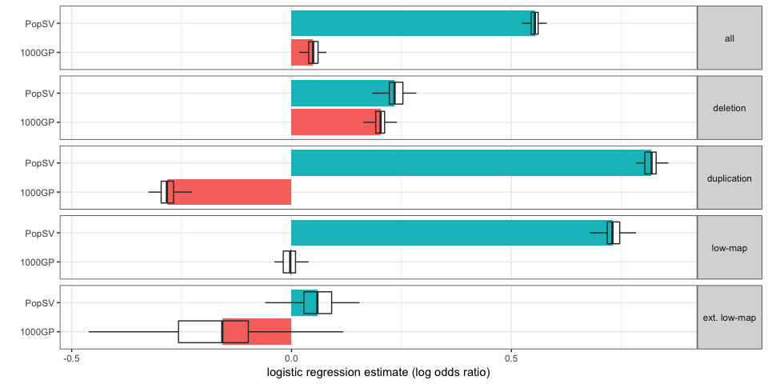
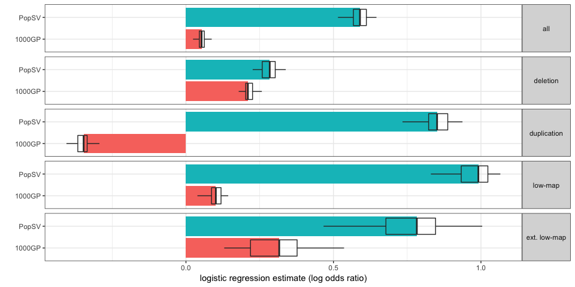
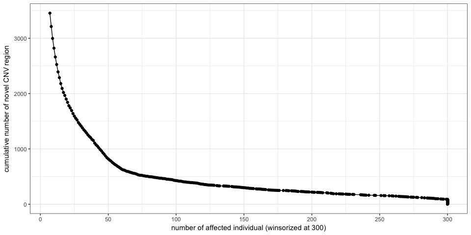
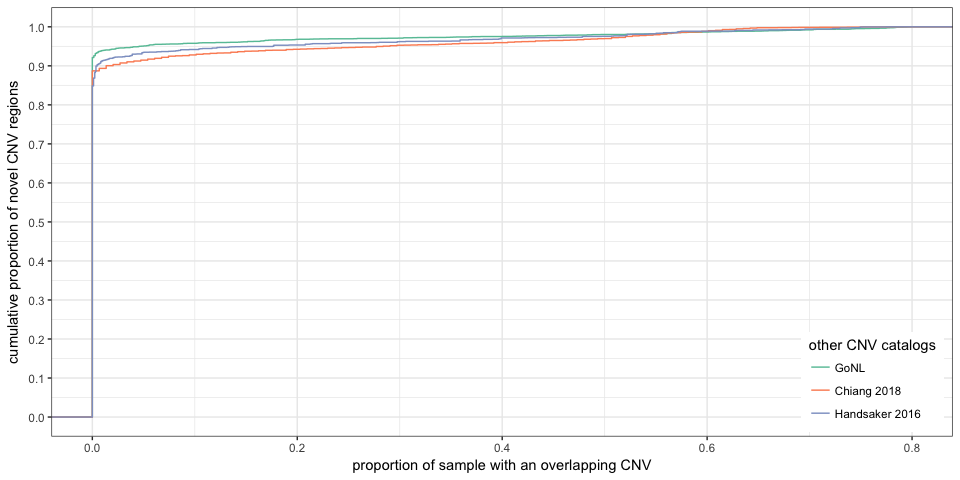

CNV catalog overview
====================

Load packages, functions and data
---------------------------------

``` r
library(dplyr)
library(magrittr)
library(ggplot2)
library(tidyr)
library(GenomicRanges)
library(knitr)
library(broom)
library(PopSV)

winsor <- function(x, u = NULL, l = NULL) {
    if (!is.null(u) & any(x > u)) 
        x[x > u] = u
    if (!is.null(l) & any(x < l)) 
        x[x < l] = l
    x
}
olProp <- function(qgr, sgr) {
    sgr = reduce(sgr)
    ol = findOverlaps(qgr, sgr) %>% as.data.frame %>% mutate(qw = width(qgr)[queryHits], 
        qsw = width(pintersect(qgr[queryHits], sgr[subjectHits]))) %>% group_by(queryHits) %>% 
        summarize(prop = sum(qsw/qw))
    res = rep(0, length(qgr))
    res[ol$queryHits] = ol$prop
    res
}
NB.CORES = 3
```

PopSV CNVs
----------

``` r
cnv.df = read.table("../data/CNV-PopSV-Twin_CageKid_GoNL-germline.tsv", as.is = TRUE, 
    header = TRUE)
cnv.df %<>% mutate(project = ifelse(grepl("gonl", sample), "GoNL", "Twins"), 
    project = ifelse(grepl("ck", sample), "CageKid", project))
```

Low-mappability calls in the population
---------------------------------------

``` r
load("../data/twins-coverage-tracks-5kbp.RData")
extlowmap.gr = ns.df %>% filter(cov.class2 == "extremely low") %>% makeGRangesFromDataFrame
lowmap.gr = ns.df %>% filter(cov.class == "low") %>% makeGRangesFromDataFrame
cnv.df$extlowmap.prop = cnv.df %>% makeGRangesFromDataFrame %>% olProp(extlowmap.gr)
cnv.df$lowmap.prop = cnv.df %>% makeGRangesFromDataFrame %>% olProp(lowmap.gr)
cnv.df %<>% mutate(extlowmap = extlowmap.prop >= 0.9, lowmap = lowmap.prop >= 
    0.9, type = ifelse(cn < 2, "DEL", "DUP"))
```

CNV catalog
-----------

``` r
compAllNumbers <- function(reg.df) {
    sizeGenFun <- function(df) {
        df %>% makeGRangesFromDataFrame %>% reduce %>% width %>% sum/1e+06
    }
    sampleSumFun <- function(df) {
        data.frame(nb = nrow(df), nb.lm = sum(df$extlowmap), mb = sizeGenFun(df), 
            nb.less3kb = sum(df$size.kb < 3))
    }
    reg.df %<>% mutate(size.kb = (end - start + 1)/1000)
    ## samp.df = reg.df %>% group_by(sample) %>% do(sampleSumFun(.))
    samp.df = reg.df %>% group_by(sample) %>% summarize(nb = n(), nb.lm = sum(extlowmap), 
        nb.less3kb = sum(size.kb < 3), mb = sum(size.kb/1000))
    data.frame(sample = length(unique(reg.df$sample)), nb.calls = nbCallCollapsed(reg.df), 
        nb.calls.samp = mean(samp.df$nb), nb.lm.samp = mean(samp.df$nb.lm), 
        mean.size.kb = mean(reg.df$size.kb), prop.less3kb = mean(reg.df$size.kb < 
            3), nb.less3kb.samp = mean(samp.df$nb.less3kb), gen.mb = sizeGenFun(reg.df), 
        gen.mb.min = min(samp.df$mb), gen.mb.samp = mean(samp.df$mb), gen.mb.max = max(samp.df$mb))
}

nbCallCollapsed <- function(reg.df, chunk.size = 50000) {
    reg.gr = makeGRangesFromDataFrame(reg.df)
    nbCallCollapsed.chunk <- function(gr, all.gr) {
        findOverlaps(gr, all.gr) %>% as.data.frame %>% mutate(qsw = width(pintersect(gr[queryHits], 
            all.gr[subjectHits])), qw = width(gr[queryHits]), sw = width(all.gr[subjectHits])) %>% 
            filter(qsw/sw > 0.5, qsw/qw > 0.5) %>% group_by(queryHits) %>% summarize(weight = 1/n()) %>% 
            .$weight %>% sum
    }
    res = tapply(1:length(reg.gr), cut(1:length(reg.gr), 1 + ceiling(length(reg.gr)/chunk.size)), 
        function(ii) nbCallCollapsed.chunk(reg.gr[ii], reg.gr))
    res %>% unlist %>% sum %>% round
}
sum.df = rbind(cnv.df %>% filter(project == "Twins") %>% compAllNumbers %>% 
    mutate(project = "Twins", type = "all"), cnv.df %>% filter(project == "Twins" & 
    type == "DEL") %>% compAllNumbers %>% mutate(project = "Twins", type = "DEL"), 
    cnv.df %>% filter(project == "Twins" & type == "DUP") %>% compAllNumbers %>% 
        mutate(project = "Twins", type = "DUP"), cnv.df %>% filter(project == 
        "CageKid") %>% compAllNumbers %>% mutate(project = "CageKid", type = "all"), 
    cnv.df %>% filter(project == "CageKid" & type == "DEL") %>% compAllNumbers %>% 
        mutate(project = "CageKid", type = "DEL"), cnv.df %>% filter(project == 
        "CageKid" & type == "DUP") %>% compAllNumbers %>% mutate(project = "CageKid", 
        type = "DUP"), cnv.df %>% filter(project == "GoNL") %>% compAllNumbers %>% 
        mutate(project = "GoNL", type = "all"), cnv.df %>% filter(project == 
        "GoNL" & type == "DEL") %>% compAllNumbers %>% mutate(project = "GoNL", 
        type = "DEL"), cnv.df %>% filter(project == "GoNL" & type == "DUP") %>% 
        compAllNumbers %>% mutate(project = "GoNL", type = "DUP"))

sum.df %>% select(project, type, everything()) %>% kable(digits = 2)
```

| project | type |  sample|  nb.calls|  nb.calls.samp|  nb.lm.samp|  mean.size.kb|  prop.less3kb|  nb.less3kb.samp|  gen.mb|  gen.mb.min|  gen.mb.samp|  gen.mb.max|
|:--------|:-----|-------:|---------:|--------------:|-----------:|-------------:|-------------:|----------------:|-------:|-----------:|------------:|-----------:|
| Twins   | all  |      45|     20222|        1637.27|      243.24|          4.21|          0.65|          1056.84|   62.22|        5.30|         6.89|        9.03|
| Twins   | DEL  |      45|     10661|         727.04|       13.20|          4.53|          0.58|           423.80|   33.97|        2.79|         3.30|        3.85|
| Twins   | DUP  |      45|     10396|         910.22|      230.04|          3.94|          0.70|           633.04|   34.20|        2.50|         3.59|        5.29|
| CageKid | all  |      95|     56256|        2132.81|      336.46|          3.58|          0.71|          1521.16|  134.77|        5.53|         7.63|       10.24|
| CageKid | DEL  |      95|     25367|         805.08|       12.74|          4.30|          0.63|           508.56|   70.65|        2.65|         3.46|        7.26|
| CageKid | DUP  |      95|     32356|        1327.73|      323.73|          3.14|          0.76|          1012.60|   76.28|        2.31|         4.17|        6.70|
| GoNL    | all  |     500|     27945|         549.52|       81.97|          8.71|          0.46|           250.24|  226.50|        3.05|         4.79|        8.16|
| GoNL    | DEL  |     500|     13818|         262.41|        1.45|          8.50|          0.42|           110.16|  106.83|        1.30|         2.23|        3.96|
| GoNL    | DUP  |     500|     15291|         287.10|       80.52|          8.91|          0.49|           140.08|  139.21|        1.45|         2.56|        5.72|

``` r
merge.sum = rbind(cnv.df %>% filter(project %in% c("Twins", "CageKid")) %>% 
    compAllNumbers %>% mutate(project = "Twins & CageKid", type = "all"), cnv.df %>% 
    filter(project %in% c("Twins", "CageKid"), type == "DEL") %>% compAllNumbers %>% 
    mutate(project = "Twins & CageKid", type = "DEL"), cnv.df %>% filter(project %in% 
    c("Twins", "CageKid"), type == "DUP") %>% compAllNumbers %>% mutate(project = "Twins & CageKid", 
    type = "DUP"), cnv.df %>% compAllNumbers %>% mutate(project = "All", type = "all"), 
    cnv.df %>% filter(type == "DEL") %>% compAllNumbers %>% mutate(project = "All", 
        type = "DEL"), cnv.df %>% filter(type == "DUP") %>% compAllNumbers %>% 
        mutate(project = "All", type = "DUP"))

merge.sum %>% select(project, type, everything()) %>% kable(digits = 2)
```

| project         | type |  sample|  nb.calls|  nb.calls.samp|  nb.lm.samp|  mean.size.kb|  prop.less3kb|  nb.less3kb.samp|  gen.mb|  gen.mb.min|  gen.mb.samp|  gen.mb.max|
|:----------------|:-----|-------:|---------:|--------------:|-----------:|-------------:|-------------:|----------------:|-------:|-----------:|------------:|-----------:|
| Twins & CageKid | all  |     140|     69179|        1973.53|      306.50|          3.74|          0.70|          1371.91|  162.71|        5.30|         7.39|       10.24|
| Twins & CageKid | DEL  |     140|     33066|         780.00|       12.89|          4.37|          0.62|           481.31|   88.05|        2.65|         3.41|        7.26|
| Twins & CageKid | DUP  |     140|     38326|        1193.53|      293.61|          3.34|          0.75|           890.60|   91.69|        2.31|         3.98|        6.70|
| All             | all  |     640|     91735|         861.02|      131.09|          6.22|          0.58|           495.61|  325.66|        3.05|         5.36|       10.24|
| All             | DEL  |     640|     44110|         375.64|        3.95|          6.63|          0.51|           191.35|  165.26|        1.30|         2.49|        7.26|
| All             | DUP  |     640|     50856|         485.38|      127.14|          5.91|          0.63|           304.26|  194.42|        1.45|         2.87|        6.70|

On average in the individuals from the Twins dataset and the normals from the CageKid dataset, 7.39, 3.41, 3.98, 5.36, 2.49, 2.87 Mb of the genome is affected per sample.

1000 Genomes Project CNV catalog
--------------------------------

``` r
load("../data/tgp-CNV-noX-noCNV.RData")
tgp.comp = subset(tgp, svsize > 300 & prop < 0.8)
tgp.comp$extlowmap.prop = olProp(tgp.comp, extlowmap.gr)
tgp.comp$extlowmap = tgp.comp$extlowmap.prop >= 0.9
```

``` r
nbCallCollapsed <- function(reg.gr) {
    reg.gr %>% as.data.frame %>% select(seqnames, start, end) %>% unique %>% 
        nrow
}
sum.tgp.df = rbind(tgp.comp %>% as.data.frame %>% compAllNumbers %>% mutate(project = "1000GP", 
    type = "all"), tgp.comp %>% as.data.frame %>% filter(type == "DEL") %>% 
    compAllNumbers %>% mutate(project = "1000GP", type = "DEL"), tgp.comp %>% 
    as.data.frame %>% filter(type == "DUP") %>% compAllNumbers %>% mutate(project = "1000GP", 
    type = "DUP"))

sum.tgp.df %>% select(project, type, everything()) %>% kable(digits = 2)
```

| project | type |  sample|  nb.calls|  nb.calls.samp|  nb.lm.samp|  mean.size.kb|  prop.less3kb|  nb.less3kb.samp|  gen.mb|  gen.mb.min|  gen.mb.samp|  gen.mb.max|
|:--------|:-----|-------:|---------:|--------------:|-----------:|-------------:|-------------:|----------------:|-------:|-----------:|------------:|-----------:|
| 1000GP  | all  |    2504|     41979|        1024.44|        2.22|          6.00|          0.68|           700.52|  580.03|        3.39|         6.14|       26.30|
| 1000GP  | DEL  |    2504|     36102|         975.32|        2.21|          4.67|          0.72|           700.52|  342.97|        2.73|         4.56|       14.98|
| 1000GP  | DUP  |    2504|      8503|          48.26|        0.00|         32.54|          0.00|             0.00|  331.48|        0.28|         1.57|       11.32|

``` r
prop.gain = merge.sum$gen.mb.samp/subset(sum.tgp.df, type == "all")$gen.mb.samp - 
    1
```

On average per sample, there is 20.29% more of the genome affected in PopSV catalog (in term of CNVs larger than 300 bp).

Frequency distribution
----------------------

``` r
## Remove related samples in the Twins dataset
load("../data/twins-5kbp-files.RData")
twins = files.df %>% filter(grepl("Twin", ped)) %>% select(sample, ped)
cnv.ur = subset(cnv.df, !(sample %in% twins$sample))
nb.samp.ur = cnv.ur$sample %>% unique %>% length

## Cumulative proportion
cnv.dd = cnv.ur %>% group_by(type) %>% do(freq.range(.)) %>% mutate(prop = round(prop, 
    4)) %>% group_by(type, nb, prop) %>% summarize(kb = sum((end - start + 1)/1000))
tgp.subsamps = tgp.comp$sample %>% unique %>% sample(nb.samp.ur)
tgp.dd = tgp.comp %>% as.data.frame %>% dplyr::rename(chr = seqnames) %>% filter(sample %in% 
    tgp.subsamps) %>% group_by(type) %>% do(freq.range(.)) %>% mutate(prop = round(prop, 
    4)) %>% group_by(type, nb, prop) %>% summarize(kb = sum((end - start + 1)/1000))
cumfreq.popsv.tgp = rbind(data.frame(set = "PopSV", cnv.dd), data.frame(set = "1000GP", 
    tgp.dd)) %>% group_by(set, type) %>% arrange(desc(prop)) %>% mutate(prop.gen = kb/sum(kb), 
    cumprop = cumsum(prop.gen))

cumfreq.popsv.tgp %>% filter(!is.na(type)) %>% ggplot(aes(x = prop, y = cumprop, 
    colour = type, linetype = set)) + geom_line(alpha = 0.9, size = 2) + theme_bw() + 
    ylim(0, 1) + xlab("frequency") + ylab("cumulative proportion") + theme(legend.position = c(0.99, 
    0.99), legend.justification = c(1, 1)) + scale_colour_brewer(name = "", 
    palette = "Set1") + scale_x_log10(breaks = c(0.002, 0.005, 0.01, 0.02, 0.05, 
    0.1, 0.2, 0.5))
```


CNV catalogs from GenomeSTRiP
-----------------------------

``` r
load("../data/GenomeSTRiP-CNVcatalogs-Handsaker2016-Chiang2018.RData")

gs.hand$extlowmap.prop = olProp(gs.hand, extlowmap.gr)
gs.hand$extlowmap = gs.hand$extlowmap.prop >= 0.9

chiang.tot.samp = 148
gs.chiang.samp = lapply(1:chiang.tot.samp, function(ii) {
    var = runif(nrow(gs.chiang))
    res = gs.chiang[which(var < gs.chiang$NSAMP/chiang.tot.samp), ]
    res$sample = paste0("s", ii)
    res
})
gs.chiang.samp = do.call(rbind, gs.chiang.samp)
gs.chiang.samp = makeGRangesFromDataFrame(gs.chiang.samp, keep.extra.columns = TRUE)
gs.chiang.samp$extlowmap.prop = olProp(gs.chiang.samp, extlowmap.gr)
gs.chiang.samp$extlowmap = gs.chiang.samp$extlowmap.prop >= 0.9

sum.gs.df = rbind(gs.hand %>% as.data.frame %>% compAllNumbers %>% mutate(project = "GenomeSTRiP (Handsaker 2016)", 
    type = "all"), gs.hand %>% as.data.frame %>% filter(type == "DEL") %>% compAllNumbers %>% 
    mutate(project = "GenomeSTRiP (Handsaker 2016)", type = "DEL"), gs.hand %>% 
    as.data.frame %>% filter(type == "DUP") %>% compAllNumbers %>% mutate(project = "GenomeSTRiP (Handsaker 2016)", 
    type = "DUP"), gs.chiang.samp %>% as.data.frame %>% compAllNumbers %>% mutate(project = "GenomeSTRiP (Chiang 2018)", 
    type = "all"))

sum.gs.df %>% dplyr::select(project, type, everything()) %>% kable(digits = 2)
```

| project                      | type |  sample|  nb.calls|  nb.calls.samp|  nb.lm.samp|  mean.size.kb|  prop.less3kb|  nb.less3kb.samp|  gen.mb|  gen.mb.min|  gen.mb.samp|  gen.mb.max|
|:-----------------------------|:-----|-------:|---------:|--------------:|-----------:|-------------:|-------------:|----------------:|-------:|-----------:|------------:|-----------:|
| GenomeSTRiP (Handsaker 2016) | all  |     847|      8657|         212.03|        1.88|         27.80|          0.00|             0.00|  196.57|        3.44|         5.89|        8.46|
| GenomeSTRiP (Handsaker 2016) | DEL  |     847|      5961|         145.78|        0.56|         21.64|          0.00|             0.00|  108.03|        1.62|         3.15|        5.54|
| GenomeSTRiP (Handsaker 2016) | DUP  |     847|      3469|          66.26|        1.32|         41.35|          0.00|             0.00|  118.28|        0.85|         2.74|        5.20|
| GenomeSTRiP (Chiang 2018)    | all  |     148|      7940|         826.32|        9.20|          6.14|          0.42|           349.11|   59.43|        4.18|         5.07|        9.09|

CNV catalog from GoNL
---------------------

``` r
load("../data/GoNL-CNVs.RData")
gonl.cnv = subset(gonl.cnv, width(gonl.cnv) > 300 & prop < 0.8)

gonl.tot.samp = 750
gonl.samp = lapply(1:gonl.tot.samp, function(ii) {
    var = runif(length(gonl.cnv))
    res = gonl.cnv[which(var < gonl.cnv$prop)]
    res$sample = paste0("s", ii)
    res
})
gonl.samp = do.call(c, gonl.samp)
gonl.samp$extlowmap.prop = olProp(gonl.samp, extlowmap.gr)
gonl.samp$extlowmap = gonl.samp$extlowmap.prop >= 0.9

sum.gonl.df = rbind(gonl.samp %>% as.data.frame %>% compAllNumbers %>% mutate(project = "GoNL", 
    type = "all"), gonl.samp %>% as.data.frame %>% filter(type == "DEL") %>% 
    compAllNumbers %>% mutate(project = "GoNL", type = "DEL"), gonl.samp %>% 
    as.data.frame %>% filter(type == "DUP") %>% compAllNumbers %>% mutate(project = "GoNL", 
    type = "DUP"))

sum.gonl.df %>% dplyr::select(project, type, everything()) %>% kable(digits = 2)
```

| project | type |  sample|  nb.calls|  nb.calls.samp|  nb.lm.samp|  mean.size.kb|  prop.less3kb|  nb.less3kb.samp|  gen.mb|  gen.mb.min|  gen.mb.samp|  gen.mb.max|
|:--------|:-----|-------:|---------:|--------------:|-----------:|-------------:|-------------:|----------------:|-------:|-----------:|------------:|-----------:|
| GoNL    | all  |     750|      9545|        1047.37|        0.61|          2.93|          0.81|           843.85|   63.56|        2.35|         3.07|        4.37|
| GoNL    | DEL  |     750|      8974|        1012.84|        0.61|          2.36|          0.82|           832.91|   34.45|        1.91|         2.39|        2.90|
| GoNL    | DUP  |     750|       515|          20.99|        0.00|         29.43|          0.15|             3.19|   29.23|        0.11|         0.62|        1.79|

Comparison with long-read-based catalogs
----------------------------------------

### Chaisson et al

``` r
load("../data/sv.chaisson.RData")
sv.chaisson = subset(sv.chaisson, chr %in% 1:22)
sv.chaisson.gr = makeGRangesFromDataFrame(sv.chaisson)

## Collapsed CNVs
reduceDF <- function(df) {
    df %>% makeGRangesFromDataFrame %>% reduce %>% as.data.frame
}
tgp.col = tgp %>% as.data.frame %>% dplyr::select(-sample, -CN) %>% unique %>% 
    filter(type %in% c("DEL", "DUP")) %>% group_by(type) %>% do(reduceDF(.)) %>% 
    makeGRangesFromDataFrame(keep.extra.columns = TRUE)
popsv.col = cnv.df %>% dplyr::select(chr, start, end, type) %>% unique %>% group_by(type) %>% 
    do(reduceDF(.)) %>% makeGRangesFromDataFrame(keep.extra.columns = TRUE)
## Merge catalogs
catalogs = list(PopSV = popsv.col, `1000GP` = tgp.col)

## Create subsets for each catalog: all calls, loss only, gain only, low-map,
## extremely low map.
cat.l = lapply(catalogs, function(cat.gr) {
    list(all = cat.gr, loss = cat.gr[which(cat.gr$type == "DEL")], gain = cat.gr[which(cat.gr$type == 
        "DUP")], lm = cat.gr[overlapsAny(cat.gr, lowmap.gr)], elm = cat.gr[overlapsAny(cat.gr, 
        extlowmap.gr)])
})

## Enrichment analysis
testOlLR <- function(gr, feat.grl, cat.list) {
    ## This function draws control regions that fit the distribution of 'gr',
    ## controlling for 'feat.grl' features, and compute the overlap with each
    ## catalog/subset in 'cat.list'.
    cont.gr = draw.controls(gr, feat.grl, nb.cores = 1)
    var.ol = lapply(names(cat.list), function(cat.name) {
        res = lapply(names(cat.list[[cat.name]]), function(set.name) {
            # mean(overlapsAny(gr, cont.gr)))
            df = rbind(data.frame(region = TRUE, ol = overlapsAny(cat.l[[cat.name]][[set.name]], 
                gr)), data.frame(region = FALSE, ol = overlapsAny(cat.l[[cat.name]][[set.name]], 
                cont.gr)))
            glm(ol ~ region, data = df, family = binomial()) %>% tidy %>% mutate(catalog = cat.name, 
                set = set.name)
        })
        do.call(rbind, res)
    })
    do.call(rbind, var.ol)
}

load("../data/centelgap.RData")
chaisson.enr.df = lapply(1:50, function(ii) {
    testOlLR(sv.chaisson.gr, list(ctg = centelgap), cat.l)
})
chaisson.enr.df = do.call(rbind, chaisson.enr.df)
chaisson.enr.df %<>% mutate(region = factor(set, levels = c("all", "loss", "gain", 
    "lm", "elm"), label = c("all", "deletion", "duplication", "low-map", "ext. low-map")))
```

``` r
chaisson.enr.s = chaisson.enr.df %>% filter(term == "regionTRUE") %>% group_by(region, 
    catalog) %>% summarize(estimate = median(estimate))
chaisson.enr.df %>% filter(term == "regionTRUE") %>% ggplot(aes(x = catalog, 
    y = estimate)) + geom_bar(aes(fill = catalog), data = chaisson.enr.s, stat = "identity", 
    position = "dodge") + geom_boxplot(alpha = 0, position = position_dodge(0.9)) + 
    theme_bw() + coord_flip() + ylab("logistic regression estimate (log odds ratio)") + 
    xlab("") + theme(strip.text.y = element_text(angle = 0)) + facet_grid(region ~ 
    .) + guides(fill = FALSE)
```



``` r
chaisson.enr.s %>% kable
```

| region       | catalog |    estimate|
|:-------------|:--------|-----------:|
| all          | 1000GP  |   0.0490543|
| all          | PopSV   |   0.5533390|
| deletion     | 1000GP  |   0.2025550|
| deletion     | PopSV   |   0.2341978|
| duplication  | 1000GP  |  -0.2834591|
| duplication  | PopSV   |   0.8186714|
| low-map      | 1000GP  |  -0.0030204|
| low-map      | PopSV   |   0.7298795|
| ext. low-map | 1000GP  |  -0.1574896|
| ext. low-map | PopSV   |   0.0587449|

### Pendleton et al

``` r
if (!file.exists("../data/NA12878.sorted.vcf.gz")) {
    download.file("ftp://ftp-trace.ncbi.nlm.nih.gov/giab/ftp/data/NA12878/NA12878_PacBio_MtSinai/NA12878.sorted.vcf.gz", 
        "../data/NA12878.sorted.vcf.gz")
}
pend.sv = read.table("../data/NA12878.sorted.vcf.gz")
pend.sv = pend.sv[, c(1, 2, 5, 7, 8, 10)]
colnames(pend.sv) = c("chr", "start", "type", "filter", "info", "gt")
pend.sv %<>% mutate(chr = gsub("chr", "", chr), end = as.numeric(gsub(".*;END=([^;]*);.*", 
    "\\1", info))) %>% makeGRangesFromDataFrame

pend.enr.df = lapply(1:50, function(ii) {
    testOlLR(pend.sv, list(ctg = centelgap), cat.l)
})
pend.enr.df = do.call(rbind, pend.enr.df)
pend.enr.df %<>% mutate(region = factor(set, levels = c("all", "loss", "gain", 
    "lm", "elm"), label = c("all", "deletion", "duplication", "low-map", "ext. low-map")))
```

``` r
pend.enr.s = pend.enr.df %>% filter(term == "regionTRUE") %>% group_by(region, 
    catalog) %>% summarize(estimate = median(estimate))
pend.enr.df %>% filter(term == "regionTRUE") %>% ggplot(aes(x = catalog, y = estimate)) + 
    geom_bar(aes(fill = catalog), data = pend.enr.s, stat = "identity", position = "dodge") + 
    geom_boxplot(alpha = 0, position = position_dodge(0.9)) + theme_bw() + coord_flip() + 
    ylab("logistic regression estimate (log odds ratio)") + xlab("") + theme(strip.text.y = element_text(angle = 0)) + 
    facet_grid(region ~ .) + guides(fill = FALSE)
```



``` r
pend.enr.s %>% kable
```

| region       | catalog |    estimate|
|:-------------|:--------|-----------:|
| all          | 1000GP  |   0.0529943|
| all          | PopSV   |   0.5898988|
| deletion     | 1000GP  |   0.2099124|
| deletion     | PopSV   |   0.2840336|
| duplication  | 1000GP  |  -0.3469243|
| duplication  | PopSV   |   0.8513615|
| low-map      | 1000GP  |   0.1013096|
| low-map      | PopSV   |   0.9912317|
| ext. low-map | 1000GP  |   0.3161972|
| ext. low-map | PopSV   |   0.7826792|

Novel CNV regions
-----------------

``` r
cnv.ur %<>% freq.range(annotate.only = TRUE)
cnv.ur$tgp.ol = cnv.ur %>% makeGRangesFromDataFrame %>% overlapsAny(reduce(tgp))
novel.reg = cnv.ur %>% filter(prop > 0.01, !tgp.ol) %>% makeGRangesFromDataFrame %>% 
    reduce
ol = cnv.ur %>% makeGRangesFromDataFrame %>% findOverlaps(novel.reg) %>% as.data.frame %>% 
    mutate(sample = cnv.ur$sample[queryHits]) %>% group_by(subjectHits) %>% 
    summarize(nb = length(unique(sample)))
novel.reg$count = 0
novel.reg$count[ol$subjectHits] = ol$nb
novel.reg$freq = novel.reg$count/length(unique(cnv.ur$sample))
novel.reg %>% as.data.frame %>% select(-width, -strand) %>% write.table(file = "../data/CNV-novel-notTGP.tsv", 
    row.names = FALSE, quote = FALSE, sep = "\t")
```

Cumulative number of novel region versus the frequency in the PopSV catalog.

``` r
novel.reg.cs = novel.reg %>% as.data.frame %>% arrange(count) %>% mutate(region = rev(1:n())) %>% 
    group_by(count, freq) %>% summarize(region = max(region))
novel.reg.cs %>% head %>% kable
```

|  count|       freq|  region|
|------:|----------:|-------:|
|      7|  0.0112903|    3455|
|      8|  0.0129032|    3213|
|      9|  0.0145161|    2998|
|     10|  0.0161290|    2821|
|     11|  0.0177419|    2662|
|     12|  0.0193548|    2526|

``` r
ggplot(novel.reg.cs, aes(x = winsor(count, 300), y = region)) + geom_line() + 
    theme_bw() + ylab("cumulative number of novel CNV region") + xlab("number of affected individual (winsorized at 300)") + 
    scale_x_continuous(breaks = seq(0, 300, 50)) + geom_point()
```



Proportion overlapping low-mappability regions.

``` r
novel.reg$extlowmap = olProp(novel.reg, extlowmap.gr) >= 0.9
novel.reg$lowmap = olProp(novel.reg, lowmap.gr) >= 0.9
novel.reg %>% as.data.frame %>% summarize(region = n(), lowmap = mean(lowmap), 
    extlowmap = mean(extlowmap)) %>% kable(digits = 3)
```

|  region|  lowmap|  extlowmap|
|-------:|-------:|----------:|
|    3455|   0.813|      0.184|

### Novel regions in other CNV catalogs

``` r
ol = findOverlaps(novel.reg, gs.hand) %>% as.data.frame %>% mutate(prop.samp = gs.hand$prop.samp[subjectHits]) %>% 
    group_by(queryHits) %>% summarize(prop.samp = max(prop.samp))
novel.reg$max.freq.gs.hand = 0
novel.reg$max.freq.gs.hand[ol$queryHits] = ol$prop.samp

ol = findOverlaps(novel.reg, gs.chiang.samp) %>% as.data.frame %>% mutate(NSAMP = gs.chiang.samp$NSAMP[subjectHits]) %>% 
    group_by(queryHits) %>% summarize(NSAMP = max(NSAMP))
novel.reg$max.freq.gs.chiang = 0
novel.reg$max.freq.gs.chiang[ol$queryHits] = ol$NSAMP/chiang.tot.samp

ol = findOverlaps(novel.reg, gonl.cnv) %>% as.data.frame %>% mutate(prop.samp = gonl.cnv$prop[subjectHits]) %>% 
    group_by(queryHits) %>% summarize(prop.samp = max(prop.samp))
novel.reg$max.freq.gonl = 0
novel.reg$max.freq.gonl[ol$queryHits] = ol$prop.samp

novel.reg %>% as.data.frame %>% select(seqnames, start, end, max.freq.gs.chiang, 
    max.freq.gs.hand, max.freq.gonl) %>% gather(catalog, prop.samp, 4:6) %>% 
    ggplot(aes(prop.samp, colour = catalog)) + stat_ecdf() + theme_bw() + xlab("proportion of sample with an overlapping CNV") + 
    ylab("cumulative proportion of novel CNV regions") + scale_colour_brewer(name = "other CNV catalogs", 
    labels = c("GoNL", "Chiang 2018", "Handsaker 2016"), palette = "Set2") + 
    theme(legend.position = c(0.99, 0.01), legend.justification = c(1, 0)) + 
    scale_y_continuous(breaks = seq(0, 1, 0.1))
```



``` r
novel.reg %>% as.data.frame %>% summarize(in.gs.handsaker = mean(max.freq.gs.hand > 
    0), in.gs.chiang = mean(max.freq.gs.chiang > 0), in.gonl = mean(max.freq.gonl > 
    0)) %>% kable
```

|  in.gs.handsaker|  in.gs.chiang|    in.gonl|
|----------------:|-------------:|----------:|
|        0.1513748|     0.1128799|  0.0787265|

Frequency distribution in novel or low-mappability regions
----------------------------------------------------------

``` r
freq.df = rbind(cnv.ur %>% freq.range %>% mutate(cnv = "all"), cnv.ur %>% filter(extlowmap) %>% 
    freq.range %>% mutate(cnv = "ext. low-mappability"), cnv.ur %>% filter(lowmap) %>% 
    freq.range %>% mutate(cnv = "low-mappability"), cnv.ur %>% filter(!tgp.ol) %>% 
    freq.range %>% mutate(cnv = "novel"))

freq.s = freq.df %>% mutate(cnv = factor(cnv, levels = c("all", "novel", "low-mappability", 
    "ext. low-mappability")), prop = round(prop, 4)) %>% group_by(cnv, prop) %>% 
    summarize(kb = sum((end - start + 1)/1000)) %>% arrange(desc(prop)) %>% 
    mutate(prop.gen = kb/sum(kb), cumprop = cumsum(prop.gen))

ggplot(freq.s, aes(x = prop, y = cumprop, colour = cnv)) + geom_line(alpha = 0.9, 
    size = 2) + theme_bw() + ylim(0, 1) + xlab("frequency") + ylab("cumulative proportion") + 
    theme(legend.position = c(0.99, 0.99), legend.justification = c(1, 1)) + 
    scale_colour_brewer(name = "", palette = "Set1") + scale_x_log10(breaks = c(0.002, 
    0.005, 0.01, 0.02, 0.05, 0.1, 0.2, 0.5))
```


