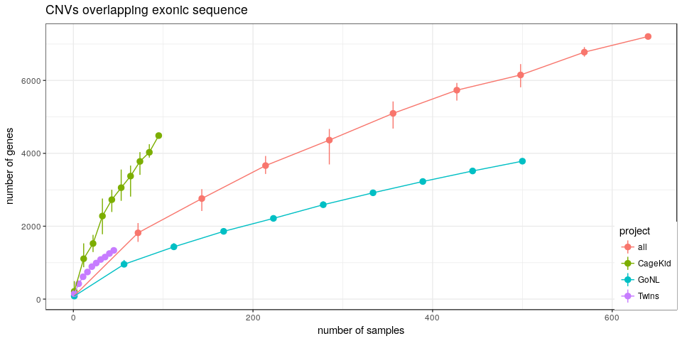

Low-mappability CNVs and functional elements
============================================

Load packages and functions
---------------------------

``` r
library(dplyr)
library(magrittr)
library(ggplot2)
library(tidyr)
library(GenomicRanges)
library(knitr)

olProp <- function(qgr, sgr) {
    sgr = reduce(sgr)
    ol = findOverlaps(qgr, sgr) %>% as.data.frame %>% mutate(qw = width(qgr)[queryHits], 
        qsw = width(pintersect(qgr[queryHits], sgr[subjectHits]))) %>% group_by(queryHits) %>% 
        summarize(prop = sum(qsw/qw))
    res = rep(0, length(qgr))
    res[ol$queryHits] = ol$prop
    res
}
NB.CORES = 3
```

CNV catalog
-----------

``` r
cnv.df = read.table("../data/CNV-PopSV-Twin_CageKid_GoNL-germline.tsv", as.is = TRUE, 
    header = TRUE)
cnv.df %<>% mutate(project = ifelse(grepl("gonl", sample), "GoNL", "Twins"), 
    project = ifelse(grepl("ck", sample), "CageKid", project), type = ifelse(cn < 
        2, "DEL", "DUP"))
```

Low-mappability calls in the population
---------------------------------------

``` r
load("../data/twins-coverage-tracks-5kbp.RData")
extlowmap.gr = ns.df %>% filter(cov.class2 == "extremely low") %>% makeGRangesFromDataFrame
lowmap.gr = ns.df %>% filter(cov.class == "low") %>% makeGRangesFromDataFrame
cnv.df$extlowmap.prop = cnv.df %>% makeGRangesFromDataFrame %>% olProp(extlowmap.gr)
cnv.df$lowmap.prop = cnv.df %>% makeGRangesFromDataFrame %>% olProp(lowmap.gr)
cnv.df %<>% mutate(extlowmap = extlowmap.prop >= 0.9, lowmap = lowmap.prop >= 
    0.9)
```

Gene, exons and promoters
-------------------------

Promoter region as 10 Kbp upstream and downstream of the TSS.

``` r
load("../data/gencodev19-proteincoding-genes-exons.RData")
proms = promoters(genes, 10000, 10000)
exon.proms = c(exons, proms)
gene.proms = c(genes, proms)
```

Repeats
-------

``` r
load("../data/simprep.RData")
cnv.df$str.prop = olProp(makeGRangesFromDataFrame(cnv.df), simprep)
load("../data/rm.RData")
cnv.df$sat.prop = olProp(makeGRangesFromDataFrame(cnv.df), subset(rm, repClass == 
    "Satellite"))
cnv.df$te.prop = olProp(makeGRangesFromDataFrame(cnv.df), subset(rm, repClass %in% 
    c("LINE", "SINE", "DNA", "Other", "LTR")))
```

Novel CNV regions
-----------------

``` r
novel.reg = read.table("../data/CNV-novel-notTGP.tsv", as.is = TRUE, header = TRUE) %>% 
    makeGRangesFromDataFrame
cnv.df$novel = cnv.df %>% makeGRangesFromDataFrame %>% overlapsAny(novel.reg, 
    type = "within")
```

Table
-----

### All CNVs

``` r
nbGenes <- function(df, feat.gr) {
    length(unique(feat.gr$gene_name[which(overlapsAny(feat.gr, makeGRangesFromDataFrame(df)))]))
}
nbCallCollapsed <- function(reg.df, chunk.size = 50000) {
    reg.gr = makeGRangesFromDataFrame(reg.df)
    nbCallCollapsed.chunk <- function(gr, all.gr) {
        findOverlaps(gr, all.gr) %>% as.data.frame %>% mutate(qsw = width(pintersect(gr[queryHits], 
            all.gr[subjectHits])), qw = width(gr[queryHits]), sw = width(all.gr[subjectHits])) %>% 
            filter(qsw/sw > 0.5, qsw/qw > 0.5) %>% group_by(queryHits) %>% summarize(weight = 1/n()) %>% 
            .$weight %>% sum
    }
    res = tapply(1:length(reg.gr), cut(1:length(reg.gr), 1 + ceiling(length(reg.gr)/chunk.size)), 
        function(ii) nbCallCollapsed.chunk(reg.gr[ii], reg.gr))
    res %>% unlist %>% sum %>% round
}
countGenes <- function(df, exons, exon.proms, gene.proms) {
    data.frame(nb.cnvs = nbCallCollapsed(df), nb.exons = nbGenes(df, exons), 
        nb.exprom = nbGenes(df, exon.proms), nb.geneprom = nbGenes(df, gene.proms))
}

rep.cnv = rbind(cnv.df %>% mutate(set = "All CNVs"), cnv.df %>% filter(lowmap.prop > 
    0.9) %>% mutate(set = "CNV-Low coverage"), cnv.df %>% filter(extlowmap.prop > 
    0.9) %>% mutate(set = "CNV-Extremely low coverage"), cnv.df %>% filter(str.prop > 
    0.9) %>% mutate(set = "CNV-STR"), cnv.df %>% filter(sat.prop > 0.9) %>% 
    mutate(set = "CNV-Satellite"), cnv.df %>% filter(te.prop > 0.9) %>% mutate(set = "CNV-TE"), 
    cnv.df %>% filter(sat.prop > 0.9 | te.prop > 0.9 | sat.prop > 0.9) %>% mutate(set = "CNV-STR/Sat/TE"))

table.df = rep.cnv %>% group_by(set) %>% do(countGenes(., exons, exon.proms, 
    gene.proms))
table.df %>% kable
```

| set                        |  nb.cnvs|  nb.exons|  nb.exprom|  nb.geneprom|
|:---------------------------|--------:|---------:|----------:|------------:|
| All CNVs                   |    91735|      7206|      11341|        13259|
| CNV-Extremely low coverage |     9348|       304|        401|          442|
| CNV-Low coverage           |    32707|       848|       1491|         2648|
| CNV-Satellite              |     1822|         2|         21|           33|
| CNV-STR                    |     4285|        45|        286|          748|
| CNV-STR/Sat/TE             |    22313|       166|       1760|         4014|
| CNV-TE                     |    20491|       164|       1747|         3998|

### All CNVs in OMIM disease genes

``` r
load("../data/omim-genes.RData")
table.omim = rep.cnv %>% group_by(set) %>% do(countGenes(., subset(exons, gene_name %in% 
    omim$hgnc_symbol), subset(exon.proms, gene_name %in% omim$hgnc_symbol), 
    subset(gene.proms, gene_name %in% omim$hgnc_symbol)))
table.omim %>% kable
```

| set                        |  nb.cnvs|  nb.exons|  nb.exprom|  nb.geneprom|
|:---------------------------|--------:|---------:|----------:|------------:|
| All CNVs                   |    91735|      1307|       1955|         2306|
| CNV-Extremely low coverage |     9348|        11|         14|           26|
| CNV-Low coverage           |    32707|        98|        167|          387|
| CNV-Satellite              |     1822|         0|          0|            0|
| CNV-STR                    |     4285|         5|         40|          131|
| CNV-STR/Sat/TE             |    22313|        29|        241|          701|
| CNV-TE                     |    20491|        29|        241|          701|

### Novel CNVs

``` r
rep.cnv.novel = rbind(cnv.df %>% filter(novel) %>% mutate(set = "All CNVs"), 
    cnv.df %>% filter(novel, lowmap.prop > 0.9) %>% mutate(set = "CNV-Low coverage"), 
    cnv.df %>% filter(novel, extlowmap.prop > 0.9) %>% mutate(set = "CNV-Extremely low coverage"), 
    cnv.df %>% filter(novel, str.prop > 0.9) %>% mutate(set = "CNV-STR"), cnv.df %>% 
        filter(novel, sat.prop > 0.9) %>% mutate(set = "CNV-Satellite"), cnv.df %>% 
        filter(novel, te.prop > 0.9) %>% mutate(set = "CNV-TE"), cnv.df %>% 
        filter(novel, sat.prop > 0.9 | te.prop > 0.9 | sat.prop > 0.9) %>% mutate(set = "CNV-STR/Sat/TE"))

table.novel = rep.cnv.novel %>% group_by(set) %>% do(countGenes(., exons, exon.proms, 
    gene.proms))
table.novel %>% kable
```

| set                        |  nb.cnvs|  nb.exons|  nb.exprom|  nb.geneprom|
|:---------------------------|--------:|---------:|----------:|------------:|
| All CNVs                   |    17046|       418|        680|         1102|
| CNV-Extremely low coverage |     6591|       189|        263|          285|
| CNV-Low coverage           |    15263|       347|        560|          894|
| CNV-Satellite              |      890|         1|          4|            5|
| CNV-STR                    |     1806|        14|         81|          230|
| CNV-STR/Sat/TE             |     4786|        18|        193|          505|
| CNV-TE                     |     3896|        17|        192|          504|

### Novel CNVs in OMIM disease genes

``` r
table.novel.omim = rep.cnv.novel %>% group_by(set) %>% do(countGenes(., subset(exons, 
    gene_name %in% omim$hgnc_symbol), subset(exon.proms, gene_name %in% omim$hgnc_symbol), 
    subset(gene.proms, gene_name %in% omim$hgnc_symbol)))
table.novel.omim %>% kable
```

| set                        |  nb.cnvs|  nb.exons|  nb.exprom|  nb.geneprom|
|:---------------------------|--------:|---------:|----------:|------------:|
| All CNVs                   |    17046|        39|         60|          141|
| CNV-Extremely low coverage |     6591|         5|          6|            8|
| CNV-Low coverage           |    15263|        29|         48|          116|
| CNV-Satellite              |      890|         0|          0|            0|
| CNV-STR                    |     1806|         0|          9|           42|
| CNV-STR/Sat/TE             |     4786|         1|         12|           69|
| CNV-TE                     |     3896|         1|         12|           69|

Saturation curves
-----------------

``` r
saturationCurve <- function(df, feat.gr, nb.subsamp = 10) {
    samples = unique(df$sample)
    samp.bks = seq(1, length(samples), length.out = 10)
    samp.l = mclapply(samp.bks, function(nbsamp) {
        data.frame(nbsamp = nbsamp, nbgenes = replicate(nb.subsamp, nbGenes(subset(df, 
            sample %in% sample(samples, nbsamp)), feat.gr)))
    }, mc.cores = NB.CORES)
    samp.df = do.call(rbind, samp.l)
    samp.df %>% group_by(nbsamp) %>% summarize(gene.min = min(nbgenes), gene.med = mean(nbgenes), 
        gene.max = max(nbgenes))
}

cnv.all = rbind(cnv.df, cnv.df %>% mutate(project = "all"))
sc.exons = cnv.all %>% group_by(project) %>% do(saturationCurve(., exons))
sc.exproms = cnv.all %>% group_by(project) %>% do(saturationCurve(., exon.proms))
sc.geneproms = cnv.all %>% group_by(project) %>% do(saturationCurve(., gene.proms))

ggplot(sc.exons, aes(x = nbsamp, y = gene.med, colour = project)) + geom_pointrange(aes(ymin = gene.min, 
    ymax = gene.max)) + geom_line() + theme_bw() + xlab("number of samples") + 
    ylab("number of genes") + ggtitle("CNVs overlapping exonic sequence") + 
    theme(legend.position = c(1, 0), legend.justification = c(1, 0))
```



``` r
ggplot(sc.exproms, aes(x = nbsamp, y = gene.med, colour = project)) + geom_pointrange(aes(ymin = gene.min, 
    ymax = gene.max)) + geom_line() + theme_bw() + xlab("number of samples") + 
    ylab("number of genes") + ggtitle("CNVs overlapping promoter or exon sequence") + 
    theme(legend.position = c(1, 0), legend.justification = c(1, 0))
```


``` r
ggplot(sc.geneproms, aes(x = nbsamp, y = gene.med, colour = project)) + geom_pointrange(aes(ymin = gene.min, 
    ymax = gene.max)) + geom_line() + theme_bw() + xlab("number of samples") + 
    ylab("number of genes") + ggtitle("CNVs overlapping promoter or gene sequence") + 
    theme(legend.position = c(1, 0), legend.justification = c(1, 0))
```


