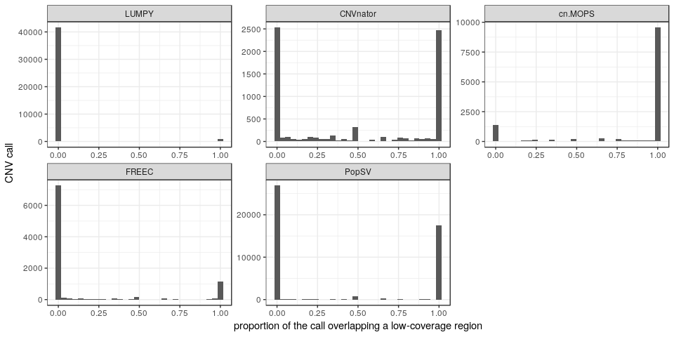
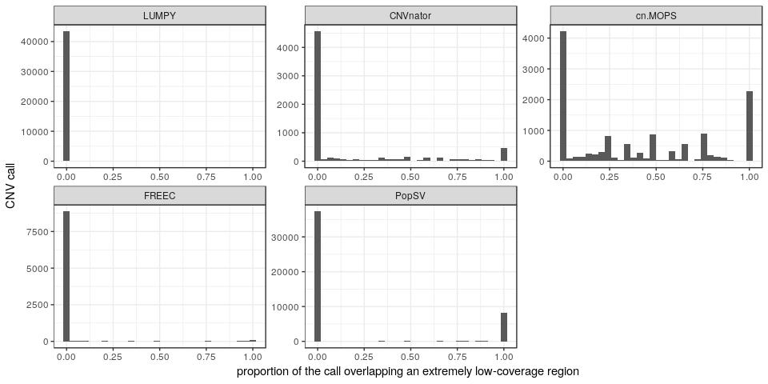
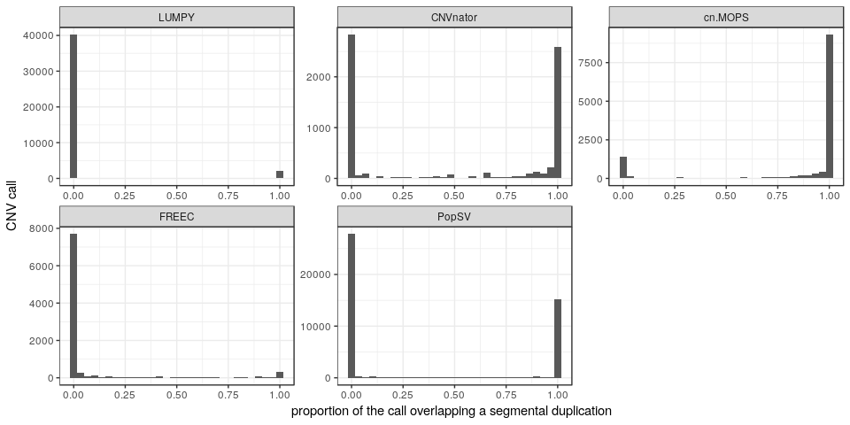
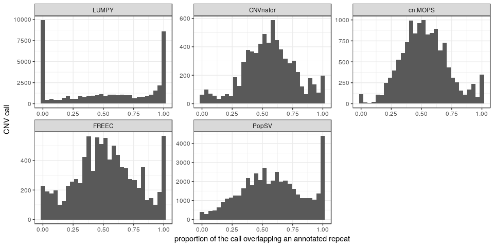
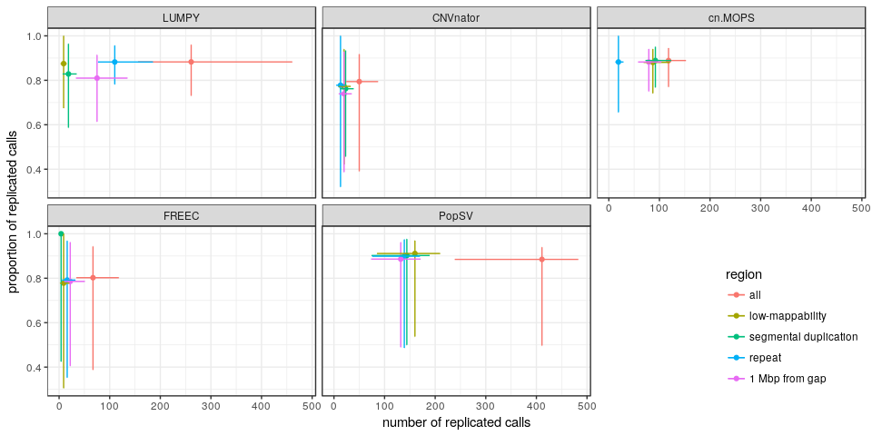
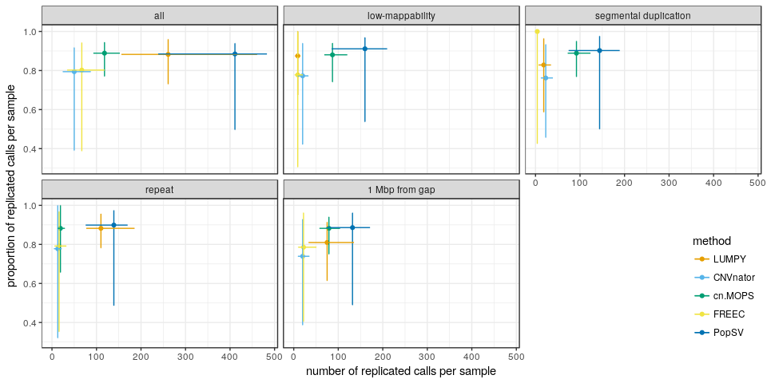
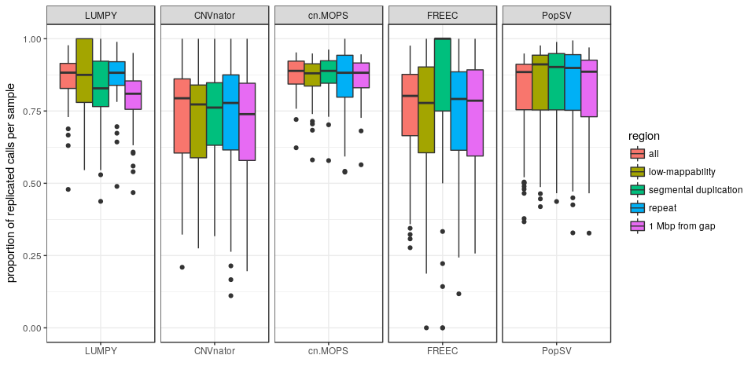
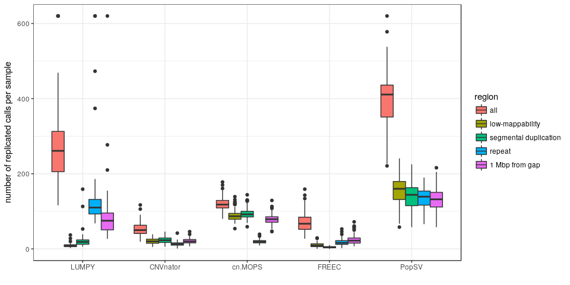

Methods benchmark using the CageKid dataset
===========================================

The [CageKid consortium](https://www.cng.fr/cagekid/) provides WGS for normal/tumor pairs of clear-cell renal carcinoma. Here we use the germline calls to evaluate the performance of the different CNV detection methods. For the vast majority of CNVs, we expect a germline variant to be present in the tumor.

Load packages, functions and data
---------------------------------

``` r
library(dplyr)
library(magrittr)
library(ggplot2)
library(PopSV)
library(GenomicRanges)
library(ggdendro)
library(fpc)
library(knitr)

winsor <- function(x, u = 3) {
    u = median(x, na.rm = TRUE) * u
    if (any(x > u)) 
        x[x > u] = u
    x
}
```

Normal-tumor pair information
-----------------------------

``` r
load("../data/cagekid-files.RData")
normals = subset(files.df, status == "normal")$sample
inds = subset(files.df, sample %in% normals)$individual
tumors = subset(files.df, individual %in% inds & status == "tumor")$sample
```

CNVs from PopSV, FREEC, CNVnator, cn.MOPS, LUMPY
------------------------------------------------

``` r
load("../data/cnvs-PopSV-cagekid-5kbp-FDR001.RData")
res.df$method = "PopSV"
res.df %<>% filter(sample %in% normals)
load("../data/cnvs-otherMethods-cagekid-5kbp.RData")
com.cols = intersect(colnames(res.df), colnames(others.df))
cnv.df = rbind(res.df[, com.cols], subset(others.df, sample %in% normals & set == 
    "stringent")[, com.cols])

## Palette and method order
cbPalette <- c("#E69F00", "#56B4E9", "#009E73", "#F0E442", "#0072B2", "#D55E00", 
    "#CC79A7")
methods.f = c("LUMPY", "CNVnator", "cn.MOPS", "FREEC", "PopSV")
cnv.df$method = factor(as.character(cnv.df$method), levels = methods.f)
```

Frequency, coverage and repeat annotation
-----------------------------------------

Here I directly annotate and remove calls that overlaps 50% or more of the samples (in each method separately). Computing the exact frequency would take too much time here because of the very large number of LUMPY calls and the large sample size. Computing directly the common regions (CNV in &gt;50% of the sample)) and filtering the calls with this track is more optimized and what we want to do eventually.

``` r
freq50 <- function(df) {
    com50 = df %>% group_by(chr) %>% do(freq.range(.)) %>% filter(prop >= 0.5) %>% 
        makeGRangesFromDataFrame %>% reduce
    df$prop50 = df %>% makeGRangesFromDataFrame %>% overlapsAny(com50)
    df
}
cnv.df %<>% group_by(method) %>% do(freq50(.))
cnv.df %>% group_by(method) %>% summarize(prop.prop50 = mean(prop50)) %>% kable(digits = 3)
```

| method   |  prop.prop50|
|:---------|------------:|
| LUMPY    |        0.913|
| CNVnator |        0.838|
| cn.MOPS  |        0.343|
| FREEC    |        0.703|
| PopSV    |        0.231|

``` r
cnv.df %<>% filter(!prop50)
```

``` r
load("../data/rm.RData")
load("../data/centelgap.RData")
load("../data/segdup.RData")
load("../data/cagekid-coverage-tracks-5kbp.RData")
lowmap.gr = ns.df %>% filter(cov.class == "low") %>% makeGRangesFromDataFrame %>% 
    reduce
extlowmap.gr = ns.df %>% filter(cov.class2 == "extremely low") %>% makeGRangesFromDataFrame %>% 
    reduce

olProp <- function(qgr, sgr) {
    sgr = reduce(sgr)
    ol = findOverlaps(qgr, sgr) %>% as.data.frame %>% mutate(qw = width(qgr)[queryHits], 
        qsw = width(pintersect(qgr[queryHits], sgr[subjectHits]))) %>% group_by(queryHits) %>% 
        summarize(prop = sum(qsw/qw))
    res = rep(0, length(qgr))
    res[ol$queryHits] = ol$prop
    res
}

cnv.gr = makeGRangesFromDataFrame(cnv.df)
cnv.df$lowmap.prop = olProp(cnv.gr, lowmap.gr)
cnv.df$extlowmap.prop = olProp(cnv.gr, extlowmap.gr)
cnv.df$rep.prop = olProp(cnv.gr, rm)
cnv.df$segdup.prop = olProp(cnv.gr, segdup)
cnv.df$centelgap.d = distanceToNearest(cnv.gr, centelgap) %>% as.data.frame %>% 
    .$distance

ggplot(cnv.df, aes(x = lowmap.prop)) + geom_histogram() + theme_bw() + facet_wrap(~method, 
    scales = "free") + ylab("CNV call") + xlab("proportion of the call overlapping a low-coverage region")
```



``` r
ggplot(cnv.df, aes(x = extlowmap.prop)) + geom_histogram() + theme_bw() + facet_wrap(~method, 
    scales = "free") + ylab("CNV call") + xlab("proportion of the call overlapping an extremely low-coverage region")
```



``` r
ggplot(cnv.df, aes(x = segdup.prop)) + geom_histogram() + theme_bw() + facet_wrap(~method, 
    scales = "free") + ylab("CNV call") + xlab("proportion of the call overlapping a segmental duplication")
```



``` r
ggplot(cnv.df, aes(x = rep.prop)) + geom_histogram() + theme_bw() + facet_wrap(~method, 
    scales = "free") + ylab("CNV call") + xlab("proportion of the call overlapping an annotated repeat")
```



Replication in the paired tumor
-------------------------------

``` r
load("../data/cnvs-PopSV-cagekid-5kbp-FDR05.RData")
cnv.l = subset(res.df, sample %in% tumors)
rm(res.df)
cnv.l = data.frame(method = "PopSV", set = "loose", cnv.l[, c("sample", "chr", 
    "start", "end")])
cnv.l = rbind(cnv.l, subset(others.df, sample %in% tumors & set == "loose")[, 
    c("method", "set", "sample", "chr", "start", "end")])
rm(others.df)
cnv.s = merge(cnv.df, files.df)
cnv.l = merge(cnv.l, files.df)

concordance.nt <- function(cnv.df, cnv.2.df) {
    cnv.df$conc = overlapsAny(makeGRangesFromDataFrame(cnv.df), makeGRangesFromDataFrame(cnv.2.df))
    cnv.df
}

cnv.s = cnv.s %>% group_by(method) %>% do({
    subset(., individual %in% unique(subset(cnv.l, method == .$method[1])$individual))
})
cnv.s = cnv.s %>% group_by(method, individual) %>% do(concordance.nt(., subset(cnv.l, 
    method == .$method[1] & individual == .$individual[1]))) %>% ungroup
```

``` r
conc.nt = rbind(data.frame(region = "all", cnv.s), data.frame(region = "low-mappability", 
    cnv.s %>% filter(lowmap.prop > 0.9)), data.frame(region = "segmental duplication", 
    cnv.s %>% filter(segdup.prop > 0.9)), data.frame(region = "repeat", cnv.s %>% 
    filter(rep.prop > 0.7)), data.frame(region = "1 Mbp from gap", cnv.s %>% 
    filter(centelgap.d < 1e+06)))

conc.nt = conc.nt %>% group_by(sample, method, region) %>% summarize(nb.c = sum(conc), 
    prop.c = mean(conc)) %>% ungroup %>% mutate(method = factor(as.character(method), 
    levels = methods.f))
conc.nt.q = conc.nt %>% group_by(region, method) %>% summarize(nb.med = median(nb.c), 
    nb.q3 = quantile(nb.c, 0.95), nb.q1 = quantile(nb.c, 0.05), prop.med = median(prop.c), 
    prop.q3 = quantile(prop.c, 0.95), prop.q1 = quantile(prop.c, 0.05))

ggplot(conc.nt.q, aes(x = nb.med, y = prop.med, colour = region)) + geom_point() + 
    theme_bw() + geom_errorbar(aes(ymin = prop.q1, ymax = prop.q3)) + geom_errorbarh(aes(xmin = nb.q1, 
    xmax = nb.q3)) + facet_wrap(~method) + xlab("number of replicated calls") + 
    ylab("proportion of replicated calls") + theme(legend.position = c(1, 0), 
    legend.justification = c(1, 0))
```



``` r
ggplot(conc.nt.q, aes(x = nb.med, y = prop.med, colour = method)) + geom_point() + 
    theme_bw() + geom_errorbar(aes(ymin = prop.q1, ymax = prop.q3)) + geom_errorbarh(aes(xmin = nb.q1, 
    xmax = nb.q3)) + facet_wrap(~region) + xlab("number of replicated calls per sample") + 
    ylab("proportion of replicated calls per sample") + theme(legend.position = c(1, 
    0), legend.justification = c(1, 0)) + scale_colour_manual(values = cbPalette)
```



``` r
ggplot(conc.nt, aes(x = method, y = prop.c)) + geom_boxplot(aes(fill = region)) + 
    theme_bw() + xlab("") + ylab("proportion of replicated calls per sample") + 
    ylim(0, 1) + facet_grid(. ~ method, scales = "free")
```



``` r
ggplot(conc.nt, aes(x = method, y = winsor(nb.c, 10))) + geom_boxplot(aes(fill = region)) + 
    theme_bw() + xlab("") + ylab("number of replicated calls per sample")
```



``` r
conc.nt.m = conc.nt %>% group_by(method, region) %>% summarize(nb.c = median(nb.c), 
    prop.c = median(prop.c))
conc.nt.m %>% arrange(desc(method)) %>% kable(digits = 3)
```

| method   | region                |   nb.c|  prop.c|
|:---------|:----------------------|------:|-------:|
| PopSV    | all                   |  411.0|   0.885|
| PopSV    | low-mappability       |  160.0|   0.911|
| PopSV    | segmental duplication |  144.0|   0.902|
| PopSV    | repeat                |  139.0|   0.899|
| PopSV    | 1 Mbp from gap        |  132.0|   0.886|
| FREEC    | all                   |   67.0|   0.802|
| FREEC    | low-mappability       |    9.0|   0.778|
| FREEC    | segmental duplication |    4.0|   1.000|
| FREEC    | repeat                |   16.0|   0.792|
| FREEC    | 1 Mbp from gap        |   22.0|   0.786|
| cn.MOPS  | all                   |  118.0|   0.889|
| cn.MOPS  | low-mappability       |   87.0|   0.880|
| cn.MOPS  | segmental duplication |   92.0|   0.889|
| cn.MOPS  | repeat                |   19.0|   0.882|
| cn.MOPS  | 1 Mbp from gap        |   79.0|   0.882|
| CNVnator | all                   |   50.0|   0.794|
| CNVnator | low-mappability       |   20.0|   0.773|
| CNVnator | segmental duplication |   23.0|   0.762|
| CNVnator | repeat                |   13.0|   0.778|
| CNVnator | 1 Mbp from gap        |   20.0|   0.739|
| LUMPY    | all                   |  261.0|   0.883|
| LUMPY    | low-mappability       |    9.0|   0.875|
| LUMPY    | segmental duplication |   18.5|   0.828|
| LUMPY    | repeat                |  110.0|   0.882|
| LUMPY    | 1 Mbp from gap        |   75.0|   0.810|

``` r
conc.nt.m %>% filter(method == "PopSV") %>% merge(conc.nt.m, by = c("region"), 
    suffixes = c(".popsv", ".other")) %>% mutate(popsv.fc = nb.c.popsv/nb.c.other) %>% 
    filter(method.other != "PopSV") %>% select(region, method.other, popsv.fc) %>% 
    arrange(region) %>% kable(digits = 3)
```

| region                | method.other |  popsv.fc|
|:----------------------|:-------------|---------:|
| all                   | LUMPY        |     1.575|
| all                   | CNVnator     |     8.220|
| all                   | cn.MOPS      |     3.483|
| all                   | FREEC        |     6.134|
| low-mappability       | LUMPY        |    17.778|
| low-mappability       | CNVnator     |     8.000|
| low-mappability       | cn.MOPS      |     1.839|
| low-mappability       | FREEC        |    17.778|
| segmental duplication | LUMPY        |     7.784|
| segmental duplication | CNVnator     |     6.261|
| segmental duplication | cn.MOPS      |     1.565|
| segmental duplication | FREEC        |    36.000|
| repeat                | LUMPY        |     1.264|
| repeat                | CNVnator     |    10.692|
| repeat                | cn.MOPS      |     7.316|
| repeat                | FREEC        |     8.688|
| 1 Mbp from gap        | LUMPY        |     1.760|
| 1 Mbp from gap        | CNVnator     |     6.600|
| 1 Mbp from gap        | cn.MOPS      |     1.671|
| 1 Mbp from gap        | FREEC        |     6.000|
