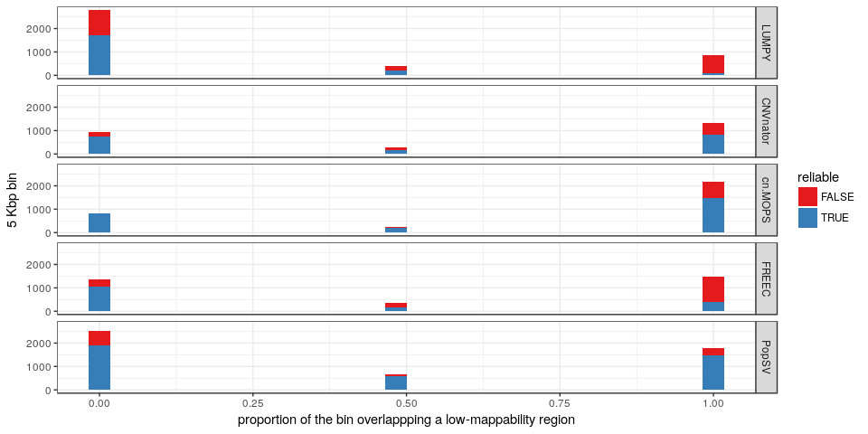
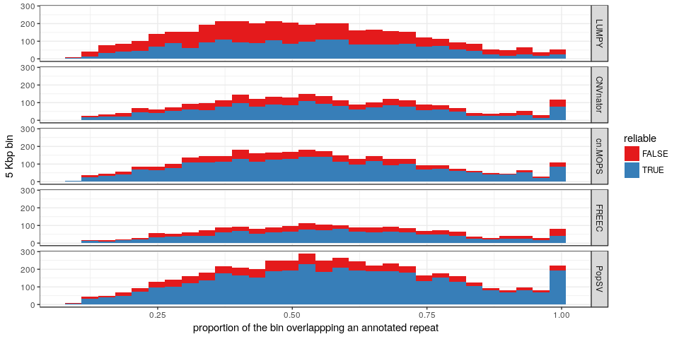
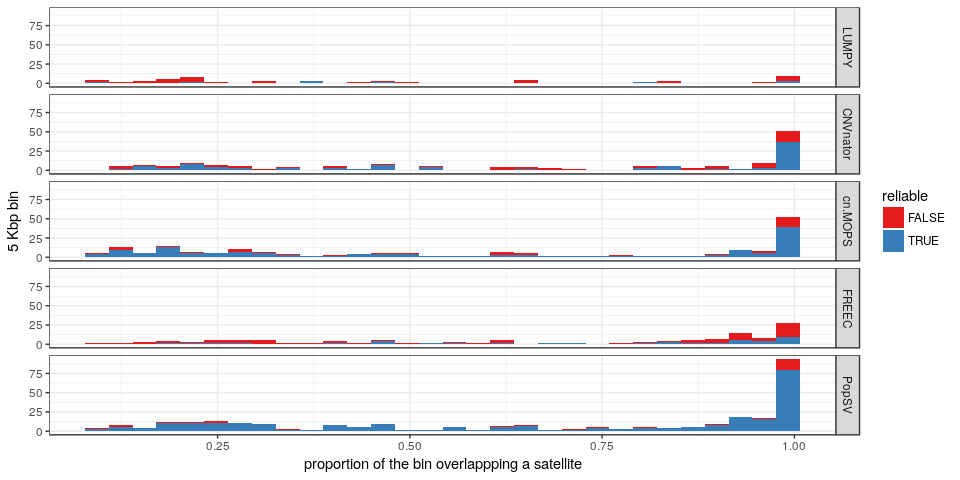
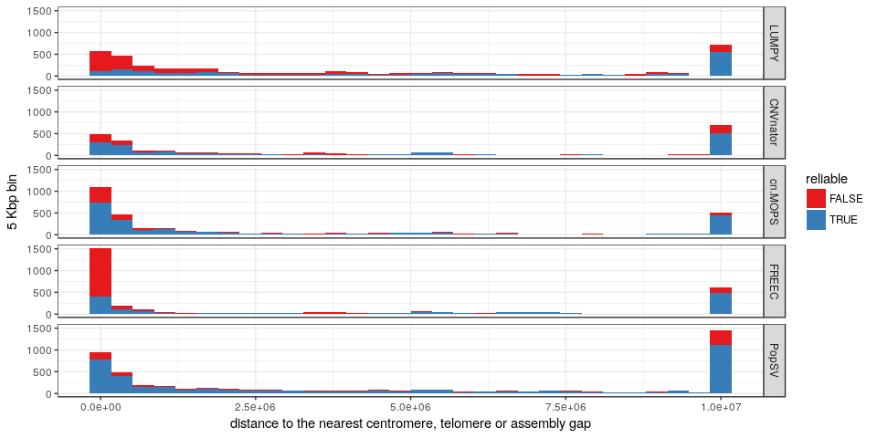

Methods benchmark using the Twin dataset - Reliability
======================================================

Load packages, functions and data
---------------------------------

``` r
library(dplyr)
library(magrittr)
library(ggplot2)
library(PopSV)
library(GenomicRanges)
library(knitr)
library(tidyr)
library(ggrepel)

winsor <- function(x, u = 1) {
    if (any(x > u)) 
        x[x > u] = u
    x
}
```

Pedigree information
--------------------

``` r
load("../data/twins-5kbp-files.RData")
files.df %<>% select(sample, family, ped)
files.df$samp.short = paste(files.df$family, files.df$ped, sep = "-")
files.df$samp.short[which(is.na(files.df$family))] = paste0("other", 1:sum(is.na(files.df$family)))
files.df$ped2 = files.df$ped %>% gsub("Twin1", "Twin", .) %>% gsub("Twin2", 
    "Twin", .)
rownames(files.df) = files.df$sample
```

CNVs from PopSV, FREEC, CNVnator, cn.MOPS, LUMPY
------------------------------------------------

``` r
load("../data/cnvs-PopSV-twin-5kbp-FDR001.RData")
res.df$method = "PopSV"
load("../data/cnvs-otherMethods-twin-5kbp.RData")
com.cols = intersect(colnames(res.df), colnames(others.df))
cnv.df = rbind(res.df[, com.cols], subset(others.df, set == "stringent")[, com.cols])

## Palette and method order
cbPalette <- c("#E69F00", "#56B4E9", "#009E73", "#F0E442", "#0072B2", "#D55E00", 
    "#CC79A7")
methods.f = c("LUMPY", "CNVnator", "cn.MOPS", "FREEC", "PopSV")
cnv.df$method = factor(as.character(cnv.df$method), levels = methods.f)
```

Frequency
---------

``` r
cnv.df %<>% group_by(method) %>% do(freq.range(., annotate.only = TRUE))
ggplot(cnv.df, aes(x = prop)) + geom_histogram() + theme_bw() + facet_wrap(~method, 
    scales = "free") + xlab("frequency") + ylab("CNV call")
```


Concordance per region
----------------------

``` r
twins = subset(files.df, grepl("Twin", ped))$sample
load("../data/cnvs-PopSV-twin-5kbp-FDR05.RData")
cnv.l = data.frame(method = "PopSV", set = "loose", res.df[, c("sample", "chr", 
    "start", "end")])
cnv.l = rbind(cnv.l, subset(others.df, set == "loose")[, c("method", "set", 
    "sample", "chr", "start", "end")])
cnv.l %<>% filter(sample %in% twins)
cnv.s = cnv.df %>% filter(prop < 0.5, sample %in% twins)
cnv.sl = rbind(cnv.s %>% select(-cn) %>% mutate(set = "stringent") %>% as.data.frame, 
    cnv.l %>% mutate(nb = NA, prop = NA, set = "loose") %>% as.data.frame)

twin.pairs.df = files.df %>% filter(ped2 == "Twin") %>% select(family, sample) %>% 
    group_by(family) %>% mutate(sample2 = rev(sample))
twin.pairs = twin.pairs.df$sample
names(twin.pairs) = twin.pairs.df$sample2

ns.df = fragment.genome.hg19(10000)

regionConcordance <- function(samples.loose, samples.stringent, sample.pairs) {
    if (any(!is.na(sample.pairs[samples.stringent]))) {
        return(mean(na.omit(sample.pairs[samples.stringent]) %in% samples.loose, 
            na.rm = TRUE))
    } else {
        return(NA)
    }
}

conc.df = findOverlaps(makeGRangesFromDataFrame(cnv.sl), makeGRangesFromDataFrame(ns.df)) %>% 
    as.data.frame %>% mutate(sample = cnv.sl$sample[queryHits], method = cnv.sl$method[queryHits], 
    set = cnv.sl$set[queryHits]) %>% group_by(method, subjectHits) %>% summarize(nb.cnv = length(unique(sample[set == 
    "stringent"])), conc = regionConcordance(sample[set == "loose"], sample[set == 
    "stringent"], twin.pairs)) %>% filter(!is.na(conc))
conc.df = cbind(as.data.frame(conc.df), ns.df[conc.df$subjectHits, ])

ggplot(conc.df, aes(x = conc, fill = cut(nb.cnv, c(0, 2, 4, 10, 20)))) + geom_histogram(colour = "black") + 
    facet_grid(method ~ .) + theme_bw() + ylab("5 Kbp region") + xlab("region average twin concordance") + 
    scale_fill_brewer(name = "frequency\n(number of twins)")
```


Other repeat-profiles
---------------------

``` r
load("../data/twins-coverage-tracks-5kbp.RData")
lowmap.gr = ns.df %>% filter(cov.class == "low") %>% makeGRangesFromDataFrame
load("../data/rm.RData")
load("../data/centelgap.RData")
load("../data/segdup.RData")

olProp <- function(qgr, sgr) {
    sgr = reduce(sgr)
    ol = findOverlaps(qgr, sgr) %>% as.data.frame %>% mutate(qw = width(qgr)[queryHits], 
        qsw = width(pintersect(qgr[queryHits], sgr[subjectHits]))) %>% group_by(queryHits) %>% 
        summarize(prop = sum(qsw/qw))
    res = rep(0, length(qgr))
    res[ol$queryHits] = ol$prop
    res
}

conc.gr = makeGRangesFromDataFrame(conc.df)
conc.df$lowmap.prop = olProp(conc.gr, lowmap.gr)
conc.df$rep.prop = olProp(conc.gr, rm)
conc.df$sat.prop = olProp(conc.gr, subset(rm, repClass == "Satellite"))
conc.df$segdup.prop = olProp(conc.gr, segdup)
conc.df$centelgap.d = distanceToNearest(conc.gr, centelgap) %>% as.data.frame %>% 
    .$distance

ggplot(conc.df, aes(x = lowmap.prop, fill = conc > 0.9)) + geom_histogram() + 
    facet_grid(method ~ .) + theme_bw() + xlab("proportion of the bin overlappping a low-mappability region") + 
    ylab("5 Kbp bin") + scale_fill_brewer(name = "reliable", palette = "Set1")
```



``` r
ggplot(subset(conc.df, rep.prop > 0.1), aes(x = rep.prop, fill = conc > 0.9)) + 
    geom_histogram() + facet_grid(method ~ .) + theme_bw() + xlab("proportion of the bin overlappping an annotated repeat") + 
    ylab("5 Kbp bin") + scale_fill_brewer(name = "reliable", palette = "Set1")
```



``` r
ggplot(subset(conc.df, sat.prop > 0.1), aes(x = sat.prop, fill = conc > 0.9)) + 
    geom_histogram() + facet_grid(method ~ .) + theme_bw() + xlab("proportion of the bin overlappping a satellite") + 
    ylab("5 Kbp bin") + scale_fill_brewer(name = "reliable", palette = "Set1")
```



``` r
ggplot(conc.df, aes(x = segdup.prop, fill = conc > 0.9)) + geom_histogram() + 
    facet_grid(method ~ .) + theme_bw() + xlab("proportion of the bin overlappping a segmental duplication") + 
    ylab("5 Kbp bin") + scale_fill_brewer(name = "reliable", palette = "Set1")
```


``` r
ggplot(conc.df, aes(x = winsor(centelgap.d, 1e+07), fill = conc > 0.9)) + geom_histogram() + 
    facet_grid(method ~ .) + theme_bw() + xlab("distance to the nearest centromere, telomere or assembly gap") + 
    ylab("5 Kbp bin") + scale_fill_brewer(name = "reliable", palette = "Set1")
```



Summary table
-------------

``` r
sum.df = rbind(conc.df %>% mutate(region = "all"), conc.df %>% filter(lowmap.prop > 
    0.9) %>% mutate(region = "low-mappability"), conc.df %>% filter(rep.prop > 
    0.7) %>% mutate(region = "repeat"), conc.df %>% filter(sat.prop > 0.9) %>% 
    mutate(region = "satellite"), conc.df %>% filter(segdup.prop > 0.9) %>% 
    mutate(region = "segmental duplication"), conc.df %>% filter(centelgap.d < 
    1e+06) %>% mutate(region = "1Mb from gap"))

sum.df %>% mutate(region = factor(region, levels = unique(region))) %>% group_by(region, 
    method) %>% summarize(reliable = paste0(sum(conc > 0.9), " (", round(mean(conc > 
    0.9), 2), ")")) %>% spread(method, reliable) %>% kable
```

| region                | LUMPY       | CNVnator    | cn.MOPS     | FREEC      | PopSV       |
|:----------------------|:------------|:------------|:------------|:-----------|:------------|
| all                   | 1988 (0.49) | 1729 (0.67) | 2492 (0.77) | 1610 (0.5) | 3946 (0.79) |
| low-mappability       | 98 (0.11)   | 827 (0.62)  | 1462 (0.67) | 379 (0.25) | 1457 (0.82) |
| repeat                | 438 (0.54)  | 443 (0.66)  | 597 (0.81)  | 344 (0.63) | 1182 (0.85) |
| satellite             | 5 (0.38)    | 44 (0.66)   | 55 (0.77)   | 21 (0.38)  | 117 (0.89)  |
| segmental duplication | 153 (0.17)  | 965 (0.67)  | 1717 (0.72) | 153 (0.46) | 1594 (0.85) |
| 1Mb from gap          | 389 (0.29)  | 628 (0.64)  | 1255 (0.72) | 602 (0.32) | 1375 (0.82) |

``` r
sum.df %>% mutate(region = factor(region, levels = unique(region))) %>% group_by(region, 
    method) %>% summarize(nb.reliable = sum(conc > 0.9), prop.reliable = mean(conc > 
    0.9)) %>% ggplot(aes(x = nb.reliable, y = prop.reliable, colour = method)) + 
    geom_point() + theme_bw() + facet_wrap(~region, scales = "free") + guides(colour = FALSE) + 
    geom_text_repel(aes(label = method)) + ylim(0, 1) + xlab("number of regions with reliable calls") + 
    ylab("proportion of regions with reliable calls") + scale_colour_manual(values = cbPalette)
```


