Methods benchmark using the Twin dataset
========================================

Load packages, functions and data
---------------------------------

``` r
library(dplyr)
library(magrittr)
library(ggplot2)
library(PopSV)
library(GenomicRanges)
library(ggdendro)
library(fpc)
library(knitr)
```

Pedigree information
--------------------

``` r
load("../data/twins-5kbp-files.RData")
files.df %<>% select(sample, family, ped)
files.df$samp.short = paste(files.df$family, files.df$ped, sep = "-")
files.df$samp.short[which(is.na(files.df$family))] = paste0("other", 1:sum(is.na(files.df$family)))
files.df$ped2 = files.df$ped %>% gsub("Twin1", "Twin", .) %>% gsub("Twin2", 
    "Twin", .)
rownames(files.df) = files.df$sample
```

CNVs from PopSV, FREEC, CNVnator, cn.MOPS, LUMPY
------------------------------------------------

``` r
load("../data/cnvs-PopSV-twin-5kbp-FDR001.RData")
res.df$method = "PopSV"
load("../data/cnvs-otherMethods-twin-5kbp.RData")
com.cols = intersect(colnames(res.df), colnames(others.df))
cnv.df = rbind(res.df[, com.cols], subset(others.df, set == "stringent")[, com.cols])

## Palette and method order
cbPalette <- c("#E69F00", "#56B4E9", "#009E73", "#F0E442", "#0072B2", "#D55E00", 
    "#CC79A7")
methods.f = c("LUMPY", "CNVnator", "cn.MOPS", "FREEC", "PopSV")
cnv.df$method = factor(as.character(cnv.df$method), levels = methods.f)
```

Frequency, coverage and repeat annotation
-----------------------------------------

``` r
cnv.df %<>% group_by(method) %>% do(freq.range(., annotate.only = TRUE))
ggplot(cnv.df, aes(x = prop)) + geom_histogram() + theme_bw() + facet_wrap(~method, 
    scales = "free") + xlab("frequency") + ylab("CNV call")
```

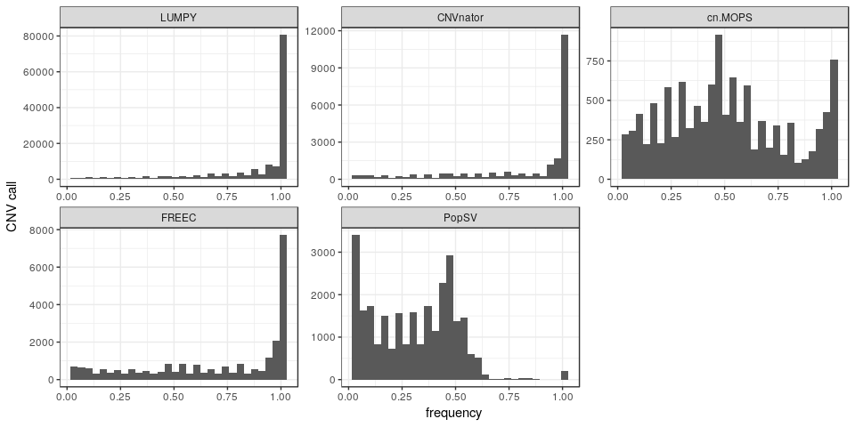

``` r
load("../data/rm.RData")
load("../data/centelgap.RData")
load("../data/segdup.RData")
load("../data/twins-coverage-tracks-5kbp.RData")
lowmap.gr = ns.df %>% filter(cov.class == "low") %>% makeGRangesFromDataFrame %>% 
    reduce
extlowmap.gr = ns.df %>% filter(cov.class2 == "extremely low") %>% makeGRangesFromDataFrame %>% 
    reduce

olProp <- function(qgr, sgr) {
    sgr = reduce(sgr)
    ol = findOverlaps(qgr, sgr) %>% as.data.frame %>% mutate(qw = width(qgr)[queryHits], 
        qsw = width(pintersect(qgr[queryHits], sgr[subjectHits]))) %>% group_by(queryHits) %>% 
        summarize(prop = sum(qsw/qw))
    res = rep(0, length(qgr))
    res[ol$queryHits] = ol$prop
    res
}

cnv.gr = makeGRangesFromDataFrame(cnv.df)
cnv.df$lowmap.prop = olProp(cnv.gr, lowmap.gr)
cnv.df$extlowmap.prop = olProp(cnv.gr, extlowmap.gr)
cnv.df$rep.prop = olProp(cnv.gr, rm)
cnv.df$sat.prop = olProp(cnv.gr, subset(rm, repClass == "Satellite"))
cnv.df$segdup.prop = olProp(cnv.gr, segdup)
cnv.df$centelgap.d = distanceToNearest(cnv.gr, centelgap) %>% as.data.frame %>% 
    .$distance

ggplot(cnv.df, aes(x = lowmap.prop)) + geom_histogram() + theme_bw() + facet_wrap(~method, 
    scales = "free") + ylab("CNV call") + xlab("proportion of the call overlapping a low-coverage region")
```

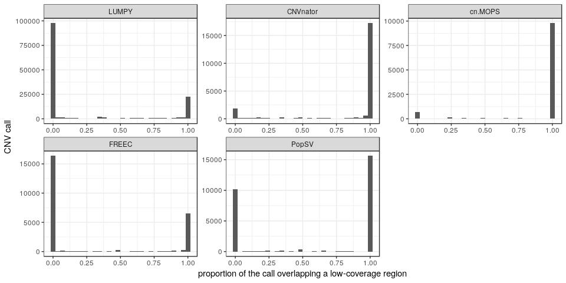

``` r
ggplot(cnv.df, aes(x = extlowmap.prop)) + geom_histogram() + theme_bw() + facet_wrap(~method, 
    scales = "free") + ylab("CNV call") + xlab("proportion of the call overlapping an extremely low-coverage region")
```

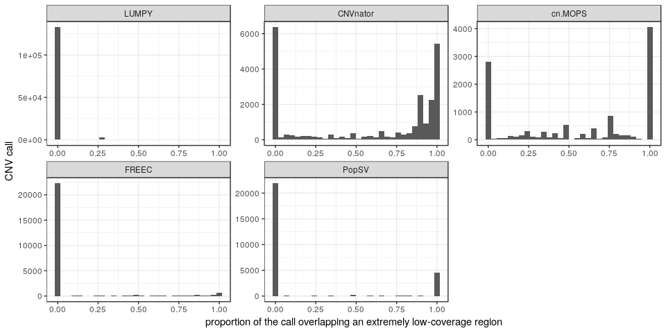

``` r
ggplot(cnv.df, aes(x = segdup.prop)) + geom_histogram() + theme_bw() + facet_wrap(~method, 
    scales = "free") + ylab("CNV call") + xlab("proportion of the call overlapping a segmental duplication")
```

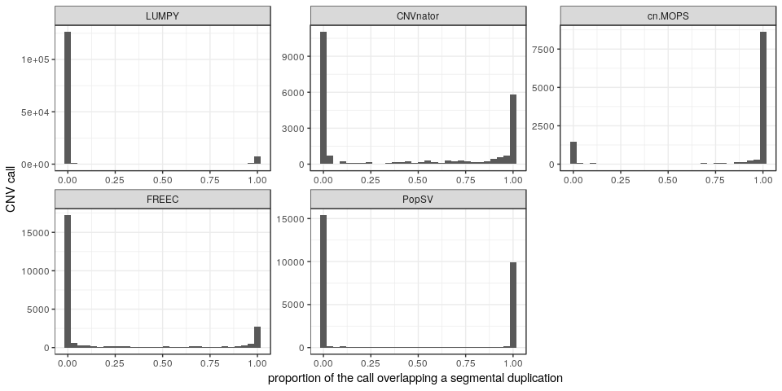

``` r
ggplot(cnv.df, aes(x = sat.prop)) + geom_histogram() + theme_bw() + facet_wrap(~method, 
    scales = "free") + ylab("CNV call") + xlab("proportion of the call overlapping a satellite")
```

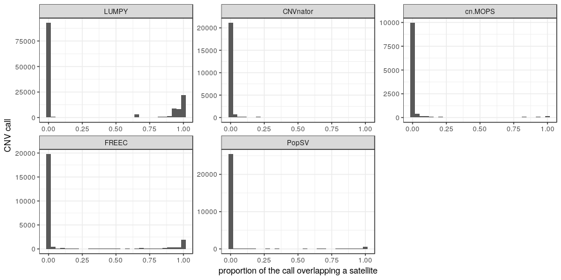

``` r
ggplot(cnv.df, aes(x = rep.prop)) + geom_histogram() + theme_bw() + facet_wrap(~method, 
    scales = "free") + ylab("CNV call") + xlab("proportion of the call overlapping an annotated repeat")
```

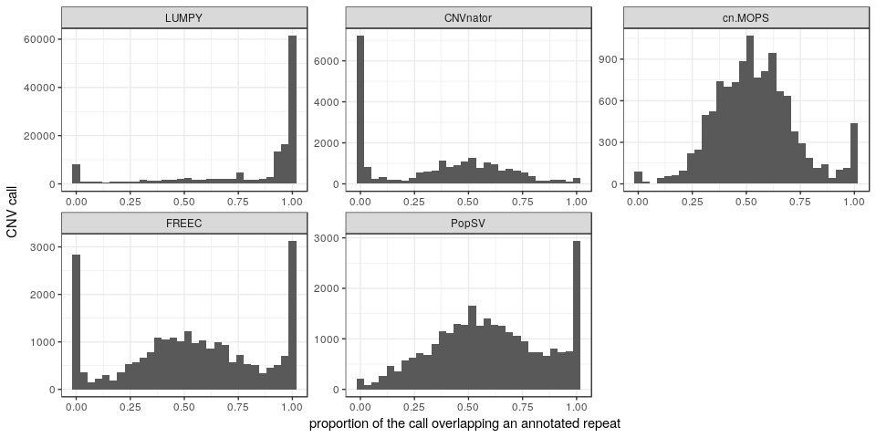

Replication in the second twin
------------------------------

``` r
twins = subset(files.df, grepl("Twin", ped))$sample
cnv.s = cnv.df %>% filter(prop < 0.5, sample %in% twins)
load("../data/cnvs-PopSV-twin-5kbp-FDR05.RData")
cnv.l = data.frame(method = "PopSV", set = "loose", res.df[, c("sample", "chr", 
    "start", "end")])
cnv.l = rbind(cnv.l, subset(others.df, set == "loose")[, c("method", "set", 
    "sample", "chr", "start", "end")])
cnv.l %<>% filter(sample %in% twins)
cnv.s = merge(cnv.s, files.df)
cnv.l = merge(cnv.l, files.df)

concordance.twin <- function(cnv.df, cnv.2.df) {
    ol.df = findOverlaps(makeGRangesFromDataFrame(cnv.df, keep.extra.columns = TRUE), 
        makeGRangesFromDataFrame(cnv.2.df, keep.extra.columns = TRUE)) %>% as.data.frame %>% 
        mutate(samp.q = cnv.df$sample[queryHits], samp.s = cnv.2.df$sample[subjectHits], 
            fam.q = cnv.df$family[queryHits], fam.s = cnv.2.df$family[subjectHits]) %>% 
        group_by(queryHits) %>% filter(any(fam.s == fam.q & samp.s != samp.q))
    cnv.df$conc = FALSE
    cnv.df$conc[ol.df$queryHits] = TRUE
    cnv.df
}

cnv.s = cnv.s %>% group_by(method) %>% do(concordance.twin(., subset(cnv.l, 
    method == .$method[1]))) %>% ungroup

conc.tw = rbind(data.frame(region = "all", cnv.s), data.frame(region = "low-mappability", 
    cnv.s %>% filter(lowmap.prop > 0.9)), data.frame(region = "repeat", cnv.s %>% 
    filter(rep.prop > 0.7)), data.frame(region = "satellite", cnv.s %>% filter(rep.prop > 
    0.9)), data.frame(region = "segmental duplication", cnv.s %>% filter(segdup.prop > 
    0.9)), data.frame(region = "1 Mbp from gap", cnv.s %>% filter(centelgap.d < 
    1e+06)))

conc.tw = conc.tw %>% group_by(sample, method, region) %>% summarize(nb.c = sum(conc), 
    prop.c = mean(conc)) %>% ungroup %>% mutate(method = factor(as.character(method), 
    levels = methods.f))
conc.tw.q = conc.tw %>% group_by(region, method) %>% summarize(nb.med = median(nb.c), 
    nb.q3 = quantile(nb.c, 0.95), nb.q1 = quantile(nb.c, 0.05), prop.med = median(prop.c), 
    prop.q3 = quantile(prop.c, 0.95), prop.q1 = quantile(prop.c, 0.05))

ggplot(conc.tw.q, aes(x = nb.med, y = prop.med, colour = region)) + geom_point() + 
    theme_bw() + geom_errorbar(aes(ymin = prop.q1, ymax = prop.q3)) + geom_errorbarh(aes(xmin = nb.q1, 
    xmax = nb.q3)) + facet_wrap(~method) + xlab("number of replicated calls") + 
    ylab("proportion of replicated calls")
```

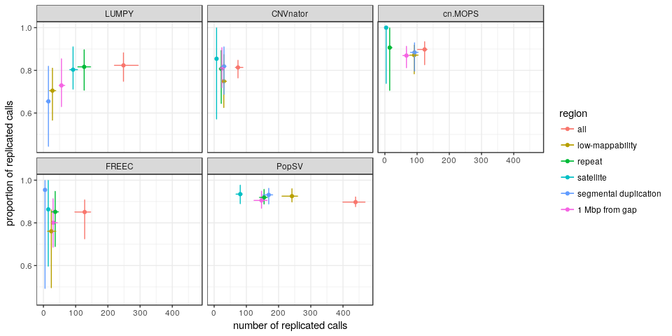

``` r
ggplot(conc.tw.q, aes(x = nb.med, y = prop.med, colour = method)) + geom_point() + 
    theme_bw() + geom_errorbar(aes(ymin = prop.q1, ymax = prop.q3)) + geom_errorbarh(aes(xmin = nb.q1, 
    xmax = nb.q3)) + facet_wrap(~region) + xlab("number of replicated calls per sample") + 
    ylab("proportion of replicated calls per sample") + scale_colour_manual(values = cbPalette)
```

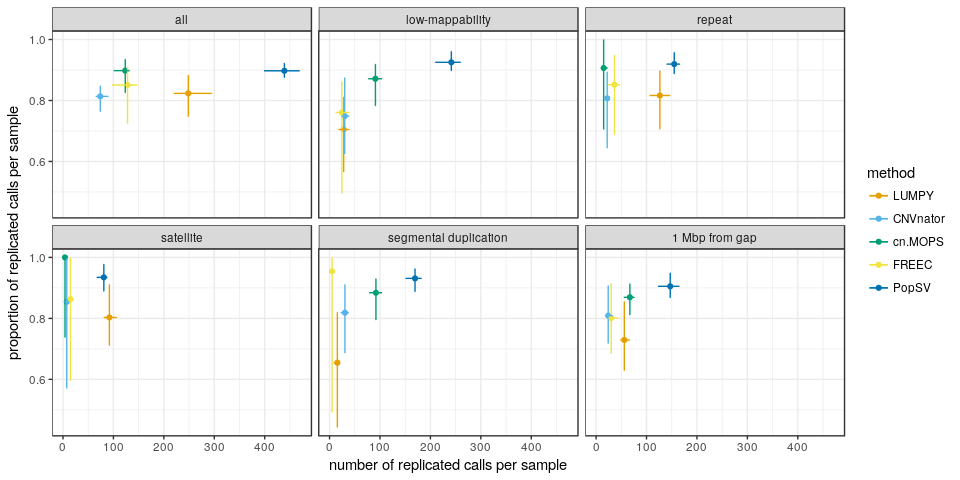

``` r
ggplot(conc.tw, aes(x = method, y = prop.c)) + geom_boxplot(aes(fill = region)) + 
    theme_bw() + xlab("") + ylab("proportion of replicated calls per sample") + 
    ylim(0, 1) + facet_grid(. ~ method, scales = "free")
```

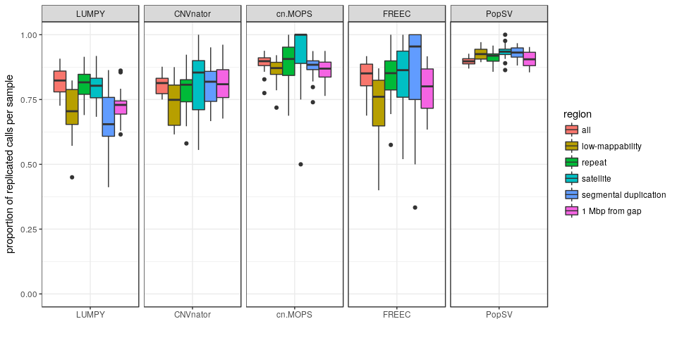

``` r
ggplot(conc.tw, aes(x = method, y = nb.c)) + geom_boxplot(aes(fill = region)) + 
    theme_bw() + xlab("") + ylab("number of replicated calls per sample") + 
    facet_grid(. ~ method, scales = "free")
```

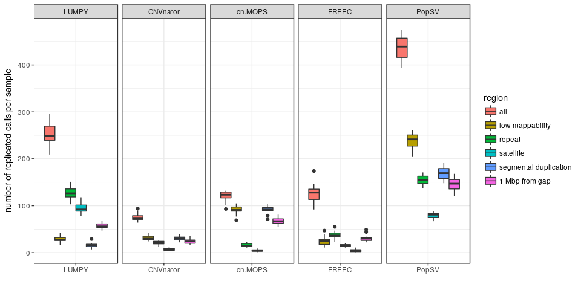

``` r
conc.tw.m = conc.tw %>% group_by(method, region) %>% summarize(nb.c = median(nb.c), 
    prop.c = median(prop.c))
conc.tw.m %>% arrange(desc(method)) %>% kable(digits = 3)
```

| method   | region                |   nb.c|  prop.c|
|:---------|:----------------------|------:|-------:|
| PopSV    | all                   |  439.0|   0.897|
| PopSV    | low-mappability       |  241.5|   0.925|
| PopSV    | repeat                |  155.0|   0.919|
| PopSV    | satellite             |   81.0|   0.935|
| PopSV    | segmental duplication |  169.5|   0.931|
| PopSV    | 1 Mbp from gap        |  147.0|   0.905|
| FREEC    | all                   |  128.0|   0.851|
| FREEC    | low-mappability       |   24.5|   0.761|
| FREEC    | repeat                |   36.5|   0.852|
| FREEC    | satellite             |   15.0|   0.863|
| FREEC    | segmental duplication |    5.0|   0.955|
| FREEC    | 1 Mbp from gap        |   30.0|   0.801|
| cn.MOPS  | all                   |  123.5|   0.898|
| cn.MOPS  | low-mappability       |   91.0|   0.871|
| cn.MOPS  | repeat                |   15.0|   0.907|
| cn.MOPS  | satellite             |    4.0|   1.000|
| cn.MOPS  | segmental duplication |   92.0|   0.884|
| cn.MOPS  | 1 Mbp from gap        |   67.0|   0.869|
| CNVnator | all                   |   74.0|   0.814|
| CNVnator | low-mappability       |   30.0|   0.749|
| CNVnator | repeat                |   22.0|   0.807|
| CNVnator | satellite             |    7.5|   0.854|
| CNVnator | segmental duplication |   30.5|   0.819|
| CNVnator | 1 Mbp from gap        |   24.0|   0.809|
| LUMPY    | all                   |  248.5|   0.823|
| LUMPY    | low-mappability       |   28.0|   0.705|
| LUMPY    | repeat                |  126.5|   0.816|
| LUMPY    | satellite             |   92.0|   0.803|
| LUMPY    | segmental duplication |   15.5|   0.655|
| LUMPY    | 1 Mbp from gap        |   56.0|   0.729|

``` r
conc.tw.m %>% filter(method == "PopSV") %>% merge(conc.tw.m, by = c("region"), 
    suffixes = c(".popsv", ".other")) %>% mutate(popsv.fc = nb.c.popsv/nb.c.other) %>% 
    filter(method.other != "PopSV") %>% select(region, method.other, popsv.fc) %>% 
    arrange(region) %>% kable(digits = 3)
```

| region                | method.other |  popsv.fc|
|:----------------------|:-------------|---------:|
| all                   | LUMPY        |     1.767|
| all                   | CNVnator     |     5.932|
| all                   | cn.MOPS      |     3.555|
| all                   | FREEC        |     3.430|
| low-mappability       | LUMPY        |     8.625|
| low-mappability       | CNVnator     |     8.050|
| low-mappability       | cn.MOPS      |     2.654|
| low-mappability       | FREEC        |     9.857|
| repeat                | LUMPY        |     1.225|
| repeat                | CNVnator     |     7.045|
| repeat                | cn.MOPS      |    10.333|
| repeat                | FREEC        |     4.247|
| satellite             | LUMPY        |     0.880|
| satellite             | CNVnator     |    10.800|
| satellite             | cn.MOPS      |    20.250|
| satellite             | FREEC        |     5.400|
| segmental duplication | LUMPY        |    10.935|
| segmental duplication | CNVnator     |     5.557|
| segmental duplication | cn.MOPS      |     1.842|
| segmental duplication | FREEC        |    33.900|
| 1 Mbp from gap        | LUMPY        |     2.625|
| 1 Mbp from gap        | CNVnator     |     6.125|
| 1 Mbp from gap        | cn.MOPS      |     2.194|
| 1 Mbp from gap        | FREEC        |     4.900|

Cluster samples using CNV calls
-------------------------------

``` r
ggfamily <- function(hc.o, ped) {
    dd <- dendro_data(hc.o)
    l.df = dd$labels
    l.df = cbind(l.df, ped[as.character(l.df$label), ])
    l.df %<>% mutate(family = ifelse(is.na(family), "other", family), ped2 = ifelse(is.na(ped2), 
        "other", ped2))
    ggplot(dd$segments) + geom_segment(aes(x = x, y = y, xend = xend, yend = yend)) + 
        geom_point(aes(x = x, y = y, colour = factor(family), shape = factor(ped2)), 
            size = 5, data = l.df) + scale_colour_hue(name = "family") + scale_shape_manual(name = "", 
        values = c(15, 16, 18, 17, 17)) + theme_minimal() + theme(plot.background = element_rect(colour = "white"), 
        legend.position = "bottom") + xlab("sample") + ylab("")
}
cluster.cnv <- function(cnv.df, cl.method = "complete") {
    samples = unique(cnv.df$sample)
    samp.o = 1:length(samples)
    names(samp.o) = samples
    cnv.gr = makeGRangesFromDataFrame(cnv.df, keep.extra.columns = TRUE)
    w.samp.kb = tapply(width(cnv.gr), factor(cnv.df$sample, levels = samples), 
        function(w) sum(w/1000))
    ol = as.data.frame(findOverlaps(cnv.gr, cnv.gr))
    ol$samp.q = samp.o[cnv.df$sample[ol$queryHits]]
    ol$samp.s = samp.o[cnv.df$sample[ol$subjectHits]]
    ol = subset(ol, samp.q < samp.s)
    ol$w.ol = width(pintersect(cnv.gr[ol$queryHits], cnv.gr[ol$subjectHits]))
    d.df = ol %>% group_by(samp.q, samp.s) %>% summarize(d = 1 - (2 * sum(w.ol/1000)/sum(w.samp.kb[c(samp.q[1], 
        samp.s[1])])))
    d.mat = matrix(NA, length(samples), length(samples))
    rownames(d.mat) = colnames(d.mat) = samples
    for (ii in 1:nrow(d.df)) d.mat[d.df$samp.q[ii], d.df$samp.s[ii]] = d.mat[d.df$samp.s[ii], 
        d.df$samp.q[ii]] = d.df$d[ii]
    ## Adding pseudo count for 0 distance (happens when few regions are used,
    ## e.g. low-coverage FREEC)
    if (any(d.mat == 0, na.rm = TRUE)) 
        d.mat[which(d.mat == 0)] = 1e-04
    hc = hclust(as.dist(d.mat), method = cl.method)
    return(list(d = d.mat, hc = hc))
}
randi.explore <- function(d, ped, cut.int = 2:20, methods.to.test = c("ave", 
    "comp", "ward.D")) {
    families = as.numeric(factor(ped$family))
    families[which(is.na(families))] = seq(1 + max(families, na.rm = TRUE), 
        length.out = sum(is.na(families)))
    res.l = lapply(methods.to.test, function(mtt) {
        hc = hclust(d, method = mtt)
        res.l = lapply(cut.int, function(ci) {
            gp.cl = cutree(hc, ci)
            gp.cl = gp.cl[ped$sample]
            data.frame(cl.meth = mtt, nb.cut = ci, rand.ind = cluster.stats(d, 
                gp.cl, families)$corrected.rand)
        })
        do.call(rbind, res.l)
    })
    do.call(rbind, res.l)
}
clMethod <- function(df) {
    meth = df$method[1]
    pdf.l = list()
    cl.cnv = cluster.cnv(df, cl.method = "ave")
    ## Rand index exploration
    ri.df = randi.explore(dist(cl.cnv$d), files.df, 2:(ncol(cl.cnv$d) - 1))
    list(dendro = ggfamily(cl.cnv$hc, files.df) + ggtitle(meth), hc = cl.cnv$hc, 
        ri.df = data.frame(method = meth, ri.df))
}
```

### Extremely low coverage regions

``` r
cl.extlowmap = lapply(unique(cnv.df$method), function(meth) {
    clMethod(subset(cnv.df, extlowmap.prop > 0.9 & method == meth))
})
names(cl.extlowmap) = unique(cnv.df$method)
```

#### Rand index

``` r
ri.extlowmap.df = do.call(rbind, lapply(cl.extlowmap, function(l) l$ri.df))
ri.extlowmap.s = aggregate(rand.ind ~ method + nb.cut, data = ri.extlowmap.df, 
    max)
ri.extlowmap.df = as.data.frame(ri.extlowmap.df)
ri.extlowmap.df$method = factor(as.character(ri.extlowmap.df$method), levels = methods.f)
ri.extlowmap.s = as.data.frame(ri.extlowmap.s)
ri.extlowmap.s$method = factor(as.character(ri.extlowmap.s$method), levels = methods.f)

ggplot(ri.extlowmap.df, aes(x = nb.cut, y = rand.ind, colour = method, linetype = cl.meth)) + 
    geom_point() + geom_line() + ylim(0, 1) + scale_linetype(name = "clustering linkage", 
    label = c("average", "complete", "Ward")) + theme_bw() + xlab("number of groups derived from CNV clustering") + 
    ylab("Rand index using pedigree information") + theme(legend.position = c(1, 
    1), legend.justification = c(1, 1), text = element_text(size = 18)) + scale_colour_manual(values = cbPalette)
```

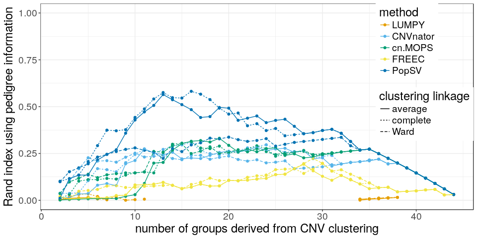

``` r
ggplot(ri.extlowmap.df, aes(x = nb.cut, y = rand.ind, colour = method)) + geom_point(aes(shape = cl.meth), 
    alpha = 1) + geom_line(size = 2, alpha = 0.5, data = ri.extlowmap.s) + ylim(min(ri.extlowmap.df$rand.ind), 
    1) + scale_shape(name = "clustering linkage", label = c("average", "complete", 
    "Ward")) + theme_bw() + xlab("number of groups derived from CNV clustering") + 
    ylab("Rand index using pedigree information") + theme(legend.position = c(1, 
    1), legend.justification = c(1, 1), text = element_text(size = 18)) + scale_colour_manual(values = cbPalette)
```

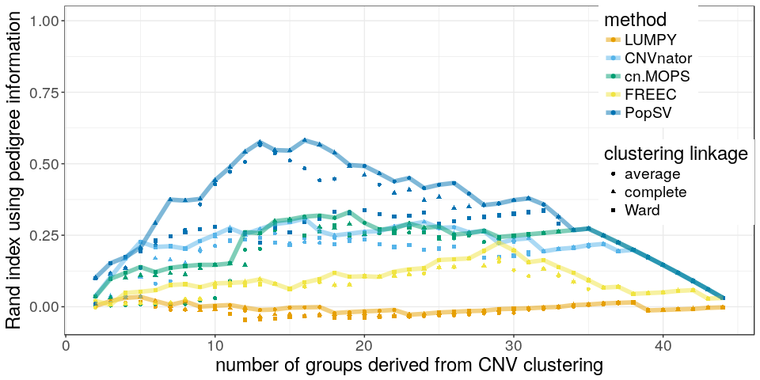

#### Dendograms

``` r
lapply(cl.extlowmap, function(l) l$dendro)
```

    ## $LUMPY

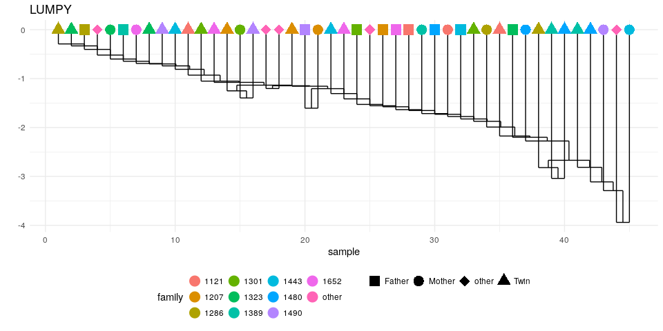

    ## 
    ## $CNVnator

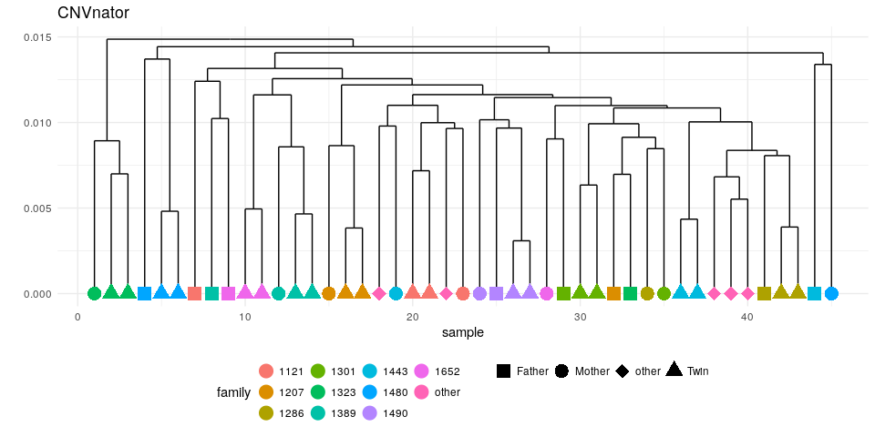

    ## 
    ## $cn.MOPS

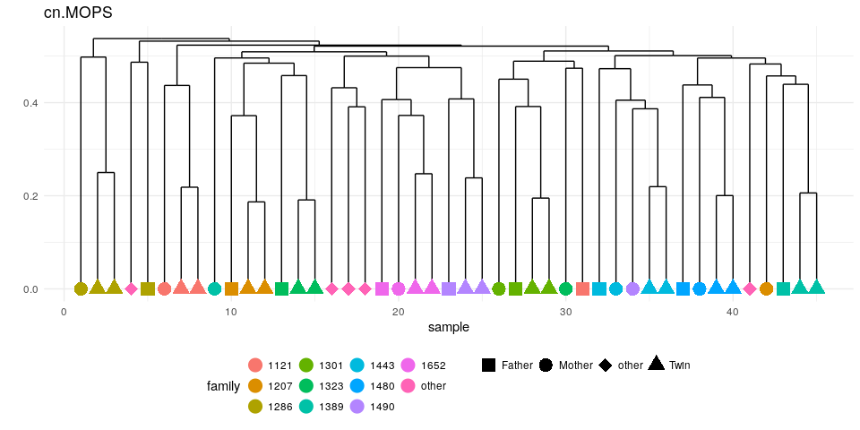

    ## 
    ## $FREEC

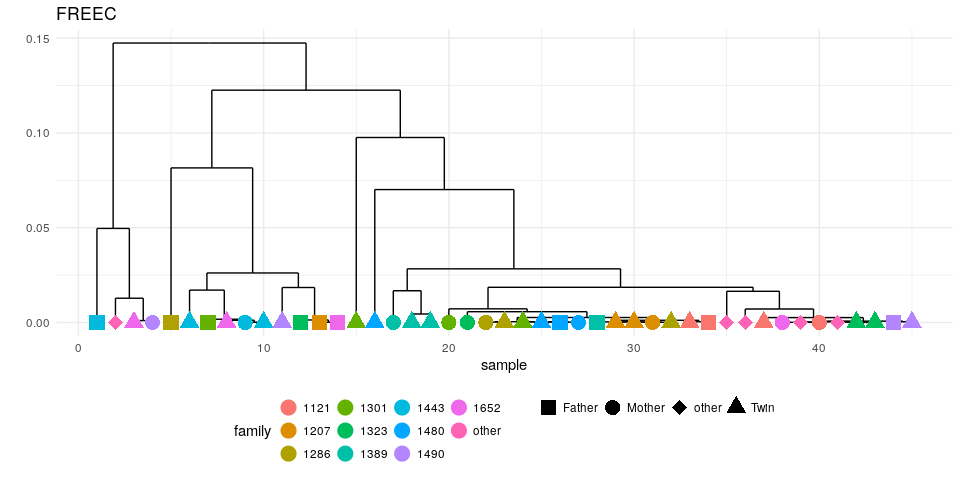

    ## 
    ## $PopSV

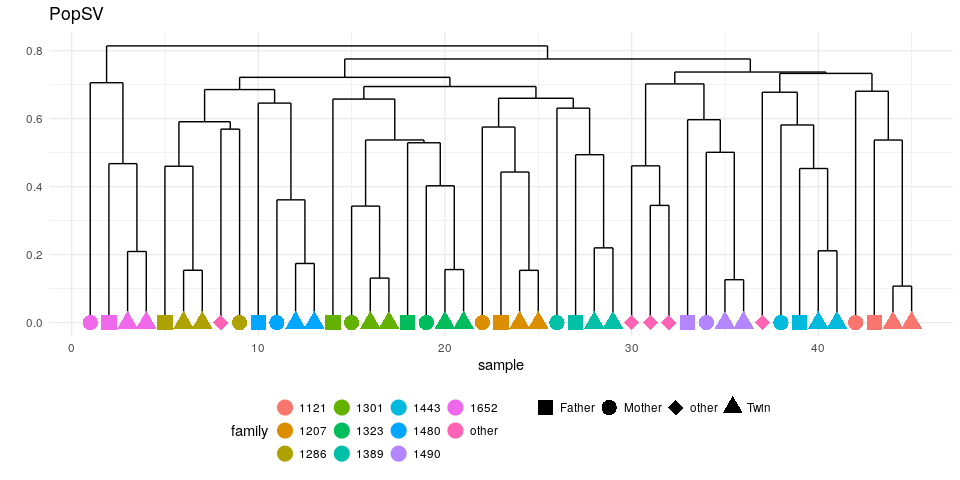
