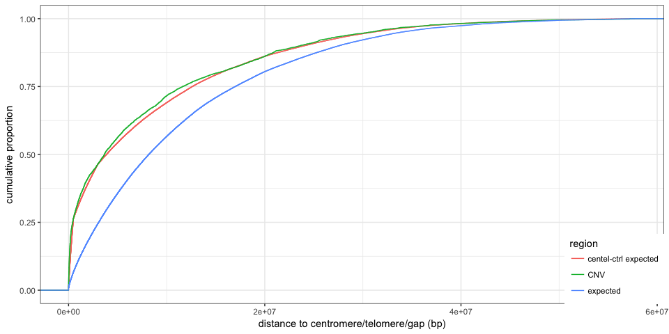
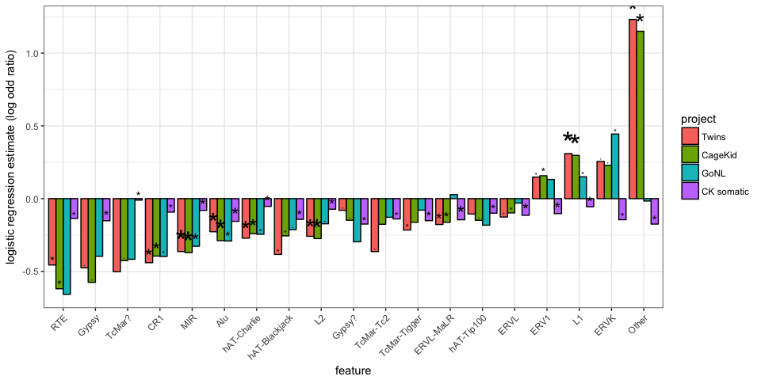
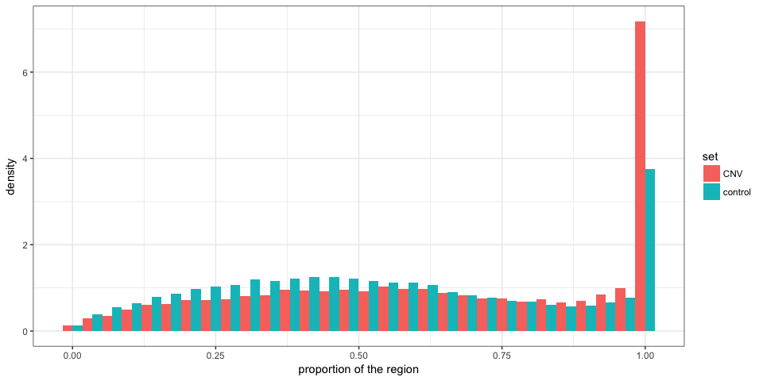

CNV enrichment in low-mappability regions
=========================================

Load packages and functions
---------------------------

``` r
library(dplyr)
library(magrittr)
library(ggplot2)
library(tidyr)
library(GenomicRanges)
library(knitr)
library(PopSV)
library(broom)

winsor <- function(x, u = NULL, l = NULL) {
    if (!is.null(u) & any(x > u)) 
        x[x > u] = u
    if (!is.null(l) & any(x < l)) 
        x[x < l] = l
    x
}
olProp <- function(qgr, sgr) {
    sgr = reduce(sgr)
    ol = findOverlaps(qgr, sgr) %>% as.data.frame %>% mutate(qw = width(qgr)[queryHits], 
        qsw = width(pintersect(qgr[queryHits], sgr[subjectHits]))) %>% group_by(queryHits) %>% 
        summarize(prop = sum(qsw/qw))
    res = rep(0, length(qgr))
    res[ol$queryHits] = ol$prop
    res
}
olLoc <- function(qgr, sgr) {
    sgr = reduce(sgr)
    qgr.center = resize(qgr, width(qgr) * 0.5, fix = "center")
    center.ol = overlapsAny(qgr.center, sgr)
    qgr.flank1 = GenomicRanges::shift(flank(qgr, width(qgr) * 0.25), width(qgr) * 
        0.25)
    qgr.flank2 = GenomicRanges::shift(flank(qgr, width(qgr) * 0.25, start = FALSE), 
        -width(qgr) * 0.25)
    flank.ol = overlapsAny(qgr.flank1, sgr) | overlapsAny(qgr.flank2, sgr)
    out = rep("none", length(qgr))
    out[which(center.ol)] = "center"
    out[which(flank.ol)] = "flank"
    out[which(flank.ol & center.ol)] = "center-flank"
    out
}
NB.CORES = 3
```

CNV catalog
-----------

``` r
cnv.germ = read.table("../data/CNV-PopSV-Twin_CageKid_GoNL-germline.tsv", as.is = TRUE, 
    header = TRUE)
cnv.germ %<>% mutate(project = ifelse(grepl("gonl", sample), "GoNL", "Twins"), 
    project = ifelse(grepl("ck", sample), "CageKid", project), type = ifelse(cn < 
        2, "DEL", "DUP"), germline = TRUE)
germ.samps = unique(cnv.germ$sample)
som.df = read.table("../data/CNV-PopSV-CageKid-somatic.tsv", as.is = TRUE, header = TRUE)
som.df %<>% mutate(project = "CK somatic", type = ifelse(cn < 2, "DEL", "DUP"), 
    germline = FALSE)
cnv.df = rbind(cnv.germ, som.df)
projects.df = cnv.df %>% select(sample, project, germline) %>% unique %>% mutate(project = factor(project, 
    levels = c("Twins", "CageKid", "GoNL", "CK somatic")))
subsamps = projects.df %>% group_by(project) %>% filter(sample %in% sample(sample, 
    45)) %>% .$sample
projects.df %<>% filter(sample %in% subsamps)
cnv.df %<>% filter(sample %in% subsamps)
cnv.germ %<>% filter(sample %in% subsamps)
```

Distance to centromere/telomere/gap
-----------------------------------

``` r
load("../data/centelgap.RData")
rand.gr = draw.controls(cnv.df, list(centel = centelgap), redo.duplicates = TRUE, 
    nb.cores = NB.CORES)
dc.df = rbind(cnv.df %>% makeGRangesFromDataFrame %>% distanceToNearest(centelgap) %>% 
    as.data.frame %>% mutate(region = "CNV", sample = cnv.df$sample[queryHits]), 
    distanceToNearest(rand.gr, centelgap) %>% as.data.frame %>% mutate(region = "expected", 
        sample = rand.gr$sample[queryHits]))
dc.df = merge(dc.df, projects.df)
```

``` r
dc.df %>% filter(germline) %>% ggplot(aes(x = distance, colour = region)) + 
    stat_ecdf() + theme_bw() + xlab("distance to centromere/telomere/gap (bp)") + 
    ylab("cumulative proportion") + theme(legend.position = c(1, 0), legend.justification = c(1, 
    0))
```


``` r
dc.df %>% filter(germline) %>% ggplot(aes(x = winsor(distance, 1e+07), colour = region)) + 
    stat_ecdf() + theme_bw() + xlab("distance to centromere/telomere/gap (bp)") + 
    ylab("cumulative proportion") + theme(legend.position = c(1, 0), legend.justification = c(1, 
    0))
```


``` r
dc.df %>% filter(germline) %>% ggplot(aes(x = distance, colour = region)) + 
    stat_ecdf() + theme_bw() + xlab("distance to centromere/telomere/gap (bp)") + 
    ylab("cumulative proportion") + theme(legend.position = c(1, 0), legend.justification = c(1, 
    0)) + scale_x_log10()
```


``` r
ggplot(dc.df, aes(x = distance, colour = region)) + stat_ecdf() + theme_bw() + 
    xlab("distance to centromere/telomere/gap (bp)") + ylab("cumulative proportion") + 
    theme(legend.position = c(1, 0), legend.justification = c(1, 0)) + facet_wrap(~project)
```


``` r
dc.df %>% group_by(region, project) %>% summarize(centelgap.1Mb = mean(distance < 
    1e+06)) %>% arrange(project, region) %>% kable(digits = 3)
```

| region   | project    |  centelgap.1Mb|
|:---------|:-----------|--------------:|
| CNV      | Twins      |          0.335|
| expected | Twins      |          0.109|
| CNV      | CageKid    |          0.324|
| expected | CageKid    |          0.108|
| CNV      | GoNL       |          0.324|
| expected | GoNL       |          0.118|
| CNV      | CK somatic |          0.114|
| expected | CK somatic |          0.105|

Low-mappability and repeat classes
----------------------------------

### Controlling for the distance to centromere/telomere/gap

By using controls with similar distribution

``` r
null.centelD.grl = list(centel = centelgap, centel.flank = reduce(c(flank(centelgap, 
    5e+05), flank(centelgap, 5e+05, start = FALSE))), centel.flank2 = reduce(c(flank(centelgap, 
    3e+06), flank(centelgap, 3e+06, start = FALSE))))
rand.centelD.gr = draw.controls(cnv.df, null.centelD.grl, redo.duplicates = TRUE, 
    nb.cores = NB.CORES)

dcc.df = rbind(dc.df %>% filter(germline) %>% select(-project, -germline), distanceToNearest(subset(rand.centelD.gr, 
    sample %in% germ.samps), centelgap) %>% as.data.frame %>% mutate(region = "centel-ctrl expected", 
    sample = rand.centelD.gr$sample[queryHits]))

ggplot(dcc.df, aes(x = distance, colour = region)) + stat_ecdf() + theme_bw() + 
    xlab("distance to centromere/telomere/gap (bp)") + ylab("cumulative proportion") + 
    theme(legend.position = c(1, 0), legend.justification = c(1, 0))
```



### Mappability, gene and repeat annotation

``` r
load("../data/twins-coverage-tracks-5kbp.RData")
covrepclass.grl = ns.df %>% makeGRangesFromDataFrame %>% split(ns.df$cov.class) %>% 
    as.list
load("../data/gencodev19-proteincoding-genes-exons.RData")
covrepclass.grl$gene = genes
covrepclass.grl$exon = exons
load("../data/segdup.RData")
covrepclass.grl$segdup = segdup
load("../data/simprep.RData")
covrepclass.grl$str = simprep
load("../data/rm.RData")
sat.gr = subset(rm, repClass == "Satellite")
te.gr = subset(rm, repClass %in% c("LINE", "SINE", "DNA", "Other", "LTR"))
covrepclass.grl$sat = sat.gr
covrepclass.grl$te = te.gr
```

### Enrichment

``` r
regionChar <- function(reg.df, genfeat.grl, null.gr) {
    reg.gr = makeGRangesFromDataFrame(reg.df, keep.extra.columns = TRUE)
    rcF <- function(gf.n, reg.gr, null.gr) {
        rc.df = rbind(data.frame(set = "CNV", sample = reg.gr$sample, ol = overlapsAny(reg.gr, 
            genfeat.grl[[gf.n]])), data.frame(set = "control", sample = null.gr$sample, 
            ol = overlapsAny(null.gr, genfeat.grl[[gf.n]])))
        fc.df = rc.df %>% group_by(set, sample) %>% summarize(prop = (sum(ol) + 
            1)/(1 + n())) %>% mutate(feature = gf.n) %>% spread(set, prop) %>% 
            mutate(prop.ratio = CNV/control) %>% as.data.frame
        lr.df = rc.df %>% group_by(sample) %>% mutate(cnv = set == "CNV") %>% 
            do(glm(ol ~ cnv, data = ., family = binomial()) %>% tidy)
        lr.df %>% filter(term == "cnvTRUE") %>% select(sample, estimate, p.value) %>% 
            merge(fc.df)
    }
    rc.enr = lapply(names(genfeat.grl), rcF, reg.gr, null.gr)
    rc.enr = do.call(rbind, rc.enr)
}

covclass.enr = regionChar(cnv.df, covrepclass.grl, rand.centelD.gr)
covclass.enr = merge(covclass.enr, projects.df)
covclass.enr.s = covclass.enr %>% group_by(project, feature) %>% summarize(estimate = median(estimate, 
    na.rm = TRUE), p.value = median(p.value, na.rm = TRUE), prop.ratio = median(prop.ratio, 
    na.rm = TRUE), prop.region = median(CNV, na.rm = TRUE), prop.null = median(control, 
    na.rm = TRUE))
```

``` r
prop.est.max = max(covclass.enr.s$estimate) * 1.5
ggplot(covclass.enr, aes(x = feature, fill = project, y = winsor(estimate, prop.est.max))) + 
    ggplot2::geom_bar(colour = "black", stat = "identity", position = "dodge", 
        data = covclass.enr.s) + geom_boxplot(alpha = 0.4, position = position_dodge(0.9)) + 
    theme_bw() + theme(axis.text.x = element_text(angle = 45, hjust = 1)) + 
    xlab("feature") + ylab("logistic regression estimate (log odd ratio)")
```


``` r
prop.ratio.max = max(covclass.enr.s$prop.ratio) * 1.5
ggplot(covclass.enr, aes(x = feature, fill = project, y = winsor(prop.ratio, 
    prop.ratio.max))) + ggplot2::geom_bar(colour = "black", stat = "identity", 
    position = "dodge", data = covclass.enr.s) + geom_boxplot(alpha = 0.4, position = position_dodge(0.9)) + 
    theme_bw() + theme(axis.text.x = element_text(angle = 45, hjust = 1)) + 
    xlab("feature") + ylab("fold enrichment") + geom_hline(yintercept = 1, linetype = 2)
```


``` r
covclass.enr.s %>% mutate(p.value = as.character(signif(p.value, 3))) %>% kable(digits = 3)
```

| project    | feature  |  estimate| p.value   |  prop.ratio|  prop.region|  prop.null|
|:-----------|:---------|---------:|:----------|-----------:|------------:|----------:|
| Twins      | exon     |    -0.673| 4.44e-09  |       0.552|        0.082|      0.148|
| Twins      | expected |    -2.680| 8.16e-172 |       0.413|        0.372|      0.896|
| Twins      | gene     |    -0.596| 3.2e-16   |       0.690|        0.311|      0.451|
| Twins      | high     |     0.886| 0.00649   |       2.316|        0.023|      0.010|
| Twins      | low      |     2.496| 1.79e-170 |       4.908|        0.651|      0.133|
| Twins      | sat      |     1.061| 1.81e-06  |       2.741|        0.049|      0.018|
| Twins      | segdup   |     1.721| 6.44e-76  |       3.675|        0.420|      0.114|
| Twins      | str      |     0.305| 1.49e-05  |       1.195|        0.454|      0.377|
| Twins      | te       |    -0.032| 0.582     |       0.995|        0.845|      0.845|
| CageKid    | exon     |    -0.551| 1.6e-07   |       0.615|        0.084|      0.136|
| CageKid    | expected |    -2.650| 8.72e-212 |       0.409|        0.361|      0.892|
| CageKid    | gene     |    -0.535| 5.97e-17  |       0.718|        0.321|      0.446|
| CageKid    | high     |     0.885| 0.00128   |       2.333|        0.022|      0.010|
| CageKid    | low      |     2.473| 5.79e-205 |       4.884|        0.652|      0.131|
| CageKid    | sat      |     0.970| 1.68e-06  |       2.528|        0.042|      0.016|
| CageKid    | segdup   |     1.685| 1.87e-93  |       3.558|        0.411|      0.114|
| CageKid    | str      |     0.259| 7.19e-05  |       1.176|        0.403|      0.340|
| CageKid    | te       |    -0.080| 0.285     |       0.985|        0.820|      0.832|
| GoNL       | exon     |    -0.649| 7.31e-05  |       0.589|        0.134|      0.227|
| GoNL       | expected |    -2.537| 3.02e-51  |       0.467|        0.419|      0.901|
| GoNL       | gene     |    -0.618| 1.16e-06  |       0.683|        0.321|      0.461|
| GoNL       | high     |     1.659| 0.000772  |       4.400|        0.051|      0.012|
| GoNL       | low      |     2.188| 3.71e-49  |       3.869|        0.629|      0.162|
| GoNL       | sat      |     1.327| 0.000175  |       3.333|        0.070|      0.020|
| GoNL       | segdup   |     1.588| 3.92e-25  |       3.315|        0.406|      0.120|
| GoNL       | str      |     0.061| 0.475     |       1.024|        0.614|      0.594|
| GoNL       | te       |    -0.344| 0.173     |       0.980|        0.934|      0.950|
| CK somatic | exon     |     0.124| 0.1       |       1.093|        0.183|      0.179|
| CK somatic | expected |    -1.006| 4.52e-16  |       0.914|        0.870|      0.940|
| CK somatic | gene     |     0.008| 0.0942    |       1.005|        0.484|      0.485|
| CK somatic | high     |     0.088| 0.232     |       1.083|        0.009|      0.008|
| CK somatic | low      |     0.412| 2.12e-16  |       1.436|        0.195|      0.123|
| CK somatic | sat      |     0.135| 0.197     |       1.125|        0.021|      0.016|
| CK somatic | segdup   |     0.479| 2.73e-10  |       1.477|        0.146|      0.089|
| CK somatic | str      |     0.122| 0.0104    |       1.047|        0.410|      0.383|
| CK somatic | te       |    -0.273| 0.00736   |       0.964|        0.810|      0.851|

Controlling for the SD enrichment
---------------------------------

``` r
null.sd.grl = list(segdup = segdup, centel = centelgap, centel.flank = reduce(c(flank(centelgap, 
    5e+05), flank(centelgap, 5e+05, start = FALSE))), centel.flank2 = reduce(c(flank(centelgap, 
    3e+06), flank(centelgap, 3e+06, start = FALSE))))
rand.sd.gr = draw.controls(cnv.df, null.sd.grl, redo.duplicates = TRUE, nb.cores = NB.CORES)
rand.sd.germ.gr = subset(rand.sd.gr, sample %in% germ.samps)
```

``` r
regionCharNoSD <- function(reg.df, genfeat.grl, null.gr) {
    reg.gr = makeGRangesFromDataFrame(reg.df, keep.extra.columns = TRUE)
    rcF <- function(gf.n, reg.gr, null.gr) {
        rc.df = rbind(data.frame(set = "CNV", sample = reg.gr$sample, ol = overlapsAny(reg.gr, 
            genfeat.grl[[gf.n]]), sd = overlapsAny(reg.gr, segdup)), data.frame(set = "control", 
            sample = null.gr$sample, ol = overlapsAny(null.gr, genfeat.grl[[gf.n]]), 
            sd = overlapsAny(reg.gr, segdup)))
        fc.df = rc.df %>% group_by(set, sample) %>% summarize(prop = (sum(ol) + 
            1)/(1 + n())) %>% mutate(feature = gf.n) %>% spread(set, prop) %>% 
            mutate(prop.ratio = CNV/control) %>% as.data.frame
        lr.df = rc.df %>% group_by(sample) %>% mutate(cnv = set == "CNV") %>% 
            do(glm(ol ~ cnv + sd, data = ., family = binomial()) %>% tidy)
        lr.df %>% filter(term == "cnvTRUE") %>% select(sample, estimate, p.value) %>% 
            merge(fc.df)
    }
    rc.enr = lapply(names(genfeat.grl), rcF, reg.gr, null.gr)
    rc.enr = do.call(rbind, rc.enr)
}

covclass.enr.nosd = regionCharNoSD(cnv.df, covrepclass.grl, rand.sd.gr)
covclass.enr.nosd = merge(covclass.enr.nosd, projects.df)
covclass.enr.nosd.s = covclass.enr.nosd %>% group_by(project, feature) %>% summarize(estimate = median(estimate, 
    na.rm = TRUE), p.value = median(p.value, na.rm = TRUE), prop.ratio = median(prop.ratio, 
    na.rm = TRUE), prop.region = median(CNV, na.rm = TRUE), prop.null = median(control, 
    na.rm = TRUE))
```

``` r
prop.est.max = max(covclass.enr.nosd.s$estimate) * 1.5
ggplot(covclass.enr.nosd, aes(x = feature, fill = project, y = winsor(estimate, 
    prop.est.max))) + ggplot2::geom_bar(colour = "black", stat = "identity", 
    position = "dodge", data = covclass.enr.nosd.s) + geom_boxplot(alpha = 0.4, 
    position = position_dodge(0.9)) + theme_bw() + theme(axis.text.x = element_text(angle = 45, 
    hjust = 1)) + xlab("feature") + ylab("logistic regression estimate (log odd ratio)")
```


``` r
prop.ratio.max = max(covclass.enr.nosd.s$prop.ratio) * 1.5
ggplot(covclass.enr.nosd, aes(x = feature, fill = project, y = winsor(prop.ratio, 
    prop.ratio.max))) + ggplot2::geom_bar(colour = "black", stat = "identity", 
    position = "dodge", data = covclass.enr.nosd.s) + geom_boxplot(alpha = 0.4, 
    position = position_dodge(0.9)) + theme_bw() + theme(axis.text.x = element_text(angle = 45, 
    hjust = 1)) + xlab("feature") + ylab("fold enrichment") + geom_hline(yintercept = 1, 
    linetype = 2)
```


``` r
covclass.enr.nosd.s %>% mutate(p.value = as.character(signif(p.value, 3))) %>% 
    kable(digits = 3)
```

| project    | feature  |  estimate| p.value   |  prop.ratio|  prop.region|  prop.null|
|:-----------|:---------|---------:|:----------|-----------:|------------:|----------:|
| Twins      | exon     |    -0.640| 1.9e-08   |       0.591|        0.082|      0.140|
| Twins      | expected |    -1.529| 7.32e-82  |       0.511|        0.372|      0.725|
| Twins      | gene     |    -0.324| 1.18e-05  |       0.798|        0.311|      0.390|
| Twins      | high     |     0.186| 0.28      |       1.250|        0.023|      0.019|
| Twins      | low      |     1.464| 3.27e-74  |       2.109|        0.651|      0.311|
| Twins      | sat      |     0.918| 8.91e-06  |       2.405|        0.049|      0.020|
| Twins      | segdup   |    -0.375| 1.47e-05  |       1.000|        0.420|      0.420|
| Twins      | str      |     0.288| 4.1e-05   |       1.194|        0.454|      0.380|
| Twins      | te       |    -0.005| 0.53      |       0.995|        0.845|      0.850|
| CageKid    | exon     |    -0.531| 5.93e-07  |       0.640|        0.084|      0.130|
| CageKid    | expected |    -1.590| 1.09e-103 |       0.504|        0.361|      0.725|
| CageKid    | gene     |    -0.314| 2.91e-06  |       0.811|        0.321|      0.395|
| CageKid    | high     |     0.274| 0.157     |       1.341|        0.022|      0.017|
| CageKid    | low      |     1.479| 1.19e-95  |       2.148|        0.652|      0.300|
| CageKid    | sat      |     0.823| 4.13e-05  |       2.167|        0.042|      0.019|
| CageKid    | segdup   |    -0.185| 0.0112    |       1.000|        0.411|      0.411|
| CageKid    | str      |     0.276| 3.21e-05  |       1.187|        0.403|      0.339|
| CageKid    | te       |    -0.078| 0.314     |       0.985|        0.820|      0.832|
| GoNL       | exon     |    -0.666| 5.37e-05  |       0.602|        0.134|      0.220|
| GoNL       | expected |    -1.531| 1.81e-27  |       0.549|        0.419|      0.761|
| GoNL       | gene     |    -0.452| 0.000342  |       0.751|        0.321|      0.427|
| GoNL       | high     |     1.085| 0.00644   |       2.786|        0.051|      0.018|
| GoNL       | low      |     1.280| 3.33e-22  |       2.000|        0.629|      0.313|
| GoNL       | sat      |     0.968| 0.00168   |       2.412|        0.070|      0.029|
| GoNL       | segdup   |    -0.367| 0.0165    |       1.000|        0.406|      0.406|
| GoNL       | str      |     0.069| 0.327     |       1.034|        0.614|      0.593|
| GoNL       | te       |    -0.515| 0.0611    |       0.973|        0.934|      0.958|
| CK somatic | exon     |     0.062| 0.0605    |       1.088|        0.183|      0.175|
| CK somatic | expected |    -0.387| 0.000593  |       0.945|        0.870|      0.912|
| CK somatic | gene     |     0.034| 0.111     |       1.026|        0.484|      0.473|
| CK somatic | high     |     0.014| 0.246     |       1.091|        0.009|      0.009|
| CK somatic | low      |    -0.064| 0.00751   |       1.154|        0.195|      0.166|
| CK somatic | sat      |    -0.048| 0.135     |       1.204|        0.021|      0.014|
| CK somatic | segdup   |    -0.460| 3.45e-10  |       1.000|        0.146|      0.146|
| CK somatic | str      |     0.065| 0.0944    |       1.053|        0.410|      0.385|
| CK somatic | te       |    -0.263| 0.00519   |       0.961|        0.810|      0.849|

Satellite families
------------------

### Enrichment

``` r
sat.grl = split(sat.gr, sat.gr$repName)
sat.enr.nosd = regionCharNoSD(cnv.df, sat.grl, rand.sd.gr)
sat.enr.nosd %<>% group_by(sample) %>% mutate(qv = p.adjust(p.value, method = "fdr")) %>% 
    merge(projects.df)
```

``` r
sat.enr.nosd.s = sat.enr.nosd %>% filter(germline) %>% group_by(feature) %>% 
    filter(any(qv < 0.05)) %>% select(feature) %>% unique
sat.enr.nosd %>% filter(feature %in% sat.enr.nosd.s$feature) %>% group_by(project, 
    feature) %>% summarize(estimate = median(estimate, na.rm = TRUE), qv = mean(qv < 
    0.05)) %>% ggplot(aes(x = reorder(feature, estimate, median), fill = project, 
    y = estimate)) + geom_bar(color = "black", position = "dodge", stat = "identity") + 
    theme_bw() + theme(axis.text.x = element_text(angle = 45, hjust = 1)) + 
    xlab("feature") + ylab("logistic regression estimate (log odd ratio)") + 
    geom_text(aes(size = qv), label = "*", position = position_dodge(0.9), vjust = 0, 
        show_guide = FALSE) + scale_size_continuous(name = "proportion\nsignificant\nsamples", 
    range = c(0, 10))
```


``` r
sat.enr.nosd %>% filter(feature %in% sat.enr.nosd.s$feature) %>% group_by(project, 
    feature) %>% summarize(ratio = median(prop.ratio, na.rm = TRUE), ratio5 = quantile(prop.ratio, 
    0.05, na.rm = TRUE), ratio95 = quantile(prop.ratio, 0.95, na.rm = TRUE)) %>% 
    ggplot(aes(x = reorder(feature, ratio, median), fill = project, y = ratio)) + 
    geom_bar(color = "black", position = "dodge", stat = "identity") + geom_errorbar(aes(group = project, 
    ymin = ratio5, ymax = ratio95), position = "dodge") + theme_bw() + theme(axis.text.x = element_text(angle = 45, 
    hjust = 1)) + xlab("feature") + ylab("fold enrichment") + geom_hline(yintercept = 1, 
    linetype = 2)
```


``` r
sat.enr.nosd %>% filter(feature %in% sat.enr.nosd.s$feature) %>% group_by(project, 
    feature) %>% summarize(estimate = median(estimate, na.rm = TRUE), p.value = median(p.value, 
    na.rm = TRUE), prop.ratio = median(prop.ratio, na.rm = TRUE), prop.region = median(CNV, 
    na.rm = TRUE), prop.null = median(control, na.rm = TRUE)) %>% mutate(p.value = as.character(signif(p.value, 
    3))) %>% kable(digits = 3)
```

| project    | feature   |  estimate| p.value  |  prop.ratio|  prop.region|  prop.null|
|:-----------|:----------|---------:|:---------|-----------:|------------:|----------:|
| Twins      | ALR/Alpha |     1.621| 2.86e-06 |       4.250|        0.029|      0.007|
| CageKid    | ALR/Alpha |     1.391| 7.01e-06 |       3.538|        0.024|      0.007|
| GoNL       | ALR/Alpha |     1.960| 0.000583 |       5.250|        0.048|      0.009|
| CK somatic | ALR/Alpha |     0.037| 0.289    |       1.200|        0.008|      0.006|

### Overlap distribution

Proportion of the call overlapped

``` r
cnv.germ$sat.prop = cnv.germ %>% makeGRangesFromDataFrame %>% olProp(sat.gr)
cnv.germ$sat.loc = cnv.germ %>% makeGRangesFromDataFrame %>% olLoc(sat.gr)
rand.sd.germ.gr$sat.prop = olProp(rand.sd.germ.gr, sat.gr)
rand.sd.germ.gr$sat.loc = olLoc(rand.sd.germ.gr, sat.gr)

sat.ol = rbind(cnv.germ %>% select(sat.prop, sat.loc) %>% mutate(set = "CNV"), 
    rand.sd.germ.gr %>% as.data.frame %>% select(sat.prop, sat.loc) %>% mutate(set = "control"))

sat.ol %>% filter(sat.prop > 0) %>% ggplot(aes(x = sat.prop, fill = set, y = ..density..)) + 
    geom_histogram(position = "dodge") + theme_bw() + xlab("proportion of the region") + 
    ylab("density")
```


``` r
sat.ol %>% filter(sat.prop > 0) %>% group_by(sat.loc, set) %>% summarize(nb = n()) %>% 
    group_by(set) %>% mutate(prop = nb/sum(nb)) %>% ggplot(aes(x = sat.loc, 
    fill = set, y = prop)) + ggplot2::geom_bar(stat = "identity", position = "dodge") + 
    theme_bw() + xlab("location relative to the region") + ylab("proportion of regions")
```


STR families
------------

### Enrichment

``` r
str.ordered = simprep %>% as.data.frame %>% group_by(sequence) %>% summarize(n = n()) %>% 
    arrange(desc(n))
simprep$sequence2 = ifelse(simprep$sequence %in% head(str.ordered$sequence, 
    20), simprep$sequence, "others")
simprepl = split(simprep, simprep$sequence2)

str.enr.nosd = regionCharNoSD(cnv.df, simprepl, rand.sd.gr)
str.enr.nosd %<>% group_by(sample) %>% mutate(qv = p.adjust(p.value, method = "fdr")) %>% 
    merge(projects.df)
```

``` r
str.enr.nosd.s = str.enr.nosd %>% filter(germline) %>% group_by(feature) %>% 
    filter(any(qv < 0.05)) %>% select(feature) %>% unique
str.enr.nosd %>% filter(feature %in% str.enr.nosd.s$feature) %>% group_by(project, 
    feature) %>% summarize(estimate = median(estimate, na.rm = TRUE), qv = mean(qv < 
    0.05)) %>% ggplot(aes(x = reorder(feature, estimate, median), fill = project, 
    y = estimate)) + geom_bar(color = "black", position = "dodge", stat = "identity") + 
    theme_bw() + theme(axis.text.x = element_text(angle = 45, hjust = 1)) + 
    xlab("feature") + ylab("logistic regression estimate (log odd ratio)") + 
    geom_text(aes(size = qv), label = "*", position = position_dodge(0.9), vjust = 0, 
        show_guide = FALSE) + scale_size_continuous(name = "proportion\nsignificant\nsamples", 
    range = c(0, 10))
```


``` r
str.enr.nosd %>% filter(feature %in% str.enr.nosd.s$feature) %>% group_by(project, 
    feature) %>% summarize(ratio = median(prop.ratio, na.rm = TRUE), ratio5 = quantile(prop.ratio, 
    0.05, na.rm = TRUE), ratio95 = quantile(prop.ratio, 0.95, na.rm = TRUE)) %>% 
    ggplot(aes(x = reorder(feature, ratio, median), fill = project, y = ratio)) + 
    geom_bar(color = "black", position = "dodge", stat = "identity") + geom_errorbar(aes(group = project, 
    ymin = ratio5, ymax = ratio95), position = "dodge") + theme_bw() + theme(axis.text.x = element_text(angle = 45, 
    hjust = 1)) + xlab("feature") + ylab("fold enrichment") + geom_hline(yintercept = 1, 
    linetype = 2)
```


``` r
str.enr.nosd %>% filter(feature %in% str.enr.nosd.s$feature) %>% group_by(project, 
    feature) %>% summarize(estimate = median(estimate, na.rm = TRUE), p.value = median(p.value, 
    na.rm = TRUE), prop.ratio = median(prop.ratio, na.rm = TRUE), prop.region = median(CNV, 
    na.rm = TRUE), prop.null = median(control, na.rm = TRUE)) %>% mutate(p.value = as.character(signif(p.value, 
    3))) %>% kable(digits = 3)
```

| project    | feature |  estimate| p.value  |  prop.ratio|  prop.region|  prop.null|
|:-----------|:--------|---------:|:---------|-----------:|------------:|----------:|
| Twins      | AAAT    |    -0.199| 0.45     |       0.882|        0.010|      0.011|
| Twins      | AC      |    -0.030| 0.622    |       1.024|        0.029|      0.028|
| Twins      | AT      |     0.238| 0.29     |       1.320|        0.021|      0.017|
| Twins      | GT      |    -0.183| 0.51     |       0.862|        0.015|      0.017|
| Twins      | others  |     0.315| 1.69e-05 |       1.229|        0.401|      0.327|
| Twins      | TA      |     0.092| 0.44     |       1.136|        0.017|      0.015|
| Twins      | TG      |    -0.281| 0.234    |       0.778|        0.019|      0.025|
| Twins      | TTTA    |     0.114| 0.478    |       1.111|        0.009|      0.008|
| CageKid    | AAAT    |     0.011| 0.443    |       1.043|        0.008|      0.009|
| CageKid    | AC      |    -0.225| 0.232    |       0.827|        0.020|      0.024|
| CageKid    | AT      |     0.393| 0.139    |       1.459|        0.020|      0.013|
| CageKid    | GT      |    -0.019| 0.668    |       1.000|        0.015|      0.015|
| CageKid    | others  |     0.314| 7.29e-06 |       1.233|        0.356|      0.288|
| CageKid    | TA      |     0.286| 0.246    |       1.324|        0.019|      0.013|
| CageKid    | TG      |    -0.097| 0.515    |       0.925|        0.018|      0.020|
| CageKid    | TTTA    |     0.088| 0.57     |       1.105|        0.009|      0.007|
| GoNL       | AAAT    |    -0.212| 0.537    |       0.889|        0.020|      0.023|
| GoNL       | AC      |    -0.178| 0.45     |       0.857|        0.049|      0.057|
| GoNL       | AT      |    -0.017| 0.525    |       1.000|        0.033|      0.031|
| GoNL       | GT      |    -0.114| 0.59     |       0.941|        0.034|      0.036|
| GoNL       | others  |     0.124| 0.272    |       1.071|        0.549|      0.516|
| GoNL       | TA      |     0.114| 0.437    |       1.143|        0.034|      0.029|
| GoNL       | TG      |    -0.138| 0.475    |       0.920|        0.043|      0.047|
| GoNL       | TTTA    |    -0.130| 0.556    |       0.889|        0.015|      0.017|
| CK somatic | AAAT    |    -0.177| 0.176    |       0.934|        0.027|      0.030|
| CK somatic | AC      |    -0.138| 0.168    |       0.936|        0.066|      0.071|
| CK somatic | AT      |    -0.077| 0.269    |       1.018|        0.051|      0.054|
| CK somatic | GT      |    -0.141| 0.149    |       0.979|        0.055|      0.055|
| CK somatic | others  |     0.070| 0.049    |       1.078|        0.361|      0.334|
| CK somatic | TA      |    -0.075| 0.246    |       1.000|        0.045|      0.048|
| CK somatic | TG      |    -0.129| 0.266    |       0.942|        0.056|      0.061|
| CK somatic | TTTA    |    -0.241| 0.135    |       0.948|        0.021|      0.026|

### Overlap distribution

Proportion of the call overlapped

``` r
cnv.germ$str.prop = cnv.germ %>% makeGRangesFromDataFrame %>% olProp(simprep)
cnv.germ$str.loc = cnv.germ %>% makeGRangesFromDataFrame %>% olLoc(simprep)
rand.sd.germ.gr$str.prop = olProp(rand.sd.germ.gr, simprep)
rand.sd.germ.gr$str.loc = olLoc(rand.sd.germ.gr, simprep)

str.ol = rbind(cnv.germ %>% select(str.prop, str.loc) %>% mutate(set = "CNV"), 
    rand.sd.germ.gr %>% as.data.frame %>% select(str.prop, str.loc) %>% mutate(set = "control"))

str.ol %>% filter(str.prop > 0) %>% ggplot(aes(x = str.prop, fill = set, y = ..density..)) + 
    geom_histogram(position = "dodge") + theme_bw() + xlab("proportion of the region") + 
    ylab("density")
```


``` r
str.ol %>% filter(str.prop > 0) %>% group_by(str.loc, set) %>% summarize(nb = n()) %>% 
    group_by(set) %>% mutate(prop = nb/sum(nb)) %>% ggplot(aes(x = str.loc, 
    fill = set, y = prop)) + ggplot2::geom_bar(stat = "identity", position = "dodge") + 
    theme_bw() + xlab("location relative to the region") + ylab("proportion of regions")
```


### Size of the STRs overlapped

``` r
simprep.size.grl = split(simprep, cut(width(simprep), breaks = c(0, 100, 500, 
    Inf)))
strsize.enr.nosd = regionCharNoSD(cnv.df, simprep.size.grl, rand.sd.gr)
strsize.enr.nosd %<>% group_by(sample) %>% mutate(qv = p.adjust(p.value, method = "fdr")) %>% 
    merge(projects.df)

strsize.enr.nosd %>% group_by(project, feature) %>% summarize(estimate = median(estimate, 
    na.rm = TRUE), qv = mean(qv < 0.05)) %>% ggplot(aes(x = reorder(feature, 
    estimate, median), fill = project, y = estimate)) + geom_bar(color = "black", 
    position = "dodge", stat = "identity") + theme_bw() + theme(axis.text.x = element_text(angle = 45, 
    hjust = 1)) + xlab("feature") + ylab("logistic regression estimate (log odd ratio)") + 
    geom_text(aes(size = qv), label = "*", position = position_dodge(0.9), vjust = 0, 
        show_guide = FALSE) + scale_size_continuous(name = "proportion\nsignificant\nsamples", 
    range = c(0, 10))
```


``` r
strsize.enr.nosd %>% group_by(project, feature) %>% summarize(ratio = median(prop.ratio, 
    na.rm = TRUE), ratio5 = quantile(prop.ratio, 0.05, na.rm = TRUE), ratio95 = quantile(prop.ratio, 
    0.95, na.rm = TRUE)) %>% ggplot(aes(x = reorder(feature, ratio, median), 
    fill = project, y = ratio)) + geom_bar(color = "black", position = "dodge", 
    stat = "identity") + geom_errorbar(aes(group = project, ymin = ratio5, ymax = ratio95), 
    position = "dodge") + theme_bw() + theme(axis.text.x = element_text(angle = 45, 
    hjust = 1)) + xlab("feature") + ylab("fold enrichment") + geom_hline(yintercept = 1, 
    linetype = 2)
```


``` r
strsize.enr.nosd %>% group_by(project, feature) %>% summarize(estimate = median(estimate, 
    na.rm = TRUE), p.value = median(p.value, na.rm = TRUE), prop.ratio = median(prop.ratio, 
    na.rm = TRUE), prop.region = median(CNV, na.rm = TRUE), prop.null = median(control, 
    na.rm = TRUE)) %>% mutate(p.value = as.character(signif(p.value, 3))) %>% 
    kable(digits = 3)
```

| project    | feature   |  estimate| p.value  |  prop.ratio|  prop.region|  prop.null|
|:-----------|:----------|---------:|:---------|-----------:|------------:|----------:|
| Twins      | (0,100]   |     0.028| 0.536    |       1.031|        0.350|      0.339|
| Twins      | (100,500] |     0.324| 0.00346  |       1.335|        0.141|      0.104|
| Twins      | (500,Inf] |     1.014| 1.17e-13 |       2.527|        0.130|      0.050|
| CageKid    | (0,100]   |    -0.017| 0.427    |       0.990|        0.297|      0.297|
| CageKid    | (100,500] |     0.331| 0.00112  |       1.343|        0.124|      0.092|
| CageKid    | (500,Inf] |     1.106| 2.88e-18 |       2.683|        0.124|      0.046|
| GoNL       | (0,100]   |    -0.068| 0.551    |       0.974|        0.524|      0.542|
| GoNL       | (100,500] |     0.029| 0.596    |       1.053|        0.194|      0.188|
| GoNL       | (500,Inf] |     0.557| 0.00642  |       1.667|        0.132|      0.085|
| CK somatic | (0,100]   |    -0.057| 0.261    |       0.974|        0.344|      0.357|
| CK somatic | (100,500] |     0.005| 0.14     |       1.118|        0.157|      0.136|
| CK somatic | (500,Inf] |     0.203| 0.00523  |       1.464|        0.114|      0.069|

Transposable element
--------------------

### Family enrichment

``` r
tefam.grl = split(te.gr, te.gr$repFamily)
tefam.enr.nosd = regionCharNoSD(cnv.df, tefam.grl, rand.sd.gr)
tefam.enr.nosd %<>% group_by(sample) %>% mutate(qv = p.adjust(p.value, method = "fdr")) %>% 
    merge(projects.df)
```

``` r
tefam.enr.nosd.s = tefam.enr.nosd %>% filter(germline) %>% group_by(feature) %>% 
    filter(any(qv < 0.05)) %>% select(feature) %>% unique
tefam.enr.nosd %>% filter(feature %in% tefam.enr.nosd.s$feature) %>% group_by(project, 
    feature) %>% summarize(estimate = median(estimate, na.rm = TRUE), qv = mean(qv < 
    0.05)) %>% ggplot(aes(x = reorder(feature, estimate, median), fill = project, 
    y = estimate)) + geom_bar(color = "black", position = "dodge", stat = "identity") + 
    theme_bw() + theme(axis.text.x = element_text(angle = 45, hjust = 1)) + 
    xlab("feature") + ylab("logistic regression estimate (log odd ratio)") + 
    geom_text(aes(size = qv), label = "*", position = position_dodge(0.9), vjust = 0, 
        show_guide = FALSE) + scale_size_continuous(name = "proportion\nsignificant\nsamples", 
    range = c(0, 10))
```



``` r
tefam.enr.nosd %>% filter(feature %in% tefam.enr.nosd.s$feature) %>% group_by(project, 
    feature) %>% summarize(ratio = median(prop.ratio, na.rm = TRUE), ratio5 = quantile(prop.ratio, 
    0.05, na.rm = TRUE), ratio95 = quantile(prop.ratio, 0.95, na.rm = TRUE)) %>% 
    ggplot(aes(x = reorder(feature, ratio, median), fill = project, y = ratio)) + 
    geom_bar(color = "black", position = "dodge", stat = "identity") + geom_errorbar(aes(group = project, 
    ymin = ratio5, ymax = ratio95), position = "dodge") + theme_bw() + theme(axis.text.x = element_text(angle = 45, 
    hjust = 1)) + xlab("feature") + ylab("fold enrichment") + geom_hline(yintercept = 1, 
    linetype = 2)
```


``` r
tefam.enr.nosd %>% filter(feature %in% tefam.enr.nosd.s$feature) %>% group_by(project, 
    feature) %>% summarize(estimate = median(estimate, na.rm = TRUE), p.value = median(p.value, 
    na.rm = TRUE), prop.ratio = median(prop.ratio, na.rm = TRUE), prop.region = median(CNV, 
    na.rm = TRUE), prop.null = median(control, na.rm = TRUE)) %>% mutate(p.value = as.character(signif(p.value, 
    3))) %>% kable(digits = 3)
```

| project    | feature       |  estimate| p.value  |  prop.ratio|  prop.region|  prop.null|
|:-----------|:--------------|---------:|:---------|-----------:|------------:|----------:|
| Twins      | Alu           |    -0.228| 0.00145  |       0.894|        0.438|      0.482|
| Twins      | CR1           |    -0.440| 0.0177   |       0.662|        0.032|      0.048|
| Twins      | ERV1          |     0.148| 0.143    |       1.177|        0.145|      0.125|
| Twins      | ERVK          |     0.256| 0.296    |       1.321|        0.024|      0.018|
| Twins      | ERVL          |    -0.126| 0.278    |       0.922|        0.103|      0.113|
| Twins      | ERVL-MaLR     |    -0.178| 0.045    |       0.874|        0.182|      0.209|
| Twins      | Gypsy         |    -0.476| 0.227    |       0.652|        0.007|      0.011|
| Twins      | Gypsy?        |    -0.080| 0.655    |       0.933|        0.006|      0.007|
| Twins      | hAT-Blackjack |    -0.384| 0.17     |       0.700|        0.013|      0.019|
| Twins      | hAT-Charlie   |    -0.272| 0.00565  |       0.815|        0.138|      0.170|
| Twins      | hAT-Tip100    |    -0.106| 0.576    |       0.941|        0.024|      0.026|
| Twins      | L1            |     0.310| 1.24e-05 |       1.166|        0.516|      0.441|
| Twins      | L2            |    -0.259| 0.00213  |       0.824|        0.204|      0.244|
| Twins      | MIR           |    -0.364| 6.78e-06 |       0.773|        0.218|      0.283|
| Twins      | Other         |     1.231| 0.00114  |       3.000|        0.020|      0.007|
| Twins      | RTE           |    -0.456| 0.118    |       0.667|        0.011|      0.018|
| Twins      | TcMar-Tc2     |    -0.364| 0.367    |       0.722|        0.007|      0.009|
| Twins      | TcMar-Tigger  |    -0.216| 0.12     |       0.836|        0.068|      0.080|
| Twins      | TcMar?        |    -0.502| 0.455    |       0.750|        0.003|      0.004|
| CageKid    | Alu           |    -0.289| 7.98e-06 |       0.858|        0.387|      0.449|
| CageKid    | CR1           |    -0.395| 0.0175   |       0.702|        0.031|      0.043|
| CageKid    | ERV1          |     0.157| 0.121    |       1.169|        0.130|      0.112|
| CageKid    | ERVK          |     0.229| 0.346    |       1.242|        0.022|      0.017|
| CageKid    | ERVL          |    -0.098| 0.337    |       0.940|        0.093|      0.102|
| CageKid    | ERVL-MaLR     |    -0.163| 0.0491   |       0.884|        0.165|      0.186|
| CageKid    | Gypsy         |    -0.575| 0.123    |       0.600|        0.006|      0.010|
| CageKid    | Gypsy?        |    -0.148| 0.542    |       0.846|        0.005|      0.006|
| CageKid    | hAT-Blackjack |    -0.256| 0.293    |       0.800|        0.012|      0.016|
| CageKid    | hAT-Charlie   |    -0.241| 0.0095   |       0.819|        0.122|      0.148|
| CageKid    | hAT-Tip100    |    -0.149| 0.46     |       0.872|        0.020|      0.023|
| CageKid    | L1            |     0.297| 2.85e-06 |       1.169|        0.484|      0.414|
| CageKid    | L2            |    -0.275| 0.000577 |       0.806|        0.178|      0.221|
| CageKid    | MIR           |    -0.371| 1.54e-06 |       0.752|        0.193|      0.255|
| CageKid    | Other         |     1.150| 0.000735 |       2.733|        0.017|      0.006|
| CageKid    | RTE           |    -0.620| 0.0483   |       0.577|        0.009|      0.015|
| CageKid    | TcMar-Tc2     |    -0.176| 0.5      |       0.875|        0.007|      0.009|
| CageKid    | TcMar-Tigger  |    -0.163| 0.185    |       0.876|        0.065|      0.072|
| CageKid    | TcMar?        |    -0.426| 0.356    |       0.692|        0.003|      0.004|
| GoNL       | Alu           |    -0.291| 0.0277   |       0.915|        0.622|      0.682|
| GoNL       | CR1           |    -0.397| 0.102    |       0.722|        0.066|      0.091|
| GoNL       | ERV1          |     0.132| 0.382    |       1.144|        0.231|      0.204|
| GoNL       | ERVK          |     0.444| 0.174    |       1.571|        0.048|      0.031|
| GoNL       | ERVL          |    -0.031| 0.567    |       0.981|        0.188|      0.190|
| GoNL       | ERVL-MaLR     |     0.028| 0.578    |       1.025|        0.338|      0.332|
| GoNL       | Gypsy         |    -0.396| 0.38     |       0.714|        0.016|      0.021|
| GoNL       | Gypsy?        |    -0.297| 0.513    |       0.800|        0.012|      0.015|
| GoNL       | hAT-Blackjack |    -0.213| 0.511    |       0.818|        0.032|      0.038|
| GoNL       | hAT-Charlie   |    -0.245| 0.0737   |       0.844|        0.239|      0.284|
| GoNL       | hAT-Tip100    |    -0.183| 0.475    |       0.880|        0.046|      0.055|
| GoNL       | L1            |     0.150| 0.224    |       1.059|        0.635|      0.599|
| GoNL       | L2            |    -0.173| 0.162    |       0.904|        0.359|      0.400|
| GoNL       | MIR           |    -0.327| 0.00849  |       0.838|        0.379|      0.454|
| GoNL       | Other         |    -0.016| 0.561    |       1.000|        0.013|      0.012|
| GoNL       | RTE           |    -0.658| 0.102    |       0.571|        0.019|      0.033|
| GoNL       | TcMar-Tc2     |    -0.128| 0.482    |       0.929|        0.017|      0.019|
| GoNL       | TcMar-Tigger  |    -0.079| 0.472    |       0.987|        0.141|      0.144|
| GoNL       | TcMar?        |    -0.417| 0.492    |       0.750|        0.007|      0.009|
| CK somatic | Alu           |    -0.156| 0.0227   |       0.936|        0.439|      0.486|
| CK somatic | CR1           |    -0.093| 0.26     |       0.979|        0.093|      0.091|
| CK somatic | ERV1          |    -0.103| 0.19     |       0.971|        0.140|      0.158|
| CK somatic | ERVK          |    -0.145| 0.165    |       1.019|        0.033|      0.036|
| CK somatic | ERVL          |    -0.115| 0.0805   |       0.961|        0.144|      0.147|
| CK somatic | ERVL-MaLR     |    -0.145| 0.0276   |       0.930|        0.214|      0.263|
| CK somatic | Gypsy         |    -0.152| 0.19     |       1.002|        0.039|      0.040|
| CK somatic | Gypsy?        |    -0.175| 0.127    |       0.935|        0.032|      0.031|
| CK somatic | hAT-Blackjack |    -0.142| 0.18     |       0.982|        0.054|      0.058|
| CK somatic | hAT-Charlie   |    -0.053| 0.166    |       0.991|        0.209|      0.208|
| CK somatic | hAT-Tip100    |    -0.100| 0.317    |       1.000|        0.072|      0.067|
| CK somatic | L1            |    -0.056| 0.149    |       0.979|        0.467|      0.460|
| CK somatic | L2            |    -0.073| 0.0956   |       0.976|        0.280|      0.286|
| CK somatic | MIR           |    -0.081| 0.054    |       0.971|        0.308|      0.329|
| CK somatic | Other         |    -0.175| 0.225    |       1.028|        0.021|      0.019|
| CK somatic | RTE           |    -0.137| 0.336    |       0.957|        0.052|      0.058|
| CK somatic | TcMar-Tc2     |    -0.139| 0.205    |       1.000|        0.032|      0.031|
| CK somatic | TcMar-Tigger  |    -0.151| 0.143    |       0.927|        0.116|      0.129|
| CK somatic | TcMar?        |    -0.010| 0.324    |       1.114|        0.022|      0.017|

### Sub-family enrichment

``` r
te.ordered = te.gr %>% as.data.frame %>% group_by(repName, repFamily, repClass) %>% 
    summarize(n = n()) %>% arrange(desc(n)) %>% filter(repFamily %in% c("L1", 
    "Other", "ERVK", "ERV1", "Alu")) %>% filter(n > 500)
te.top.gr = subset(te.gr, repName %in% te.ordered$repName)
te.grl = split(te.top.gr, te.top.gr$repName)
te.enr.nosd = regionCharNoSD(cnv.df, te.grl, rand.sd.gr)
```

``` r
te.enr.nosd.top.s = te.enr.nosd %>% merge(projects.df) %>% filter(germline) %>% 
    group_by(sample) %>% mutate(qv = p.adjust(p.value, method = "fdr")) %>% 
    group_by(feature) %>% filter(any(qv < 0.05)) %>% select(feature) %>% unique
te.enr.nosd.top = te.enr.nosd %>% group_by(sample) %>% mutate(qv = p.adjust(p.value, 
    method = "fdr")) %>% filter(feature %in% te.enr.nosd.top.s$feature) %>% 
    merge(projects.df)

te.enr.nosd.top %>% group_by(feature) %>% group_by(project, feature) %>% summarize(estimate = median(estimate, 
    na.rm = TRUE), qv = mean(qv < 0.05)) %>% ggplot(aes(x = reorder(feature, 
    estimate, median), fill = project, y = estimate)) + geom_bar(color = "black", 
    position = "dodge", stat = "identity") + theme_bw() + theme(axis.text.x = element_text(angle = 45, 
    hjust = 1)) + xlab("feature") + ylab("logistic regression estimate (log odd ratio)") + 
    geom_text(aes(size = qv), label = "*", position = position_dodge(0.9), vjust = 0, 
        show_guide = FALSE) + scale_size_continuous(name = "proportion\nsignificant\nsamples", 
    range = c(0, 10))
```


``` r
te.enr.nosd.top %>% group_by(project, feature) %>% summarize(ratio = median(prop.ratio, 
    na.rm = TRUE), ratio5 = quantile(prop.ratio, 0.05, na.rm = TRUE), ratio95 = quantile(prop.ratio, 
    0.95, na.rm = TRUE)) %>% ggplot(aes(x = reorder(feature, ratio, median), 
    fill = project, y = ratio)) + geom_bar(color = "black", position = "dodge", 
    stat = "identity") + geom_errorbar(aes(group = project, ymin = ratio5, ymax = ratio95), 
    position = "dodge") + theme_bw() + theme(axis.text.x = element_text(angle = 45, 
    hjust = 1)) + xlab("feature") + ylab("fold enrichment") + geom_hline(yintercept = 1, 
    linetype = 2)
```


``` r
te.enr.nosd.top %>% filter(feature %in% te.enr.nosd.top.s$feature) %>% group_by(project, 
    feature) %>% summarize(estimate = median(estimate, na.rm = TRUE), p.value = median(p.value, 
    na.rm = TRUE), prop.ratio = median(prop.ratio, na.rm = TRUE), prop.region = median(CNV, 
    na.rm = TRUE), prop.null = median(control, na.rm = TRUE)) %>% mutate(p.value = as.character(signif(p.value, 
    3))) %>% kable(digits = 3)
```

| project    | feature   |  estimate| p.value  |  prop.ratio|  prop.region|  prop.null|
|:-----------|:----------|---------:|:---------|-----------:|------------:|----------:|
| Twins      | AluJb     |    -0.134| 0.227    |       0.917|        0.112|      0.124|
| Twins      | AluJo     |    -0.199| 0.158    |       0.860|        0.069|      0.082|
| Twins      | AluJr     |    -0.237| 0.0728   |       0.861|        0.071|      0.084|
| Twins      | AluSx1    |    -0.025| 0.624    |       1.005|        0.113|      0.114|
| Twins      | AluSz     |    -0.131| 0.265    |       0.909|        0.096|      0.104|
| Twins      | HERVH-int |     1.338| 0.00221  |       3.375|        0.015|      0.005|
| Twins      | L1HS      |     2.041| 0.000126 |       6.000|        0.018|      0.003|
| Twins      | L1M1      |    -0.167| 0.432    |       0.905|        0.011|      0.011|
| Twins      | L1M4b     |    -0.008| 0.559    |       1.000|        0.006|      0.006|
| Twins      | L1MA7     |    -0.174| 0.489    |       0.857|        0.008|      0.009|
| Twins      | L1ME1     |    -0.148| 0.441    |       0.878|        0.022|      0.024|
| Twins      | L1ME4a    |    -0.211| 0.293    |       0.831|        0.028|      0.035|
| Twins      | L1PA2     |     1.757| 1.88e-09 |       4.917|        0.045|      0.009|
| Twins      | L1PA3     |     1.356| 1.45e-10 |       3.342|        0.063|      0.018|
| Twins      | L1PA4     |     0.930| 2.56e-05 |       2.258|        0.046|      0.020|
| Twins      | L1PA5     |     0.283| 0.258    |       1.300|        0.024|      0.019|
| Twins      | LTR12C    |     0.736| 0.128    |       2.000|        0.009|      0.005|
| Twins      | SVA\_D    |     1.053| 0.0522   |       2.429|        0.009|      0.004|
| Twins      | SVA\_F    |     1.729| 0.0281   |       4.000|        0.008|      0.002|
| CageKid    | AluJb     |    -0.153| 0.133    |       0.882|        0.095|      0.107|
| CageKid    | AluJo     |    -0.168| 0.193    |       0.864|        0.059|      0.070|
| CageKid    | AluJr     |    -0.205| 0.105    |       0.839|        0.064|      0.074|
| CageKid    | AluSx1    |    -0.178| 0.0961   |       0.861|        0.089|      0.101|
| CageKid    | AluSz     |    -0.121| 0.262    |       0.913|        0.083|      0.090|
| CageKid    | HERVH-int |     1.285| 0.00201  |       3.250|        0.012|      0.004|
| CageKid    | L1HS      |     2.208| 3.15e-05 |       7.000|        0.018|      0.003|
| CageKid    | L1M1      |    -0.104| 0.608    |       0.944|        0.009|      0.009|
| CageKid    | L1M4b     |     0.409| 0.341    |       1.500|        0.008|      0.005|
| CageKid    | L1MA7     |    -0.206| 0.509    |       0.842|        0.007|      0.009|
| CageKid    | L1ME1     |    -0.261| 0.272    |       0.786|        0.018|      0.023|
| CageKid    | L1ME4a    |    -0.332| 0.0924   |       0.727|        0.022|      0.031|
| CageKid    | L1PA2     |     1.961| 3.89e-12 |       5.765|        0.049|      0.008|
| CageKid    | L1PA3     |     1.472| 3.23e-12 |       3.786|        0.060|      0.016|
| CageKid    | L1PA4     |     0.862| 1.28e-05 |       2.244|        0.041|      0.019|
| CageKid    | L1PA5     |     0.253| 0.272    |       1.286|        0.021|      0.016|
| CageKid    | LTR12C    |     0.699| 0.124    |       1.857|        0.008|      0.004|
| CageKid    | SVA\_D    |     0.782| 0.0832   |       1.900|        0.006|      0.003|
| CageKid    | SVA\_F    |     1.552| 0.00918  |       3.800|        0.007|      0.002|
| GoNL       | AluJb     |    -0.179| 0.25     |       0.904|        0.183|      0.210|
| GoNL       | AluJo     |    -0.278| 0.11     |       0.802|        0.114|      0.144|
| GoNL       | AluJr     |    -0.253| 0.151    |       0.822|        0.123|      0.149|
| GoNL       | AluSx1    |    -0.182| 0.224    |       0.879|        0.181|      0.202|
| GoNL       | AluSz     |    -0.134| 0.365    |       0.938|        0.169|      0.179|
| GoNL       | HERVH-int |     0.984| 0.176    |       2.200|        0.014|      0.006|
| GoNL       | L1HS      |     1.122| 0.177    |       2.333|        0.015|      0.006|
| GoNL       | L1M1      |     0.017| 0.608    |       1.091|        0.023|      0.019|
| GoNL       | L1M4b     |     0.656| 0.255    |       1.800|        0.018|      0.010|
| GoNL       | L1MA7     |    -0.129| 0.546    |       1.000|        0.017|      0.017|
| GoNL       | L1ME1     |    -0.167| 0.43     |       0.917|        0.042|      0.044|
| GoNL       | L1ME4a    |    -0.232| 0.384    |       0.825|        0.054|      0.067|
| GoNL       | L1PA2     |     0.705| 0.162    |       1.833|        0.027|      0.015|
| GoNL       | L1PA3     |     0.620| 0.044    |       1.737|        0.057|      0.032|
| GoNL       | L1PA4     |     0.578| 0.0559   |       1.680|        0.058|      0.034|
| GoNL       | L1PA5     |     0.160| 0.538    |       1.167|        0.037|      0.032|
| GoNL       | LTR12C    |     0.654| 0.179    |       1.857|        0.019|      0.010|
| GoNL       | SVA\_D    |    -0.044| 0.669    |       1.000|        0.006|      0.006|
| GoNL       | SVA\_F    |     0.372| 0.766    |       1.500|        0.006|      0.004|
| CK somatic | AluJb     |    -0.041| 0.13     |       0.982|        0.147|      0.159|
| CK somatic | AluJo     |    -0.093| 0.0848   |       0.972|        0.110|      0.114|
| CK somatic | AluJr     |    -0.072| 0.138    |       0.973|        0.114|      0.121|
| CK somatic | AluSx1    |    -0.060| 0.104    |       0.995|        0.142|      0.145|
| CK somatic | AluSz     |    -0.098| 0.0456   |       0.978|        0.135|      0.137|
| CK somatic | HERVH-int |    -0.204| 0.358    |       1.000|        0.014|      0.014|
| CK somatic | L1HS      |    -0.343| 0.204    |       0.935|        0.014|      0.014|
| CK somatic | L1M1      |    -0.219| 0.251    |       0.922|        0.026|      0.025|
| CK somatic | L1M4b     |    -0.004| 0.434    |       1.104|        0.021|      0.018|
| CK somatic | L1MA7     |    -0.255| 0.284    |       0.951|        0.027|      0.032|
| CK somatic | L1ME1     |    -0.158| 0.208    |       0.986|        0.058|      0.065|
| CK somatic | L1ME4a    |    -0.097| 0.2      |       0.970|        0.070|      0.074|
| CK somatic | L1PA2     |    -0.182| 0.048    |       0.961|        0.025|      0.026|
| CK somatic | L1PA3     |    -0.228| 0.031    |       0.937|        0.044|      0.047|
| CK somatic | L1PA4     |    -0.219| 0.0603   |       0.910|        0.045|      0.047|
| CK somatic | L1PA5     |    -0.190| 0.15     |       0.918|        0.038|      0.048|
| CK somatic | LTR12C    |    -0.255| 0.24     |       0.889|        0.017|      0.020|
| CK somatic | SVA\_D    |    -0.210| 0.283    |       1.038|        0.011|      0.012|
| CK somatic | SVA\_F    |    -0.031| 0.381    |       1.111|        0.009|      0.008|

### Overlap distribution

Proportion of the call overlapped

``` r
cnv.germ$te.prop = cnv.germ %>% makeGRangesFromDataFrame %>% olProp(te.gr)
cnv.germ$te.loc = cnv.germ %>% makeGRangesFromDataFrame %>% olLoc(te.gr)
rand.sd.germ.gr$te.prop = olProp(rand.sd.germ.gr, te.gr)
rand.sd.germ.gr$te.loc = olLoc(rand.sd.germ.gr, te.gr)

te.ol = rbind(cnv.germ %>% select(te.prop, te.loc) %>% mutate(set = "CNV"), 
    rand.sd.germ.gr %>% as.data.frame %>% select(te.prop, te.loc) %>% mutate(set = "control"))

te.ol %>% filter(te.prop > 0) %>% ggplot(aes(x = te.prop, fill = set, y = ..density..)) + 
    geom_histogram(position = "dodge") + theme_bw() + xlab("proportion of the region") + 
    ylab("density")
```



``` r
te.ol %>% filter(te.prop > 0) %>% group_by(te.loc, set) %>% summarize(nb = n()) %>% 
    group_by(set) %>% mutate(prop = nb/sum(nb)) %>% ggplot(aes(x = te.loc, fill = set, 
    y = prop)) + ggplot2::geom_bar(stat = "identity", position = "dodge") + 
    theme_bw() + xlab("location relative to the region") + ylab("proportion of regions")
```


