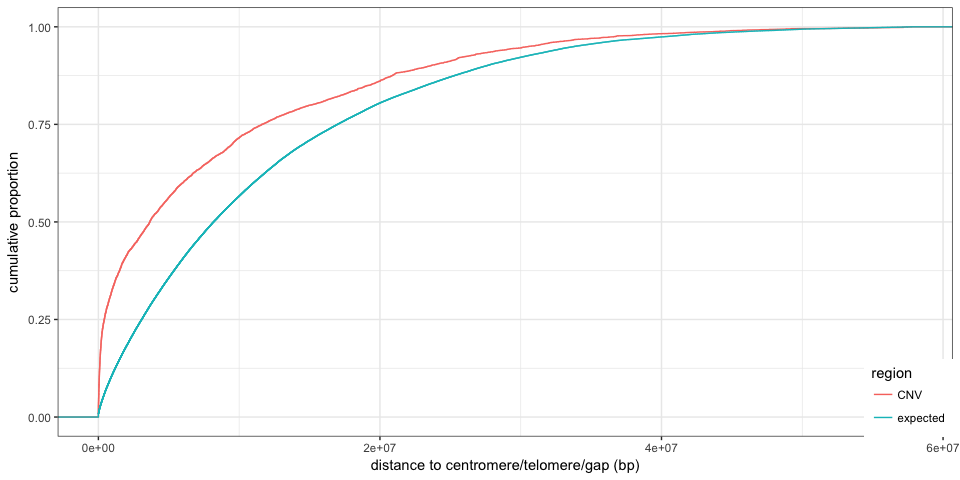
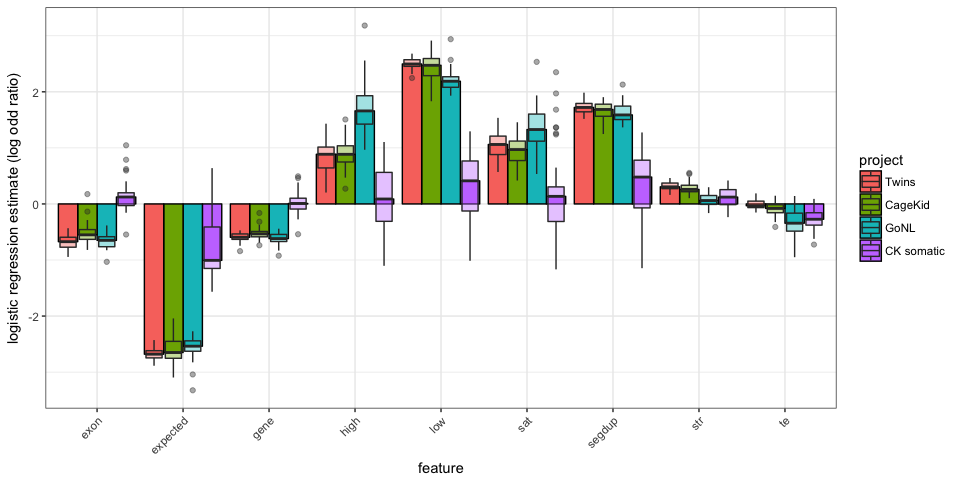
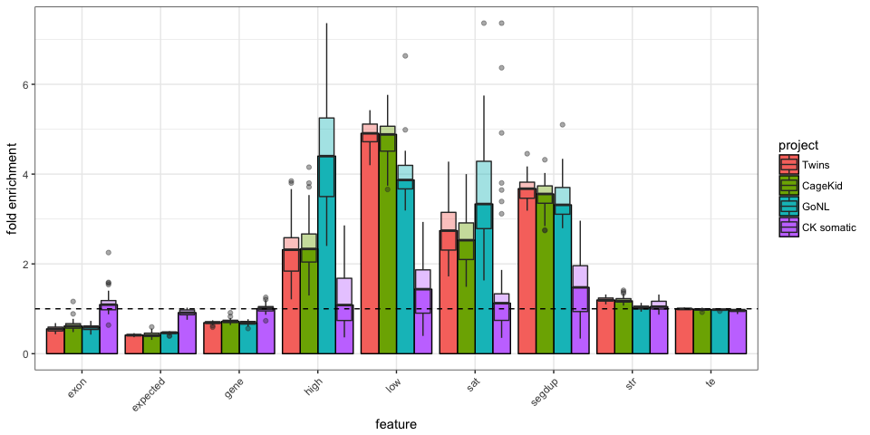
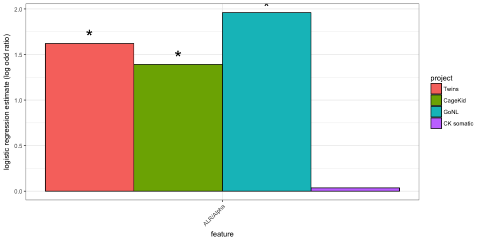
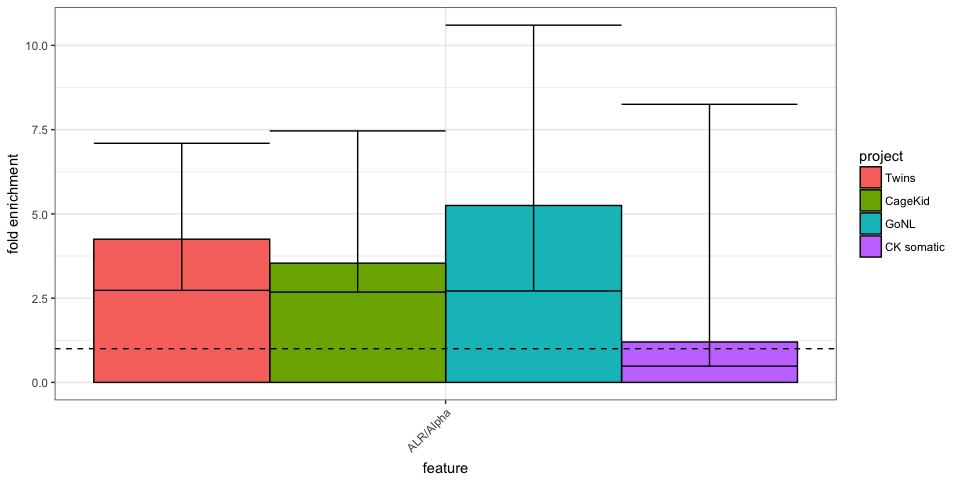
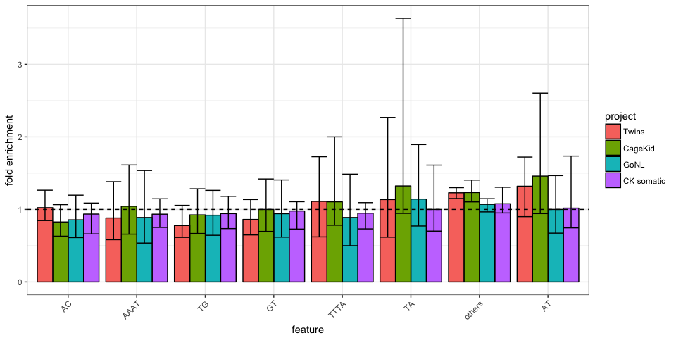
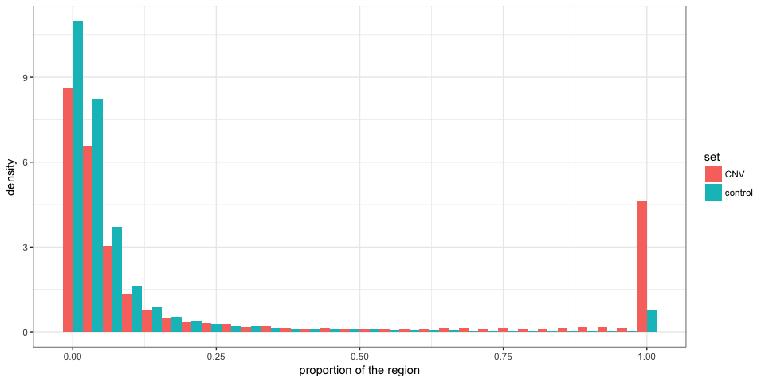
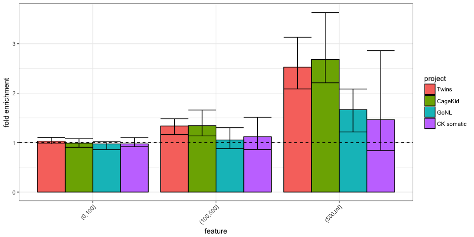
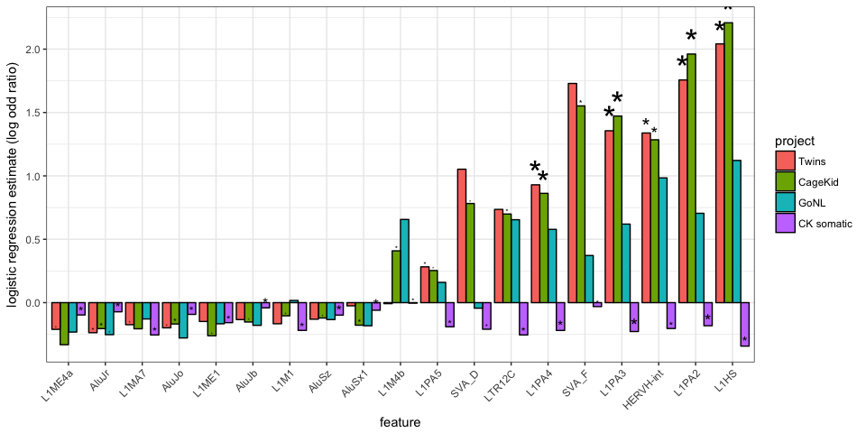

CNV enrichment in low-mappability regions
=========================================

Load packages and functions
---------------------------

``` r
library(dplyr)
library(magrittr)
library(ggplot2)
library(tidyr)
library(GenomicRanges)
library(knitr)
library(PopSV)
library(broom)

winsor <- function(x, u = NULL, l = NULL) {
    if (!is.null(u) & any(x > u)) 
        x[x > u] = u
    if (!is.null(l) & any(x < l)) 
        x[x < l] = l
    x
}
olProp <- function(qgr, sgr) {
    sgr = reduce(sgr)
    ol = findOverlaps(qgr, sgr) %>% as.data.frame %>% mutate(qw = width(qgr)[queryHits], 
        qsw = width(pintersect(qgr[queryHits], sgr[subjectHits]))) %>% group_by(queryHits) %>% 
        summarize(prop = sum(qsw/qw))
    res = rep(0, length(qgr))
    res[ol$queryHits] = ol$prop
    res
}
olLoc <- function(qgr, sgr) {
    sgr = reduce(sgr)
    qgr.center = resize(qgr, width(qgr) * 0.5, fix = "center")
    center.ol = overlapsAny(qgr.center, sgr)
    qgr.flank1 = GenomicRanges::shift(flank(qgr, width(qgr) * 0.25), width(qgr) * 
        0.25)
    qgr.flank2 = GenomicRanges::shift(flank(qgr, width(qgr) * 0.25, start = FALSE), 
        -width(qgr) * 0.25)
    flank.ol = overlapsAny(qgr.flank1, sgr) | overlapsAny(qgr.flank2, sgr)
    out = rep("none", length(qgr))
    out[which(center.ol)] = "center"
    out[which(flank.ol)] = "flank"
    out[which(flank.ol & center.ol)] = "center-flank"
    out
}
NB.CORES = 3
```

CNV catalog
-----------

``` r
cnv.germ = read.table("../data/CNV-PopSV-Twin_CageKid_GoNL-germline.tsv", as.is = TRUE, 
    header = TRUE)
cnv.germ %<>% mutate(project = ifelse(grepl("gonl", sample), "GoNL", "Twins"), 
    project = ifelse(grepl("ck", sample), "CageKid", project), type = ifelse(cn < 
        2, "DEL", "DUP"), germline = TRUE)
germ.samps = unique(cnv.germ$sample)
som.df = read.table("../data/CNV-PopSV-CageKid-somatic.tsv", as.is = TRUE, header = TRUE)
som.df %<>% mutate(project = "CK somatic", type = ifelse(cn < 2, "DEL", "DUP"), 
    germline = FALSE)
cnv.df = rbind(cnv.germ, som.df)
projects.df = cnv.df %>% select(sample, project, germline) %>% unique %>% mutate(project = factor(project, 
    levels = c("Twins", "CageKid", "GoNL", "CK somatic")))
subsamps = projects.df %>% group_by(project) %>% filter(sample %in% sample(sample, 
    45)) %>% .$sample
projects.df %<>% filter(sample %in% subsamps)
cnv.df %<>% filter(sample %in% subsamps)
cnv.germ %<>% filter(sample %in% subsamps)
```

Distance to centromere/telomere/gap
-----------------------------------

``` r
load("../data/centelgap.RData")
rand.gr = draw.controls(cnv.df, list(centel = centelgap), redo.duplicates = TRUE, 
    nb.cores = NB.CORES)
dc.df = rbind(cnv.df %>% makeGRangesFromDataFrame %>% distanceToNearest(centelgap) %>% 
    as.data.frame %>% mutate(region = "CNV", sample = cnv.df$sample[queryHits]), 
    distanceToNearest(rand.gr, centelgap) %>% as.data.frame %>% mutate(region = "expected", 
        sample = rand.gr$sample[queryHits]))
dc.df = merge(dc.df, projects.df)
```

``` r
dc.df %>% filter(germline) %>% ggplot(aes(x = distance, colour = region)) + 
    stat_ecdf() + theme_bw() + xlab("distance to centromere/telomere/gap (bp)") + 
    ylab("cumulative proportion") + theme(legend.position = c(1, 0), legend.justification = c(1, 
    0))
```



``` r
dc.df %>% filter(germline) %>% ggplot(aes(x = winsor(distance, 1e+07), colour = region)) + 
    stat_ecdf() + theme_bw() + xlab("distance to centromere/telomere/gap (bp)") + 
    ylab("cumulative proportion") + theme(legend.position = c(1, 0), legend.justification = c(1, 
    0))
```


``` r
dc.df %>% filter(germline) %>% ggplot(aes(x = distance, colour = region)) + 
    stat_ecdf() + theme_bw() + xlab("distance to centromere/telomere/gap (bp)") + 
    ylab("cumulative proportion") + theme(legend.position = c(1, 0), legend.justification = c(1, 
    0)) + scale_x_log10()
```


``` r
ggplot(dc.df, aes(x = distance, colour = region)) + stat_ecdf() + theme_bw() + 
    xlab("distance to centromere/telomere/gap (bp)") + ylab("cumulative proportion") + 
    theme(legend.position = c(1, 0), legend.justification = c(1, 0)) + facet_wrap(~project)
```


``` r
dc.df %>% group_by(region, project) %>% summarize(centelgap.1Mb = mean(distance < 
    1e+06)) %>% arrange(project, region) %>% kable(digits = 3)
```

| region   | project    |  centelgap.1Mb|
|:---------|:-----------|--------------:|
| CNV      | Twins      |          0.335|
| expected | Twins      |          0.113|
| CNV      | CageKid    |          0.334|
| expected | CageKid    |          0.112|
| CNV      | GoNL       |          0.321|
| expected | GoNL       |          0.118|
| CNV      | CK somatic |          0.106|
| expected | CK somatic |          0.106|

Low-mappability and repeat classes
----------------------------------

### Controlling for the distance to centromere/telomere/gap

By using controls with similar distribution

``` r
null.centelD.grl = list(centel = centelgap, centel.flank = reduce(c(flank(centelgap, 
    5e+05), flank(centelgap, 5e+05, start = FALSE))), centel.flank2 = reduce(c(flank(centelgap, 
    3e+06), flank(centelgap, 3e+06, start = FALSE))))
rand.centelD.gr = draw.controls(cnv.df, null.centelD.grl, redo.duplicates = TRUE, 
    nb.cores = NB.CORES)

dcc.df = rbind(dc.df %>% filter(germline) %>% select(-project, -germline), distanceToNearest(subset(rand.centelD.gr, 
    sample %in% germ.samps), centelgap) %>% as.data.frame %>% mutate(region = "centel-ctrl expected", 
    sample = rand.centelD.gr$sample[queryHits]))

ggplot(dcc.df, aes(x = distance, colour = region)) + stat_ecdf() + theme_bw() + 
    xlab("distance to centromere/telomere/gap (bp)") + ylab("cumulative proportion") + 
    theme(legend.position = c(1, 0), legend.justification = c(1, 0))
```


### Mappability, gene and repeat annotation

``` r
load("../data/twins-coverage-tracks-5kbp.RData")
covrepclass.grl = ns.df %>% makeGRangesFromDataFrame %>% split(ns.df$cov.class) %>% 
    as.list
load("../data/gencodev19-proteincoding-genes-exons.RData")
covrepclass.grl$gene = genes
covrepclass.grl$exon = exons
load("../data/segdup.RData")
covrepclass.grl$segdup = segdup
load("../data/simprep.RData")
covrepclass.grl$str = simprep
load("../data/rm.RData")
sat.gr = subset(rm, repClass == "Satellite")
te.gr = subset(rm, repClass %in% c("LINE", "SINE", "DNA", "Other", "LTR"))
covrepclass.grl$sat = sat.gr
covrepclass.grl$te = te.gr
```

### Enrichment

``` r
regionChar <- function(reg.df, genfeat.grl, null.gr, nb.cores = 1) {
    reg.gr = makeGRangesFromDataFrame(reg.df, keep.extra.columns = TRUE)
    rcF <- function(gf.n, reg.gr, null.gr) {
        rc.df = rbind(data.frame(set = "CNV", sample = reg.gr$sample, ol = overlapsAny(reg.gr, 
            genfeat.grl[[gf.n]])), data.frame(set = "control", sample = null.gr$sample, 
            ol = overlapsAny(null.gr, genfeat.grl[[gf.n]])))
        fc.df = rc.df %>% group_by(set, sample) %>% summarize(prop = (sum(ol) + 
            1)/(1 + n())) %>% mutate(feature = gf.n) %>% spread(set, prop) %>% 
            mutate(prop.ratio = CNV/control) %>% as.data.frame
        lr.df = rc.df %>% group_by(sample) %>% mutate(cnv = set == "CNV") %>% 
            do(glm(ol ~ cnv, data = ., family = binomial()) %>% tidy)
        lr.df %>% filter(term == "cnvTRUE") %>% select(sample, estimate, p.value) %>% 
            merge(fc.df)
    }
    rc.enr = mclapply(names(genfeat.grl), rcF, reg.gr, null.gr, mc.cores = nb.cores)
    rc.enr = do.call(rbind, rc.enr)
}

covclass.enr = regionChar(cnv.df, covrepclass.grl, rand.centelD.gr, nb.cores = NB.CORES)
covclass.enr = merge(covclass.enr, projects.df)
covclass.enr.s = covclass.enr %>% group_by(project, feature) %>% summarize(estimate = median(estimate, 
    na.rm = TRUE), p.value = median(p.value, na.rm = TRUE), prop.ratio = median(prop.ratio, 
    na.rm = TRUE), prop.region = median(CNV, na.rm = TRUE), prop.null = median(control, 
    na.rm = TRUE))
```

``` r
prop.est.max = max(covclass.enr.s$estimate) * 1.5
ggplot(covclass.enr, aes(x = feature, fill = project, y = winsor(estimate, prop.est.max))) + 
    ggplot2::geom_bar(colour = "black", stat = "identity", position = "dodge", 
        data = covclass.enr.s) + geom_boxplot(alpha = 0.4, position = position_dodge(0.9)) + 
    theme_bw() + theme(axis.text.x = element_text(angle = 45, hjust = 1)) + 
    xlab("feature") + ylab("logistic regression estimate (log odd ratio)")
```



``` r
prop.ratio.max = max(covclass.enr.s$prop.ratio) * 1.5
ggplot(covclass.enr, aes(x = feature, fill = project, y = winsor(prop.ratio, 
    prop.ratio.max))) + ggplot2::geom_bar(colour = "black", stat = "identity", 
    position = "dodge", data = covclass.enr.s) + geom_boxplot(alpha = 0.4, position = position_dodge(0.9)) + 
    theme_bw() + theme(axis.text.x = element_text(angle = 45, hjust = 1)) + 
    xlab("feature") + ylab("fold enrichment") + geom_hline(yintercept = 1, linetype = 2)
```



``` r
covclass.enr.s %>% mutate(p.value = as.character(signif(p.value, 3))) %>% kable(digits = 3)
```

| project    | feature  |  estimate| p.value   |  prop.ratio|  prop.region|  prop.null|
|:-----------|:---------|---------:|:----------|-----------:|------------:|----------:|
| Twins      | exon     |    -0.705| 4.2e-10   |       0.538|        0.082|      0.152|
| Twins      | expected |    -2.624| 1.06e-169 |       0.414|        0.372|      0.890|
| Twins      | gene     |    -0.589| 1.06e-15  |       0.692|        0.311|      0.448|
| Twins      | high     |     0.742| 0.0101    |       2.000|        0.023|      0.011|
| Twins      | low      |     2.454| 4.56e-168 |       4.718|        0.651|      0.138|
| Twins      | sat      |     0.972| 1.1e-05   |       2.516|        0.049|      0.018|
| Twins      | segdup   |     1.700| 1.24e-74  |       3.569|        0.420|      0.118|
| Twins      | str      |     0.315| 8.21e-06  |       1.205|        0.454|      0.378|
| Twins      | te       |     0.014| 0.519     |       1.002|        0.845|      0.846|
| CageKid    | exon     |    -0.588| 1.63e-08  |       0.594|        0.082|      0.141|
| CageKid    | expected |    -2.608| 1.36e-211 |       0.403|        0.359|      0.886|
| CageKid    | gene     |    -0.548| 1.07e-16  |       0.711|        0.319|      0.449|
| CageKid    | high     |     0.890| 0.000902  |       2.333|        0.024|      0.010|
| CageKid    | low      |     2.450| 1.72e-206 |       4.639|        0.656|      0.138|
| CageKid    | sat      |     0.887| 1.05e-05  |       2.333|        0.041|      0.017|
| CageKid    | segdup   |     1.673| 1.05e-89  |       3.457|        0.418|      0.119|
| CageKid    | str      |     0.265| 7.16e-05  |       1.182|        0.403|      0.342|
| CageKid    | te       |    -0.086| 0.177     |       0.985|        0.819|      0.829|
| GoNL       | exon     |    -0.634| 0.000101  |       0.600|        0.131|      0.224|
| GoNL       | expected |    -2.542| 2.38e-52  |       0.469|        0.422|      0.898|
| GoNL       | gene     |    -0.612| 6.91e-07  |       0.688|        0.318|      0.459|
| GoNL       | high     |     1.723| 5e-04     |       4.600|        0.051|      0.011|
| GoNL       | low      |     2.146| 2.45e-50  |       3.909|        0.622|      0.162|
| GoNL       | sat      |     1.206| 0.000178  |       3.000|        0.069|      0.024|
| GoNL       | segdup   |     1.629| 2.46e-24  |       3.422|        0.402|      0.119|
| GoNL       | str      |     0.107| 0.387     |       1.041|        0.615|      0.590|
| GoNL       | te       |    -0.244| 0.334     |       0.986|        0.936|      0.950|
| CK somatic | exon     |     0.052| 0.0949    |       1.038|        0.232|      0.201|
| CK somatic | expected |    -0.989| 3.1e-17   |       0.913|        0.854|      0.938|
| CK somatic | gene     |    -0.002| 0.123     |       0.999|        0.492|      0.487|
| CK somatic | high     |    -0.135| 0.236     |       0.889|        0.009|      0.008|
| CK somatic | low      |     0.369| 1.87e-16  |       1.316|        0.205|      0.144|
| CK somatic | sat      |     0.041| 0.0844    |       1.040|        0.019|      0.017|
| CK somatic | segdup   |     0.393| 2.29e-09  |       1.382|        0.179|      0.094|
| CK somatic | str      |     0.088| 0.0105    |       1.053|        0.480|      0.419|
| CK somatic | te       |    -0.262| 0.00705   |       0.966|        0.840|      0.864|

Controlling for the SD enrichment
---------------------------------

``` r
null.sd.grl = list(segdup = segdup, centel = centelgap, centel.flank = reduce(c(flank(centelgap, 
    5e+05), flank(centelgap, 5e+05, start = FALSE))), centel.flank2 = reduce(c(flank(centelgap, 
    3e+06), flank(centelgap, 3e+06, start = FALSE))))
rand.sd.gr = draw.controls(cnv.df, null.sd.grl, redo.duplicates = TRUE, nb.cores = NB.CORES)
rand.sd.germ.gr = subset(rand.sd.gr, sample %in% germ.samps)
```

``` r
regionCharNoSD <- function(reg.df, genfeat.grl, null.gr, nb.cores = 1) {
    reg.gr = makeGRangesFromDataFrame(reg.df, keep.extra.columns = TRUE)
    rcF <- function(gf.n, reg.gr, null.gr) {
        rc.df = rbind(data.frame(set = "CNV", sample = reg.gr$sample, ol = overlapsAny(reg.gr, 
            genfeat.grl[[gf.n]]), sd = overlapsAny(reg.gr, segdup)), data.frame(set = "control", 
            sample = null.gr$sample, ol = overlapsAny(null.gr, genfeat.grl[[gf.n]]), 
            sd = overlapsAny(reg.gr, segdup)))
        fc.df = rc.df %>% group_by(set, sample) %>% summarize(prop = (sum(ol) + 
            1)/(1 + n())) %>% mutate(feature = gf.n) %>% spread(set, prop) %>% 
            mutate(prop.ratio = CNV/control) %>% as.data.frame
        lr.df = rc.df %>% group_by(sample) %>% mutate(cnv = set == "CNV") %>% 
            do(glm(ol ~ cnv + sd, data = ., family = binomial()) %>% tidy)
        lr.df %>% filter(term == "cnvTRUE") %>% select(sample, estimate, p.value) %>% 
            merge(fc.df)
    }
    rc.enr = mclapply(names(genfeat.grl), rcF, reg.gr, null.gr, mc.cores = nb.cores)
    rc.enr = do.call(rbind, rc.enr)
}

covclass.enr.nosd = regionCharNoSD(cnv.df, covrepclass.grl, rand.sd.gr, nb.cores = NB.CORES)
covclass.enr.nosd = merge(covclass.enr.nosd, projects.df)
covclass.enr.nosd.s = covclass.enr.nosd %>% group_by(project, feature) %>% summarize(estimate = median(estimate, 
    na.rm = TRUE), p.value = median(p.value, na.rm = TRUE), prop.ratio = median(prop.ratio, 
    na.rm = TRUE), prop.region = median(CNV, na.rm = TRUE), prop.null = median(control, 
    na.rm = TRUE))
```

``` r
prop.est.max = max(covclass.enr.nosd.s$estimate) * 1.5
ggplot(covclass.enr.nosd, aes(x = feature, fill = project, y = winsor(estimate, 
    prop.est.max))) + ggplot2::geom_bar(colour = "black", stat = "identity", 
    position = "dodge", data = covclass.enr.nosd.s) + geom_boxplot(alpha = 0.4, 
    position = position_dodge(0.9)) + theme_bw() + theme(axis.text.x = element_text(angle = 45, 
    hjust = 1)) + xlab("feature") + ylab("logistic regression estimate (log odd ratio)")
```


``` r
prop.ratio.max = max(covclass.enr.nosd.s$prop.ratio) * 1.5
ggplot(covclass.enr.nosd, aes(x = feature, fill = project, y = winsor(prop.ratio, 
    prop.ratio.max))) + ggplot2::geom_bar(colour = "black", stat = "identity", 
    position = "dodge", data = covclass.enr.nosd.s) + geom_boxplot(alpha = 0.4, 
    position = position_dodge(0.9)) + theme_bw() + theme(axis.text.x = element_text(angle = 45, 
    hjust = 1)) + xlab("feature") + ylab("fold enrichment") + geom_hline(yintercept = 1, 
    linetype = 2)
```


``` r
covclass.enr.nosd.s %>% mutate(p.value = as.character(signif(p.value, 3))) %>% 
    kable(digits = 3)
```

| project    | feature  |  estimate| p.value   |  prop.ratio|  prop.region|  prop.null|
|:-----------|:---------|---------:|:----------|-----------:|------------:|----------:|
| Twins      | exon     |    -0.665| 1.74e-08  |       0.575|        0.082|      0.145|
| Twins      | expected |    -1.623| 2.04e-90  |       0.500|        0.372|      0.739|
| Twins      | gene     |    -0.357| 7.94e-07  |       0.789|        0.311|      0.396|
| Twins      | high     |     0.142| 0.399     |       1.250|        0.023|      0.018|
| Twins      | low      |     1.542| 5.3e-84   |       2.196|        0.651|      0.298|
| Twins      | sat      |     0.928| 1.81e-05  |       2.406|        0.049|      0.020|
| Twins      | segdup   |    -0.125| 0.0782    |       1.041|        0.420|      0.404|
| Twins      | str      |     0.313| 8.25e-06  |       1.195|        0.454|      0.377|
| Twins      | te       |    -0.009| 0.572     |       0.998|        0.845|      0.849|
| CageKid    | exon     |    -0.523| 2.98e-07  |       0.637|        0.082|      0.131|
| CageKid    | expected |    -1.605| 2.61e-109 |       0.495|        0.359|      0.728|
| CageKid    | gene     |    -0.322| 2.08e-06  |       0.800|        0.319|      0.396|
| CageKid    | high     |     0.141| 0.307     |       1.195|        0.024|      0.018|
| CageKid    | low      |     1.515| 5.43e-102 |       2.158|        0.656|      0.298|
| CageKid    | sat      |     0.821| 3.49e-05  |       2.170|        0.041|      0.019|
| CageKid    | segdup   |    -0.056| 0.0619    |       1.046|        0.418|      0.398|
| CageKid    | str      |     0.251| 0.000165  |       1.169|        0.403|      0.345|
| CageKid    | te       |    -0.133| 0.11      |       0.976|        0.819|      0.834|
| GoNL       | exon     |    -0.645| 0.00017   |       0.600|        0.131|      0.217|
| GoNL       | expected |    -1.606| 1e-29     |       0.552|        0.422|      0.772|
| GoNL       | gene     |    -0.450| 0.000454  |       0.751|        0.318|      0.420|
| GoNL       | high     |     0.977| 0.00681   |       2.615|        0.051|      0.020|
| GoNL       | low      |     1.395| 2.47e-25  |       2.071|        0.622|      0.302|
| GoNL       | sat      |     1.085| 0.00125   |       2.688|        0.069|      0.027|
| GoNL       | segdup   |    -0.190| 0.124     |       1.013|        0.402|      0.397|
| GoNL       | str      |     0.066| 0.429     |       1.037|        0.615|      0.590|
| GoNL       | te       |    -0.422| 0.104     |       0.977|        0.936|      0.958|
| CK somatic | exon     |     0.015| 0.0671    |       1.040|        0.232|      0.198|
| CK somatic | expected |    -0.386| 0.000453  |       0.930|        0.854|      0.920|
| CK somatic | gene     |     0.038| 0.0913    |       1.019|        0.492|      0.483|
| CK somatic | high     |    -0.053| 0.173     |       0.957|        0.009|      0.010|
| CK somatic | low      |    -0.057| 0.0103    |       1.200|        0.205|      0.178|
| CK somatic | sat      |    -0.105| 0.334     |       1.063|        0.019|      0.017|
| CK somatic | segdup   |    -0.350| 5.96e-08  |       1.027|        0.179|      0.169|
| CK somatic | str      |     0.072| 0.0501    |       1.054|        0.480|      0.432|
| CK somatic | te       |    -0.258| 0.00854   |       0.969|        0.840|      0.869|

Satellite families
------------------

### Enrichment

``` r
sat.grl = split(sat.gr, sat.gr$repName)
sat.enr.nosd = regionCharNoSD(cnv.df, sat.grl, rand.sd.gr, nb.cores = NB.CORES)
sat.enr.nosd %<>% group_by(sample) %>% mutate(qv = p.adjust(p.value, method = "fdr")) %>% 
    merge(projects.df)
```

``` r
sat.enr.nosd.s = sat.enr.nosd %>% filter(germline) %>% group_by(feature) %>% 
    filter(any(qv < 0.05)) %>% select(feature) %>% unique
sat.enr.nosd %>% filter(feature %in% sat.enr.nosd.s$feature) %>% group_by(project, 
    feature) %>% summarize(estimate = median(estimate, na.rm = TRUE), qv = mean(qv < 
    0.05)) %>% ggplot(aes(x = reorder(feature, estimate, median), fill = project, 
    y = estimate)) + geom_bar(color = "black", position = "dodge", stat = "identity") + 
    theme_bw() + theme(axis.text.x = element_text(angle = 45, hjust = 1)) + 
    xlab("feature") + ylab("logistic regression estimate (log odd ratio)") + 
    geom_text(aes(size = qv), label = "*", position = position_dodge(0.9), vjust = 0, 
        show_guide = FALSE) + scale_size_continuous(name = "proportion\nsignificant\nsamples", 
    range = c(0, 10))
```



``` r
sat.enr.nosd %>% filter(feature %in% sat.enr.nosd.s$feature) %>% group_by(project, 
    feature) %>% summarize(ratio = median(prop.ratio, na.rm = TRUE), ratio5 = quantile(prop.ratio, 
    0.05, na.rm = TRUE), ratio95 = quantile(prop.ratio, 0.95, na.rm = TRUE)) %>% 
    ggplot(aes(x = reorder(feature, ratio, median), fill = project, y = ratio)) + 
    geom_bar(color = "black", position = "dodge", stat = "identity") + geom_errorbar(aes(group = project, 
    ymin = ratio5, ymax = ratio95), position = "dodge") + theme_bw() + theme(axis.text.x = element_text(angle = 45, 
    hjust = 1)) + xlab("feature") + ylab("fold enrichment") + geom_hline(yintercept = 1, 
    linetype = 2)
```



``` r
sat.enr.nosd %>% filter(feature %in% sat.enr.nosd.s$feature) %>% group_by(project, 
    feature) %>% summarize(estimate = median(estimate, na.rm = TRUE), p.value = median(p.value, 
    na.rm = TRUE), prop.ratio = median(prop.ratio, na.rm = TRUE), prop.region = median(CNV, 
    na.rm = TRUE), prop.null = median(control, na.rm = TRUE)) %>% mutate(p.value = as.character(signif(p.value, 
    3))) %>% kable(digits = 3)
```

| project    | feature   |  estimate| p.value  |  prop.ratio|  prop.region|  prop.null|
|:-----------|:----------|---------:|:---------|-----------:|------------:|----------:|
| Twins      | ALR/Alpha |     1.598| 6.34e-06 |       4.300|        0.029|      0.006|
| CageKid    | ALR/Alpha |     1.429| 8.73e-06 |       3.818|        0.024|      0.006|
| GoNL       | ALR/Alpha |     1.870| 0.000724 |       5.000|        0.046|      0.009|
| CK somatic | ALR/Alpha |     0.017| 0.263    |       1.069|        0.007|      0.006|

### Overlap distribution

Proportion of the call overlapped

``` r
cnv.germ$sat.prop = cnv.germ %>% makeGRangesFromDataFrame %>% olProp(sat.gr)
cnv.germ$sat.loc = cnv.germ %>% makeGRangesFromDataFrame %>% olLoc(sat.gr)
rand.sd.germ.gr$sat.prop = olProp(rand.sd.germ.gr, sat.gr)
rand.sd.germ.gr$sat.loc = olLoc(rand.sd.germ.gr, sat.gr)

sat.ol = rbind(cnv.germ %>% select(sat.prop, sat.loc) %>% mutate(set = "CNV"), 
    rand.sd.germ.gr %>% as.data.frame %>% select(sat.prop, sat.loc) %>% mutate(set = "control"))

sat.ol %>% filter(sat.prop > 0) %>% ggplot(aes(x = sat.prop, fill = set, y = ..density..)) + 
    geom_histogram(position = "dodge") + theme_bw() + xlab("proportion of the region") + 
    ylab("density")
```


``` r
sat.ol %>% filter(sat.prop > 0) %>% group_by(sat.loc, set) %>% summarize(nb = n()) %>% 
    group_by(set) %>% mutate(prop = nb/sum(nb)) %>% ggplot(aes(x = sat.loc, 
    fill = set, y = prop)) + ggplot2::geom_bar(stat = "identity", position = "dodge") + 
    theme_bw() + xlab("location relative to the region") + ylab("proportion of regions")
```


STR families
------------

### Enrichment

``` r
str.ordered = simprep %>% as.data.frame %>% group_by(sequence) %>% summarize(n = n()) %>% 
    arrange(desc(n))
simprep$sequence2 = ifelse(simprep$sequence %in% head(str.ordered$sequence, 
    20), simprep$sequence, "others")
simprepl = split(simprep, simprep$sequence2)

str.enr.nosd = regionCharNoSD(cnv.df, simprepl, rand.sd.gr, nb.cores = NB.CORES)
str.enr.nosd %<>% group_by(sample) %>% mutate(qv = p.adjust(p.value, method = "fdr")) %>% 
    merge(projects.df)
```

``` r
str.enr.nosd.s = str.enr.nosd %>% filter(germline) %>% group_by(feature) %>% 
    filter(any(qv < 0.05)) %>% select(feature) %>% unique
str.enr.nosd %>% filter(feature %in% str.enr.nosd.s$feature) %>% group_by(project, 
    feature) %>% summarize(estimate = median(estimate, na.rm = TRUE), qv = mean(qv < 
    0.05)) %>% ggplot(aes(x = reorder(feature, estimate, median), fill = project, 
    y = estimate)) + geom_bar(color = "black", position = "dodge", stat = "identity") + 
    theme_bw() + theme(axis.text.x = element_text(angle = 45, hjust = 1)) + 
    xlab("feature") + ylab("logistic regression estimate (log odd ratio)") + 
    geom_text(aes(size = qv), label = "*", position = position_dodge(0.9), vjust = 0, 
        show_guide = FALSE) + scale_size_continuous(name = "proportion\nsignificant\nsamples", 
    range = c(0, 10))
```


``` r
str.enr.nosd %>% filter(feature %in% str.enr.nosd.s$feature) %>% group_by(project, 
    feature) %>% summarize(ratio = median(prop.ratio, na.rm = TRUE), ratio5 = quantile(prop.ratio, 
    0.05, na.rm = TRUE), ratio95 = quantile(prop.ratio, 0.95, na.rm = TRUE)) %>% 
    ggplot(aes(x = reorder(feature, ratio, median), fill = project, y = ratio)) + 
    geom_bar(color = "black", position = "dodge", stat = "identity") + geom_errorbar(aes(group = project, 
    ymin = ratio5, ymax = ratio95), position = "dodge") + theme_bw() + theme(axis.text.x = element_text(angle = 45, 
    hjust = 1)) + xlab("feature") + ylab("fold enrichment") + geom_hline(yintercept = 1, 
    linetype = 2)
```



``` r
str.enr.nosd %>% filter(feature %in% str.enr.nosd.s$feature) %>% group_by(project, 
    feature) %>% summarize(estimate = median(estimate, na.rm = TRUE), p.value = median(p.value, 
    na.rm = TRUE), prop.ratio = median(prop.ratio, na.rm = TRUE), prop.region = median(CNV, 
    na.rm = TRUE), prop.null = median(control, na.rm = TRUE)) %>% mutate(p.value = as.character(signif(p.value, 
    3))) %>% kable(digits = 3)
```

| project    | feature |  estimate| p.value  |  prop.ratio|  prop.region|  prop.null|
|:-----------|:--------|---------:|:---------|-----------:|------------:|----------:|
| Twins      | AT      |     0.320| 0.217    |       1.375|        0.021|      0.017|
| Twins      | others  |     0.336| 5.53e-06 |       1.237|        0.401|      0.323|
| Twins      | TA      |     0.117| 0.386    |       1.095|        0.017|      0.015|
| Twins      | TG      |    -0.309| 0.215    |       0.760|        0.019|      0.024|
| Twins      | TTTA    |     0.167| 0.389    |       1.176|        0.009|      0.008|
| CageKid    | AT      |     0.417| 0.109    |       1.480|        0.019|      0.014|
| CageKid    | others  |     0.272| 7.17e-05 |       1.202|        0.355|      0.296|
| CageKid    | TA      |     0.441| 0.107    |       1.526|        0.019|      0.013|
| CageKid    | TG      |    -0.153| 0.455    |       0.889|        0.018|      0.021|
| CageKid    | TTTA    |     0.067| 0.587    |       1.118|        0.009|      0.007|
| GoNL       | AT      |    -0.003| 0.645    |       1.000|        0.030|      0.032|
| GoNL       | others  |     0.136| 0.206    |       1.076|        0.547|      0.512|
| GoNL       | TA      |     0.028| 0.589    |       1.053|        0.033|      0.030|
| GoNL       | TG      |    -0.145| 0.471    |       0.889|        0.044|      0.047|
| GoNL       | TTTA    |    -0.196| 0.579    |       0.857|        0.015|      0.016|
| CK somatic | AT      |    -0.055| 0.424    |       1.010|        0.060|      0.063|
| CK somatic | others  |     0.085| 0.0337   |       1.062|        0.422|      0.375|
| CK somatic | TA      |    -0.065| 0.14     |       1.024|        0.056|      0.059|
| CK somatic | TG      |    -0.113| 0.283    |       0.957|        0.078|      0.082|
| CK somatic | TTTA    |    -0.173| 0.235    |       0.945|        0.036|      0.037|

### Overlap distribution

Proportion of the call overlapped

``` r
cnv.germ$str.prop = cnv.germ %>% makeGRangesFromDataFrame %>% olProp(simprep)
cnv.germ$str.loc = cnv.germ %>% makeGRangesFromDataFrame %>% olLoc(simprep)
rand.sd.germ.gr$str.prop = olProp(rand.sd.germ.gr, simprep)
rand.sd.germ.gr$str.loc = olLoc(rand.sd.germ.gr, simprep)

str.ol = rbind(cnv.germ %>% select(str.prop, str.loc) %>% mutate(set = "CNV"), 
    rand.sd.germ.gr %>% as.data.frame %>% select(str.prop, str.loc) %>% mutate(set = "control"))

str.ol %>% filter(str.prop > 0) %>% ggplot(aes(x = str.prop, fill = set, y = ..density..)) + 
    geom_histogram(position = "dodge") + theme_bw() + xlab("proportion of the region") + 
    ylab("density")
```



``` r
str.ol %>% filter(str.prop > 0) %>% group_by(str.loc, set) %>% summarize(nb = n()) %>% 
    group_by(set) %>% mutate(prop = nb/sum(nb)) %>% ggplot(aes(x = str.loc, 
    fill = set, y = prop)) + ggplot2::geom_bar(stat = "identity", position = "dodge") + 
    theme_bw() + xlab("location relative to the region") + ylab("proportion of regions")
```


### Size of the STRs overlapped

``` r
simprep.size.grl = split(simprep, cut(width(simprep), breaks = c(0, 100, 500, 
    Inf)))
strsize.enr.nosd = regionCharNoSD(cnv.df, simprep.size.grl, rand.sd.gr, nb.cores = NB.CORES)
strsize.enr.nosd %<>% group_by(sample) %>% mutate(qv = p.adjust(p.value, method = "fdr")) %>% 
    merge(projects.df)

strsize.enr.nosd %>% group_by(project, feature) %>% summarize(estimate = median(estimate, 
    na.rm = TRUE), qv = mean(qv < 0.05)) %>% ggplot(aes(x = reorder(feature, 
    estimate, median), fill = project, y = estimate)) + geom_bar(color = "black", 
    position = "dodge", stat = "identity") + theme_bw() + theme(axis.text.x = element_text(angle = 45, 
    hjust = 1)) + xlab("feature") + ylab("logistic regression estimate (log odd ratio)") + 
    geom_text(aes(size = qv), label = "*", position = position_dodge(0.9), vjust = 0, 
        show_guide = FALSE) + scale_size_continuous(name = "proportion\nsignificant\nsamples", 
    range = c(0, 10))
```


``` r
strsize.enr.nosd %>% group_by(project, feature) %>% summarize(ratio = median(prop.ratio, 
    na.rm = TRUE), ratio5 = quantile(prop.ratio, 0.05, na.rm = TRUE), ratio95 = quantile(prop.ratio, 
    0.95, na.rm = TRUE)) %>% ggplot(aes(x = reorder(feature, ratio, median), 
    fill = project, y = ratio)) + geom_bar(color = "black", position = "dodge", 
    stat = "identity") + geom_errorbar(aes(group = project, ymin = ratio5, ymax = ratio95), 
    position = "dodge") + theme_bw() + theme(axis.text.x = element_text(angle = 45, 
    hjust = 1)) + xlab("feature") + ylab("fold enrichment") + geom_hline(yintercept = 1, 
    linetype = 2)
```



``` r
strsize.enr.nosd %>% group_by(project, feature) %>% summarize(estimate = median(estimate, 
    na.rm = TRUE), p.value = median(p.value, na.rm = TRUE), prop.ratio = median(prop.ratio, 
    na.rm = TRUE), prop.region = median(CNV, na.rm = TRUE), prop.null = median(control, 
    na.rm = TRUE)) %>% mutate(p.value = as.character(signif(p.value, 3))) %>% 
    kable(digits = 3)
```

| project    | feature    |  estimate| p.value |  prop.ratio|  prop.region|  prop.null|
|:-----------|:-----------|---------:|:--------|-----------:|------------:|----------:|
| Twins      | (0,100\]   |     0.032| 0.64    |       1.029|        0.350|      0.338|
| Twins      | (100,500\] |     0.350| 0.00137 |       1.361|        0.141|      0.102|
| Twins      | (500,Inf\] |     1.020| 1e-13   |       2.494|        0.130|      0.051|
| CageKid    | (0,100\]   |    -0.041| 0.421   |       0.973|        0.297|      0.303|
| CageKid    | (100,500\] |     0.284| 0.00226 |       1.295|        0.124|      0.094|
| CageKid    | (500,Inf\] |     1.071| 3.5e-18 |       2.645|        0.127|      0.049|
| GoNL       | (0,100\]   |    -0.097| 0.423   |       0.960|        0.527|      0.547|
| GoNL       | (100,500\] |     0.044| 0.587   |       1.066|        0.197|      0.182|
| GoNL       | (500,Inf\] |     0.593| 0.00413 |       1.729|        0.136|      0.079|
| CK somatic | (0,100\]   |    -0.066| 0.247   |       0.979|        0.388|      0.405|
| CK somatic | (100,500\] |    -0.005| 0.0458  |       1.084|        0.200|      0.178|
| CK somatic | (500,Inf\] |     0.260| 0.00159 |       1.352|        0.114|      0.081|

Transposable element
--------------------

### Family enrichment

``` r
tefam.grl = split(te.gr, te.gr$repFamily)
tefam.enr.nosd = regionCharNoSD(cnv.df, tefam.grl, rand.sd.gr, nb.cores = NB.CORES)
tefam.enr.nosd %<>% group_by(sample) %>% mutate(qv = p.adjust(p.value, method = "fdr")) %>% 
    merge(projects.df)
```

``` r
tefam.enr.nosd.s = tefam.enr.nosd %>% filter(germline) %>% group_by(feature) %>% 
    filter(any(qv < 0.05)) %>% select(feature) %>% unique
tefam.enr.nosd %>% filter(feature %in% tefam.enr.nosd.s$feature) %>% group_by(project, 
    feature) %>% summarize(estimate = median(estimate, na.rm = TRUE), qv = mean(qv < 
    0.05)) %>% ggplot(aes(x = reorder(feature, estimate, median), fill = project, 
    y = estimate)) + geom_bar(color = "black", position = "dodge", stat = "identity") + 
    theme_bw() + theme(axis.text.x = element_text(angle = 45, hjust = 1)) + 
    xlab("feature") + ylab("logistic regression estimate (log odd ratio)") + 
    geom_text(aes(size = qv), label = "*", position = position_dodge(0.9), vjust = 0, 
        show_guide = FALSE) + scale_size_continuous(name = "proportion\nsignificant\nsamples", 
    range = c(0, 10))
```


``` r
tefam.enr.nosd %>% filter(feature %in% tefam.enr.nosd.s$feature) %>% group_by(project, 
    feature) %>% summarize(ratio = median(prop.ratio, na.rm = TRUE), ratio5 = quantile(prop.ratio, 
    0.05, na.rm = TRUE), ratio95 = quantile(prop.ratio, 0.95, na.rm = TRUE)) %>% 
    ggplot(aes(x = reorder(feature, ratio, median), fill = project, y = ratio)) + 
    geom_bar(color = "black", position = "dodge", stat = "identity") + geom_errorbar(aes(group = project, 
    ymin = ratio5, ymax = ratio95), position = "dodge") + theme_bw() + theme(axis.text.x = element_text(angle = 45, 
    hjust = 1)) + xlab("feature") + ylab("fold enrichment") + geom_hline(yintercept = 1, 
    linetype = 2)
```


``` r
tefam.enr.nosd %>% filter(feature %in% tefam.enr.nosd.s$feature) %>% group_by(project, 
    feature) %>% summarize(estimate = median(estimate, na.rm = TRUE), p.value = median(p.value, 
    na.rm = TRUE), prop.ratio = median(prop.ratio, na.rm = TRUE), prop.region = median(CNV, 
    na.rm = TRUE), prop.null = median(control, na.rm = TRUE)) %>% mutate(p.value = as.character(signif(p.value, 
    3))) %>% kable(digits = 3)
```

| project    | feature       |  estimate| p.value  |  prop.ratio|  prop.region|  prop.null|
|:-----------|:--------------|---------:|:---------|-----------:|------------:|----------:|
| Twins      | Alu           |    -0.212| 0.00276  |       0.900|        0.438|      0.482|
| Twins      | CR1           |    -0.489| 0.00726  |       0.630|        0.032|      0.051|
| Twins      | ERV1          |     0.143| 0.15     |       1.145|        0.145|      0.126|
| Twins      | ERVK          |     0.224| 0.261    |       1.306|        0.024|      0.019|
| Twins      | ERVL-MaLR     |    -0.170| 0.0632   |       0.878|        0.182|      0.204|
| Twins      | Gypsy         |    -0.363| 0.338    |       0.706|        0.007|      0.010|
| Twins      | hAT           |    -0.058| 0.565    |       0.955|        0.014|      0.014|
| Twins      | hAT-Blackjack |    -0.297| 0.295    |       0.750|        0.013|      0.018|
| Twins      | hAT-Charlie   |    -0.257| 0.0106   |       0.815|        0.138|      0.170|
| Twins      | hAT-Tip100    |    -0.083| 0.509    |       0.932|        0.024|      0.026|
| Twins      | L1            |     0.306| 1.74e-05 |       1.168|        0.516|      0.444|
| Twins      | L2            |    -0.237| 0.00513  |       0.833|        0.204|      0.243|
| Twins      | MIR           |    -0.353| 1.91e-05 |       0.769|        0.218|      0.281|
| Twins      | Other         |     1.074| 0.00235  |       2.667|        0.020|      0.007|
| Twins      | RTE           |    -0.469| 0.137    |       0.652|        0.011|      0.017|
| Twins      | TcMar-Mariner |    -0.252| 0.356    |       0.806|        0.014|      0.018|
| Twins      | TcMar-Tc2     |    -0.258| 0.485    |       0.786|        0.007|      0.009|
| Twins      | TcMar-Tigger  |    -0.225| 0.0924   |       0.822|        0.068|      0.083|
| CageKid    | Alu           |    -0.273| 1.1e-05  |       0.863|        0.386|      0.449|
| CageKid    | CR1           |    -0.453| 0.00996  |       0.655|        0.031|      0.044|
| CageKid    | ERV1          |     0.144| 0.112    |       1.157|        0.132|      0.117|
| CageKid    | ERVK          |     0.239| 0.269    |       1.275|        0.022|      0.017|
| CageKid    | ERVL-MaLR     |    -0.147| 0.0692   |       0.886|        0.166|      0.187|
| CageKid    | Gypsy         |    -0.478| 0.197    |       0.640|        0.006|      0.010|
| CageKid    | hAT           |    -0.060| 0.624    |       0.952|        0.012|      0.012|
| CageKid    | hAT-Blackjack |    -0.277| 0.275    |       0.774|        0.012|      0.017|
| CageKid    | hAT-Charlie   |    -0.259| 0.00389  |       0.821|        0.124|      0.150|
| CageKid    | hAT-Tip100    |    -0.148| 0.446    |       0.887|        0.021|      0.025|
| CageKid    | L1            |     0.284| 4.77e-06 |       1.163|        0.484|      0.414|
| CageKid    | L2            |    -0.259| 0.000779 |       0.816|        0.177|      0.219|
| CageKid    | MIR           |    -0.347| 4.79e-06 |       0.767|        0.195|      0.256|
| CageKid    | Other         |     1.101| 0.00106  |       2.727|        0.017|      0.006|
| CageKid    | RTE           |    -0.554| 0.0678   |       0.593|        0.009|      0.015|
| CageKid    | TcMar-Mariner |    -0.226| 0.339    |       0.814|        0.013|      0.015|
| CageKid    | TcMar-Tc2     |    -0.230| 0.418    |       0.833|        0.007|      0.009|
| CageKid    | TcMar-Tigger  |    -0.172| 0.166    |       0.869|        0.063|      0.074|
| GoNL       | Alu           |    -0.226| 0.0741   |       0.933|        0.622|      0.673|
| GoNL       | CR1           |    -0.415| 0.0701   |       0.696|        0.063|      0.094|
| GoNL       | ERV1          |     0.207| 0.131    |       1.193|        0.235|      0.198|
| GoNL       | ERVK          |     0.424| 0.195    |       1.556|        0.049|      0.032|
| GoNL       | ERVL-MaLR     |     0.008| 0.586    |       0.995|        0.335|      0.330|
| GoNL       | Gypsy         |    -0.247| 0.505    |       0.786|        0.016|      0.022|
| GoNL       | hAT           |    -0.051| 0.511    |       0.955|        0.028|      0.029|
| GoNL       | hAT-Blackjack |    -0.329| 0.326    |       0.762|        0.030|      0.038|
| GoNL       | hAT-Charlie   |    -0.216| 0.101    |       0.856|        0.241|      0.276|
| GoNL       | hAT-Tip100    |    -0.067| 0.584    |       0.967|        0.048|      0.050|
| GoNL       | L1            |     0.161| 0.214    |       1.062|        0.637|      0.599|
| GoNL       | L2            |    -0.157| 0.229    |       0.906|        0.354|      0.385|
| GoNL       | MIR           |    -0.340| 0.00651  |       0.825|        0.367|      0.453|
| GoNL       | Other         |     0.098| 0.651    |       1.125|        0.014|      0.012|
| GoNL       | RTE           |    -0.503| 0.183    |       0.647|        0.020|      0.034|
| GoNL       | TcMar-Mariner |    -0.108| 0.473    |       0.905|        0.031|      0.033|
| GoNL       | TcMar-Tc2     |    -0.084| 0.533    |       1.000|        0.018|      0.016|
| GoNL       | TcMar-Tigger  |    -0.004| 0.521    |       1.013|        0.140|      0.140|
| CK somatic | Alu           |    -0.126| 0.0295   |       0.943|        0.473|      0.506|
| CK somatic | CR1           |    -0.097| 0.269    |       0.991|        0.127|      0.125|
| CK somatic | ERV1          |    -0.098| 0.118    |       0.983|        0.170|      0.192|
| CK somatic | ERVK          |    -0.105| 0.304    |       1.009|        0.043|      0.044|
| CK somatic | ERVL-MaLR     |    -0.126| 0.0527   |       0.961|        0.272|      0.286|
| CK somatic | Gypsy         |    -0.059| 0.285    |       1.000|        0.047|      0.049|
| CK somatic | hAT           |    -0.081| 0.205    |       1.013|        0.057|      0.053|
| CK somatic | hAT-Blackjack |    -0.035| 0.235    |       1.005|        0.077|      0.072|
| CK somatic | hAT-Charlie   |    -0.044| 0.0859   |       0.985|        0.238|      0.243|
| CK somatic | hAT-Tip100    |    -0.099| 0.21     |       1.000|        0.085|      0.092|
| CK somatic | L1            |    -0.074| 0.111    |       0.975|        0.480|      0.481|
| CK somatic | L2            |    -0.047| 0.126    |       0.981|        0.336|      0.332|
| CK somatic | MIR           |     0.001| 0.0634   |       0.997|        0.362|      0.376|
| CK somatic | Other         |    -0.146| 0.109    |       1.016|        0.032|      0.030|
| CK somatic | RTE           |    -0.085| 0.206    |       0.984|        0.064|      0.065|
| CK somatic | TcMar-Mariner |    -0.083| 0.267    |       1.000|        0.065|      0.067|
| CK somatic | TcMar-Tc2     |    -0.112| 0.364    |       0.966|        0.042|      0.042|
| CK somatic | TcMar-Tigger  |    -0.116| 0.139    |       0.932|        0.145|      0.161|

### Sub-family enrichment

``` r
te.ordered = te.gr %>% as.data.frame %>% group_by(repName, repFamily, repClass) %>% 
    summarize(n = n()) %>% arrange(desc(n)) %>% filter(repFamily %in% c("L1", 
    "Other", "ERVK", "ERV1")) %>% filter(n > 500)
te.top.gr = subset(te.gr, repName %in% te.ordered$repName)
te.grl = split(te.top.gr, te.top.gr$repName)
te.enr.nosd = regionCharNoSD(cnv.df, te.grl, rand.sd.gr, nb.cores = NB.CORES)
```

``` r
te.enr.nosd.top.s = te.enr.nosd %>% merge(projects.df) %>% filter(germline) %>% 
    group_by(sample) %>% mutate(qv = p.adjust(p.value, method = "fdr")) %>% 
    group_by(feature) %>% filter(any(qv < 0.05)) %>% select(feature) %>% unique
te.enr.nosd.top = te.enr.nosd %>% group_by(sample) %>% mutate(qv = p.adjust(p.value, 
    method = "fdr")) %>% filter(feature %in% te.enr.nosd.top.s$feature) %>% 
    merge(projects.df)

te.enr.nosd.top %>% group_by(feature) %>% group_by(project, feature) %>% summarize(estimate = median(estimate, 
    na.rm = TRUE), qv = mean(qv < 0.05)) %>% ggplot(aes(x = reorder(feature, 
    estimate, median), fill = project, y = estimate)) + geom_bar(color = "black", 
    position = "dodge", stat = "identity") + theme_bw() + theme(axis.text.x = element_text(angle = 45, 
    hjust = 1)) + xlab("feature") + ylab("logistic regression estimate (log odd ratio)") + 
    geom_text(aes(size = qv), label = "*", position = position_dodge(0.9), vjust = 0, 
        show_guide = FALSE) + scale_size_continuous(name = "proportion\nsignificant\nsamples", 
    range = c(0, 10))
```



``` r
te.enr.nosd.top %>% group_by(project, feature) %>% summarize(ratio = median(prop.ratio, 
    na.rm = TRUE), ratio5 = quantile(prop.ratio, 0.05, na.rm = TRUE), ratio95 = quantile(prop.ratio, 
    0.95, na.rm = TRUE)) %>% ggplot(aes(x = reorder(feature, ratio, median), 
    fill = project, y = ratio)) + geom_bar(color = "black", position = "dodge", 
    stat = "identity") + geom_errorbar(aes(group = project, ymin = ratio5, ymax = ratio95), 
    position = "dodge") + theme_bw() + theme(axis.text.x = element_text(angle = 45, 
    hjust = 1)) + xlab("feature") + ylab("fold enrichment") + geom_hline(yintercept = 1, 
    linetype = 2)
```


``` r
te.enr.nosd.top %>% filter(feature %in% te.enr.nosd.top.s$feature) %>% group_by(project, 
    feature) %>% summarize(estimate = median(estimate, na.rm = TRUE), p.value = median(p.value, 
    na.rm = TRUE), prop.ratio = median(prop.ratio, na.rm = TRUE), prop.region = median(CNV, 
    na.rm = TRUE), prop.null = median(control, na.rm = TRUE)) %>% mutate(p.value = as.character(signif(p.value, 
    3))) %>% kable(digits = 3)
```

| project    | feature   |  estimate| p.value  |  prop.ratio|  prop.region|  prop.null|
|:-----------|:----------|---------:|:---------|-----------:|------------:|----------:|
| Twins      | HERVH-int |     1.441| 0.00194  |       3.500|        0.015|      0.004|
| Twins      | L1HS      |     2.067| 0.000165 |       6.000|        0.018|      0.003|
| Twins      | L1M4b     |     0.117| 0.473    |       1.100|        0.006|      0.006|
| Twins      | L1ME1     |    -0.169| 0.443    |       0.860|        0.022|      0.026|
| Twins      | L1ME2     |    -0.171| 0.492    |       0.857|        0.010|      0.012|
| Twins      | L1ME4a    |    -0.229| 0.229    |       0.808|        0.028|      0.035|
| Twins      | L1P1      |     0.658| 0.0947   |       1.818|        0.012|      0.006|
| Twins      | L1PA2     |     1.675| 2.9e-09  |       4.538|        0.045|      0.010|
| Twins      | L1PA3     |     1.364| 2.85e-10 |       3.481|        0.063|      0.018|
| Twins      | L1PA4     |     0.864| 6.36e-05 |       2.188|        0.046|      0.021|
| Twins      | L1PA5     |     0.293| 0.251    |       1.321|        0.024|      0.019|
| Twins      | L1PB4     |     0.290| 0.41     |       1.333|        0.010|      0.008|
| Twins      | LTR12C    |     0.600| 0.178    |       1.667|        0.009|      0.006|
| Twins      | SVA\_F    |     1.736| 0.0243   |       3.667|        0.008|      0.002|
| CageKid    | HERVH-int |     1.348| 0.00218  |       3.429|        0.012|      0.004|
| CageKid    | L1HS      |     1.975| 5.26e-05 |       5.667|        0.018|      0.003|
| CageKid    | L1M4b     |     0.410| 0.272    |       1.444|        0.008|      0.006|
| CageKid    | L1ME1     |    -0.215| 0.323    |       0.814|        0.018|      0.023|
| CageKid    | L1ME2     |    -0.197| 0.54     |       0.833|        0.009|      0.010|
| CageKid    | L1ME4a    |    -0.241| 0.211    |       0.797|        0.024|      0.030|
| CageKid    | L1P1      |     0.474| 0.197    |       1.562|        0.010|      0.006|
| CageKid    | L1PA2     |     1.785| 1.18e-11 |       5.353|        0.047|      0.008|
| CageKid    | L1PA3     |     1.362| 5.9e-12  |       3.571|        0.056|      0.017|
| CageKid    | L1PA4     |     0.870| 9.74e-06 |       2.205|        0.041|      0.018|
| CageKid    | L1PA5     |     0.197| 0.33     |       1.211|        0.021|      0.018|
| CageKid    | L1PB4     |     0.271| 0.338    |       1.292|        0.010|      0.008|
| CageKid    | LTR12C    |     0.623| 0.164    |       1.778|        0.008|      0.004|
| CageKid    | SVA\_F    |     1.607| 0.013    |       4.000|        0.008|      0.002|
| GoNL       | HERVH-int |     0.985| 0.168    |       2.000|        0.014|      0.007|
| GoNL       | L1HS      |     0.973| 0.196    |       2.000|        0.015|      0.006|
| GoNL       | L1M4b     |     0.363| 0.4      |       1.500|        0.016|      0.011|
| GoNL       | L1ME1     |    -0.206| 0.418    |       0.846|        0.042|      0.045|
| GoNL       | L1ME2     |     0.013| 0.528    |       1.000|        0.021|      0.021|
| GoNL       | L1ME4a    |    -0.187| 0.447    |       0.852|        0.053|      0.063|
| GoNL       | L1P1      |     0.515| 0.326    |       1.500|        0.016|      0.011|
| GoNL       | L1PA2     |     0.602| 0.195    |       1.667|        0.025|      0.015|
| GoNL       | L1PA3     |     0.734| 0.0275   |       1.923|        0.054|      0.029|
| GoNL       | L1PA4     |     0.591| 0.0655   |       1.625|        0.058|      0.034|
| GoNL       | L1PA5     |     0.289| 0.392    |       1.318|        0.036|      0.030|
| GoNL       | L1PB4     |     0.417| 0.315    |       1.455|        0.023|      0.016|
| GoNL       | LTR12C    |     0.850| 0.208    |       2.000|        0.019|      0.009|
| GoNL       | SVA\_F    |     0.723| 0.734    |       1.500|        0.007|      0.004|
| CK somatic | HERVH-int |    -0.175| 0.36     |       0.884|        0.018|      0.020|
| CK somatic | L1HS      |    -0.280| 0.24     |       0.923|        0.017|      0.017|
| CK somatic | L1M4b     |    -0.008| 0.49     |       1.096|        0.029|      0.027|
| CK somatic | L1ME1     |    -0.082| 0.241    |       0.998|        0.073|      0.074|
| CK somatic | L1ME2     |    -0.062| 0.204    |       1.003|        0.046|      0.044|
| CK somatic | L1ME4a    |    -0.087| 0.296    |       0.975|        0.098|      0.104|
| CK somatic | L1P1      |    -0.199| 0.168    |       0.973|        0.021|      0.029|
| CK somatic | L1PA2     |    -0.195| 0.0917   |       0.923|        0.033|      0.037|
| CK somatic | L1PA3     |    -0.154| 0.0794   |       0.963|        0.050|      0.054|
| CK somatic | L1PA4     |    -0.148| 0.102    |       0.919|        0.052|      0.057|
| CK somatic | L1PA5     |    -0.124| 0.222    |       0.923|        0.053|      0.059|
| CK somatic | L1PB4     |    -0.119| 0.361    |       0.967|        0.036|      0.038|
| CK somatic | LTR12C    |    -0.245| 0.197    |       0.900|        0.024|      0.027|
| CK somatic | SVA\_F    |    -0.127| 0.415    |       1.042|        0.012|      0.011|

### Overlap distribution

Proportion of the call overlapped

``` r
cnv.germ$te.prop = cnv.germ %>% makeGRangesFromDataFrame %>% olProp(te.gr)
cnv.germ$te.loc = cnv.germ %>% makeGRangesFromDataFrame %>% olLoc(te.gr)
rand.sd.germ.gr$te.prop = olProp(rand.sd.germ.gr, te.gr)
rand.sd.germ.gr$te.loc = olLoc(rand.sd.germ.gr, te.gr)

te.ol = rbind(cnv.germ %>% select(te.prop, te.loc) %>% mutate(set = "CNV"), 
    rand.sd.germ.gr %>% as.data.frame %>% select(te.prop, te.loc) %>% mutate(set = "control"))

te.ol %>% filter(te.prop > 0) %>% ggplot(aes(x = te.prop, fill = set, y = ..density..)) + 
    geom_histogram(position = "dodge") + theme_bw() + xlab("proportion of the region") + 
    ylab("density")
```


``` r
te.ol %>% filter(te.prop > 0) %>% group_by(te.loc, set) %>% summarize(nb = n()) %>% 
    group_by(set) %>% mutate(prop = nb/sum(nb)) %>% ggplot(aes(x = te.loc, fill = set, 
    y = prop)) + ggplot2::geom_bar(stat = "identity", position = "dodge") + 
    theme_bw() + xlab("location relative to the region") + ylab("proportion of regions")
```


