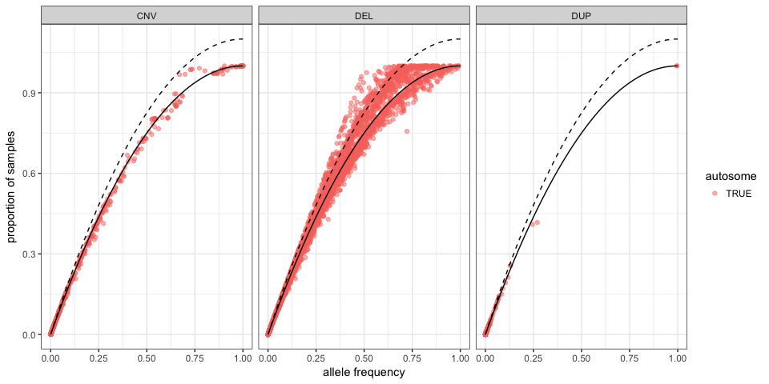

Download and format public annotations
======================================

Load packages, functions and data
---------------------------------

``` r
library(dplyr)
library(magrittr)
library(ggplot2)
library(tidyr)
library(data.table)
library(GenomicRanges)
library(rtracklayer)
library(VariantAnnotation)
library(knitr)
```

Download the data
-----------------

``` r
files.todownload = c("rmsk.txt.gz", "http://hgdownload.soe.ucsc.edu/goldenPath/hg19/database/rmsk.txt.gz", 
    "gencode.v19.annotation.gtf.gz", "ftp://ftp.sanger.ac.uk/pub/gencode/Gencode_human/release_19/gencode.v19.annotation.gtf.gz", 
    "cytoBandIdeo.txt.gz", "http://hgdownload.soe.ucsc.edu/goldenPath/hg19/database/cytoBandIdeo.txt.gz", 
    "gap.txt.gz", "http://hgdownload.soe.ucsc.edu/goldenPath/hg19/database/gap.txt.gz", 
    "simpleRepeat.txt.gz", "http://hgdownload.soe.ucsc.edu/goldenPath/hg19/database/simpleRepeat.txt.gz", 
    "genomicSuperDups.txt.gz", "http://hgdownload.soe.ucsc.edu/goldenPath/hg19/database/genomicSuperDups.txt.gz", 
    "ALL.wgs.mergedSV.v8.20130502.svs.genotypes.vcf.gz", "http://ftp.1000genomes.ebi.ac.uk/vol1/ftp/phase3/integrated_sv_map/ALL.wgs.mergedSV.v8.20130502.svs.genotypes.vcf.gz", 
    "1000G_phase1_cnv_genotypes_phased_25Jul2014.genotypes.vcf.gz", "http://www.broadinstitute.org/~handsake/mcnv_data/bulk/1000G_phase1_cnv_genotypes_phased_25Jul2014.genotypes.vcf.gz", 
    "20161013_GoNL_AF_genotyped_SVs.vcf.gz", "https://molgenis26.target.rug.nl/downloads/gonl_public/variants/release6.1/20161013_GoNL_AF_genotyped_SVs.vcf.gz", 
    "chaisson_STR_expansions.bed", "http://eichlerlab.gs.washington.edu/publications/chm1-structural-variation/data/GRCh37/STR_expansions.bed", 
    "chaisson_insertions.bed", "http://eichlerlab.gs.washington.edu/publications/chm1-structural-variation/data/GRCh37/insertions.bed", 
    "chaisson_inversions.bed", "http://eichlerlab.gs.washington.edu/publications/chm1-structural-variation/data/GRCh37/inversions.bed", 
    "chaisson_deletions.bed", "http://eichlerlab.gs.washington.edu/publications/chm1-structural-variation/data/GRCh37/deletions.bed")
files.todownload %<>% matrix(ncol = 2, byrow = TRUE) %>% as.data.frame(stringsAsFactors = FALSE)
colnames(files.todownload) = c("out.filename", "url")
kable(files.todownload)
```

| out.filename                                                      | url                                                                                                                    |
|:------------------------------------------------------------------|:-----------------------------------------------------------------------------------------------------------------------|
| rmsk.txt.gz                                                       | <http://hgdownload.soe.ucsc.edu/goldenPath/hg19/database/rmsk.txt.gz>                                                  |
| gencode.v19.annotation.gtf.gz                                     | <ftp://ftp.sanger.ac.uk/pub/gencode/Gencode_human/release_19/gencode.v19.annotation.gtf.gz>                            |
| cytoBandIdeo.txt.gz                                               | <http://hgdownload.soe.ucsc.edu/goldenPath/hg19/database/cytoBandIdeo.txt.gz>                                          |
| gap.txt.gz                                                        | <http://hgdownload.soe.ucsc.edu/goldenPath/hg19/database/gap.txt.gz>                                                   |
| simpleRepeat.txt.gz                                               | <http://hgdownload.soe.ucsc.edu/goldenPath/hg19/database/simpleRepeat.txt.gz>                                          |
| genomicSuperDups.txt.gz                                           | <http://hgdownload.soe.ucsc.edu/goldenPath/hg19/database/genomicSuperDups.txt.gz>                                      |
| ALL.wgs.mergedSV.v8.20130502.svs.genotypes.vcf.gz                 | <http://ftp.1000genomes.ebi.ac.uk/vol1/ftp/phase3/integrated_sv_map/ALL.wgs.mergedSV.v8.20130502.svs.genotypes.vcf.gz> |
| 1000G\_phase1\_cnv\_genotypes\_phased\_25Jul2014.genotypes.vcf.gz | <http://www.broadinstitute.org/~handsake/mcnv_data/bulk/1000G_phase1_cnv_genotypes_phased_25Jul2014.genotypes.vcf.gz>  |
| 20161013\_GoNL\_AF\_genotyped\_SVs.vcf.gz                         | <https://molgenis26.target.rug.nl/downloads/gonl_public/variants/release6.1/20161013_GoNL_AF_genotyped_SVs.vcf.gz>     |
| chaisson\_STR\_expansions.bed                                     | <http://eichlerlab.gs.washington.edu/publications/chm1-structural-variation/data/GRCh37/STR_expansions.bed>            |
| chaisson\_insertions.bed                                          | <http://eichlerlab.gs.washington.edu/publications/chm1-structural-variation/data/GRCh37/insertions.bed>                |
| chaisson\_inversions.bed                                          | <http://eichlerlab.gs.washington.edu/publications/chm1-structural-variation/data/GRCh37/inversions.bed>                |
| chaisson\_deletions.bed                                           | <http://eichlerlab.gs.washington.edu/publications/chm1-structural-variation/data/GRCh37/deletions.bed>                 |

``` r
## Download if not there
temp = lapply(1:nrow(files.todownload), function(ii) {
    if (!file.exists(paste0("../data/", files.todownload$out.filename[ii]))) {
        download.file(files.todownload$url[ii], paste0("../data/", files.todownload$out.filename[ii]))
    }
})
```

Repeat masker
-------------

``` r
rm = read.table("../data/rmsk.txt.gz", colClasses = c(rep("NULL", 5), "character", 
    "integer", "integer", "NULL", "NULL", rep("character", 3)))
colnames(rm) = c("chr", "start", "end", "repName", "repClass", "repFamily")
rm %<>% mutate(chr = gsub("chr", "", chr)) %>% filter(chr %in% 1:22) %>% makeGRangesFromDataFrame(keep.extra.columns = TRUE)
save(rm, file = "../data/rm.RData")
rm %>% as.data.frame %>% head %>% kable
```

| seqnames |  start|    end|  width| strand | repName   | repClass       | repFamily      |
|:---------|------:|------:|------:|:-------|:----------|:---------------|:---------------|
| 1        |  10000|  10468|    469| \*     | (CCCTAA)n | Simple\_repeat | Simple\_repeat |
| 1        |  10468|  11447|    980| \*     | TAR1      | Satellite      | telo           |
| 1        |  11503|  11675|    173| \*     | L1MC      | LINE           | L1             |
| 1        |  11677|  11780|    104| \*     | MER5B     | DNA            | hAT-Charlie    |
| 1        |  15264|  15355|     92| \*     | MIR3      | SINE           | MIR            |
| 1        |  16712|  16749|     38| \*     | (TGG)n    | Simple\_repeat | Simple\_repeat |

Gencode v19
-----------

``` r
gc.gtf = import("../data/gencode.v19.annotation.gtf.gz", "GTF")
seqlevels(gc.gtf) = gsub("chr", "", seqlevels(gc.gtf))
gc.gtf = subset(gc.gtf, gene_type == "protein_coding")
mcols(gc.gtf) = mcols(gc.gtf)[, c("type", "gene_name", "gene_id")]
genes = subset(gc.gtf, type == "gene")
exons = subset(gc.gtf, type == "exon")
save(genes, exons, file = "../data/gencodev19-proteincoding-genes-exons.RData")
genes %>% as.data.frame %>% head %>% kable
```

| seqnames |   start|     end|  width| strand | type | gene\_name | gene\_id          |
|:---------|-------:|-------:|------:|:-------|:-----|:-----------|:------------------|
| 1        |   69091|   70008|    918| +      | gene | OR4F5      | ENSG00000186092.4 |
| 1        |  134901|  139379|   4479| -      | gene | AL627309.1 | ENSG00000237683.5 |
| 1        |  367640|  368634|    995| +      | gene | OR4F29     | ENSG00000235249.1 |
| 1        |  621059|  622053|    995| -      | gene | OR4F16     | ENSG00000185097.2 |
| 1        |  738532|  739137|    606| -      | gene | AL669831.1 | ENSG00000269831.1 |
| 1        |  818043|  819983|   1941| +      | gene | AL645608.2 | ENSG00000269308.1 |

``` r
exons %>% as.data.frame %>% head %>% kable
```

| seqnames |   start|     end|  width| strand | type | gene\_name | gene\_id          |
|:---------|-------:|-------:|------:|:-------|:-----|:-----------|:------------------|
| 1        |   69091|   70008|    918| +      | exon | OR4F5      | ENSG00000186092.4 |
| 1        |  137621|  139379|   1759| -      | exon | AL627309.1 | ENSG00000237683.5 |
| 1        |  134901|  135802|    902| -      | exon | AL627309.1 | ENSG00000237683.5 |
| 1        |  367640|  368634|    995| +      | exon | OR4F29     | ENSG00000235249.1 |
| 1        |  621059|  622053|    995| -      | exon | OR4F16     | ENSG00000185097.2 |
| 1        |  739121|  739137|     17| -      | exon | AL669831.1 | ENSG00000269831.1 |

Centromere, telomere, gap annotation
------------------------------------

``` r
chr.band = read.table("../data/cytoBandIdeo.txt.gz", sep = "\t", as.is = TRUE)
colnames(chr.band) = c("chr", "start", "end", "band", "type")
centelgap = read.table("../data/gap.txt.gz", sep = "\t", as.is = TRUE)
centelgap = centelgap[, c(2:4, 8)]
colnames(centelgap) = c("chr", "start", "end", "type")
## Adding telomeres as 10kbp from each chromosomal end
centelgap = rbind(centelgap, chr.band %>% group_by(chr) %>% summarize(start = min(start), 
    end = 10000) %>% mutate(type = "telomere"))
centelgap = rbind(centelgap, chr.band %>% group_by(chr) %>% summarize(start = max(end) - 
    10000, end = max(end)) %>% mutate(type = "telomere"))
## 
centelgap %<>% mutate(chr = gsub("chr", "", chr)) %>% makeGRangesFromDataFrame(keep.extra.columns = TRUE)
save(centelgap, file = "../data/centelgap.RData")
centelgap %>% as.data.frame %>% head %>% kable
```

| seqnames |    start|      end|   width| strand | type     |
|:---------|--------:|--------:|-------:|:-------|:---------|
| 1        |        0|    10000|   10001| \*     | telomere |
| 1        |   177417|   227417|   50001| \*     | clone    |
| 1        |   267719|   317719|   50001| \*     | contig   |
| 1        |   471368|   521368|   50001| \*     | contig   |
| 1        |  2634220|  2684220|   50001| \*     | clone    |
| 1        |  3845268|  3995268|  150001| \*     | contig   |

Simple repeats
--------------

``` r
simprep = read.table("../data/simpleRepeat.txt.gz", as.is = TRUE, sep = "\t")
simprep = simprep[, c(2:4, 17)]
colnames(simprep) = c("chr", "start", "end", "sequence")
simprep %<>% mutate(chr = gsub("chr", "", chr)) %>% makeGRangesFromDataFrame(keep.extra.columns = TRUE)
save(simprep, file = "../data/simprep.RData")
simprep %>% as.data.frame %>% head %>% kable
```

| seqnames |  start|    end|  width| strand | sequence                                                                                                                  |
|:---------|------:|------:|------:|:-------|:--------------------------------------------------------------------------------------------------------------------------|
| 1        |  10000|  10468|    469| \*     | TAACCC                                                                                                                    |
| 1        |  10627|  10800|    174| \*     | AGGCGCGCCGCGCCGGCGCAGGCGCAGAG                                                                                             |
| 1        |  10757|  10997|    241| \*     | GGCGCAGGCGCAGAGAGGCGCGCCGCGCCGGCGCAGGCGCAGAGACACATGCTAGCGCGTCCAGGGGTGGAGGCGT                                              |
| 1        |  11225|  11447|    223| \*     | CGCCCCCTGCTGGCGACTAGGGCAACTGCAGGGTCCTCTTGCTCAAGGTGAGTGGCAGACGCCCACCTGCTGGCAGCCGGGGACACTGCAGGGCCCTCTTGCTTACTGTATAGTGGTGGCA |
| 1        |  11271|  11448|    178| \*     | AGTGGTGGCACGCCACCTGCTGGCAGCTAGGGACACTGCAGGGCCCTCTTGCTCAAGGTAT                                                             |
| 1        |  11283|  11448|    166| \*     | CGCCCCCTGCTGGCAGCTGGGGACACTGCAGGGCCCTCTTGCTCAAGGTATAGTGGCAGCA                                                             |

Segmental Duplications
----------------------

``` r
segdup = read.table("../data/genomicSuperDups.txt.gz", sep = "\t")
segdup = segdup[, c(2:4, 27)]
colnames(segdup) = c("chr", "start", "end", "fracMatch")
segdup %<>% mutate(chr = gsub("chr", "", chr)) %>% makeGRangesFromDataFrame(keep.extra.columns = TRUE)
save(segdup, file = "../data/segdup.RData")
segdup %>% as.data.frame %>% head %>% kable
```

| seqnames |  start|    end|  width| strand |  fracMatch|
|:---------|------:|------:|------:|:-------|----------:|
| 1        |  10000|  87112|  77113| \*     |   0.992904|
| 1        |  10000|  20818|  10819| \*     |   0.981582|
| 1        |  10000|  19844|   9845| \*     |   0.982898|
| 1        |  10000|  19844|   9845| \*     |   0.982898|
| 1        |  10464|  40733|  30270| \*     |   0.987856|
| 1        |  10485|  19844|   9360| \*     |   0.986907|

1000 Genomes Project - CNV catalog
----------------------------------

``` r
tgp.vcf = readVcf("../data/ALL.wgs.mergedSV.v8.20130502.svs.genotypes.vcf.gz", 
    "hg19")
```

``` r
tgp.df = rowRanges(tgp.vcf) %>% as.data.frame %>% mutate(ALT = unlist(lapply(ALT, 
    paste, collapse = ";"))) %>% dplyr::select(seqnames, start, ALT)
tgp.df$type = info(tgp.vcf)$SVTYPE
tgp.df$end = info(tgp.vcf)$END
tgp.df$af = unlist(lapply(info(tgp.vcf)$AF, sum))
tgp.df = cbind(tgp.df, geno(tgp.vcf)$GT %>% as.data.frame)
rownames(tgp.df) = NULL
nb.samps = ncol(geno(tgp.vcf)$GT)
tgp.df = tgp.df %>% mutate(type = ifelse(grepl("DEL", type), "DEL", type)) %>% 
    filter(seqnames != "X", type %in% c("CNV", "DEL", "DUP")) %>% gather(sample, 
    geno, -seqnames, -start, -end, -type, -af, -ALT) %>% filter(geno != "0|0", 
    geno != ".", geno != "0") %>% group_by(seqnames, start, end) %>% mutate(prop = n()/nb.samps, 
    svsize = end - start)
```

The catalog is reformatted to have one row per sample/variant. We save the coordinates and SV type information.

To focus on CNV we kept the following *SVTYPE*s: *DEL*, *DUP* and *CNV*.

### Allele frequency vs sample proportion

The 1000 Genomes Project provides both the allele frequencies and the genotype for each sample. We can compare the allele frequency estimate with the proportion of samples with a mutated allele. Assuming Hardy-Weinberg equilibrium, we expect (1-(1-AF)^2) of the samples to have a mutated allele.

``` r
hw.exp = data.frame(af = seq(0, 1, 0.01))
hw.exp$prop = 1 - (1 - hw.exp$af) * (1 - hw.exp$af)
tgp.freq = tgp.df %>% group_by(seqnames, start, end, type, af) %>% summarize(prop = n()/nb.samps)

ggplot(tgp.freq, aes(x = af, y = prop)) + geom_point(aes(colour = seqnames %in% 
    1:22), alpha = 0.5) + geom_line(data = hw.exp, linetype = 1) + geom_line(aes(y = 1.1 * 
    prop), data = hw.exp, linetype = 2) + facet_wrap(~type) + theme_bw() + scale_colour_hue(name = "autosome") + 
    xlab("allele frequency") + ylab("proportion of samples")
```



``` r
tgp.freq$prop.exp = 1 - (1 - tgp.freq$af) * (1 - tgp.freq$af)
```

Most of the variants follow the HW expectation (plain line). Many of the ones that deviates from HW affect **more samples than expected**. This is not so surprising, these variants were most likely depleted in homozygous variant by selective pressure. The few variants that affect less samples than expected are on chromosomes X and Y.

In practice, if we estimate the proportion of samples from the allele frequency we will **under-estimate** it. Here for example, it would be under-estimated for 86.9% of the variants. Instead we could use a slightly **skewed HW expectation** (dotted line). Then, the under-estimation would only affect 0.5% of the variants. Although we use the genotypes for this dataset, this conservative approximation will be used for the GoNL catalog which only provides allele frequencies (see below).

### Copy number estimates

For variants with *SVTYPE=CNV*, we compute the copy number from the genotype and (if different from 2) assign *DEL*/*DUP* for each sample. The copy-number information is saved in column *CN*. To compare with PopSV we removed variants in chromosome X.

``` r
genoToCN <- function(df) {
    alt = df$ALT[1]
    if (alt %in% c("A", "T", "G", "C")) {
        if (all(df$type == "DEL")) {
            cns = c(1, 0)
        } else {
            stop("Should be a deletion from ALT but is not according to type")
        }
    } else {
        cns = gsub("<CN([0-9])>", "\\1", alt) %>% strsplit(";") %>% unlist %>% 
            as.numeric
        cns = c(1, cns)
    }
    geno.mat = strsplit(df$geno, "\\|") %>% unlist %>% as.numeric %>% matrix(2)
    df$CN = cns[geno.mat[1, ] + 1] + cns[geno.mat[2, ] + 1]
    df
}

tgp.df = tgp.df %>% group_by(ALT) %>% do(genoToCN(.)) %>% mutate(type = ifelse(CN < 
    2, "DEL", NA), type = ifelse(CN > 2, "DUP", type))
tgp = makeGRangesFromDataFrame(tgp.df, keep.extra.columns = TRUE)
tgp$geno = tgp$ALT = NULL
save(tgp, file = "../data/tgp-CNV-noX-noCNV.RData")
tgp %>% as.data.frame %>% head %>% kable
```

| seqnames |     start|       end|  width| strand | type |         af| sample  |       prop|  svsize|   CN|
|:---------|---------:|---------:|------:|:-------|:-----|----------:|:--------|----------:|-------:|----:|
| 1        |   6434482|   6445321|  10840| \*     | DEL  |  0.0043930| HG00096 |  0.0087859|   10839|    1|
| 1        |   6438160|   6445897|   7738| \*     | DEL  |  0.0059904| HG00096 |  0.0119808|    7737|    1|
| 1        |   7570074|   7571521|   1448| \*     | DEL  |  0.1617410| HG00096 |  0.2919329|    1447|    1|
| 1        |  10482499|  10483790|   1292| \*     | DEL  |  0.3292730| HG00096 |  0.5371406|    1291|    1|
| 1        |  11682873|  11683189|    317| \*     | DEL  |  0.5055910| HG00096 |  0.7232428|     316|    1|
| 1        |  17676165|  17677662|   1498| \*     | DEL  |  0.3402560| HG00096 |  0.5227636|    1497|    1|

GenomeSTRiP CNV catalogs
------------------------

CNVs from Chiang et al are available from the GTEx data portal which requires to login (free). Hence the [GTEx\_Analysis\_2016-10-24\_WholeGenomeSeq\_147Indiv\_SV\_sites.vcf.gz](https://www.gtexportal.org/home/datasets) file (data release v6) should be **downloaded manually** and placed in the `data` folder.

``` r
hand = readVcf("../data/1000G_phase1_cnv_genotypes_phased_25Jul2014.genotypes.vcf.gz")
als = lapply(rowRanges(hand)$ALT, function(alts) {
    alts = as.numeric(gsub("<CN", "", gsub(">", "", alts)))
    if (any(alts == 1)) {
        alts = c(2, alts)
    } else {
        alts = c(1, alts)
    }
    alts
})
geno.l = strsplit(geno(hand)$GT, "\\|")
geno.l = lapply(geno.l, function(x) as.numeric(x) + 1)
ij = rep(1:nrow(geno(hand)$GT), ncol(geno(hand)$GT))
cn.l = lapply(1:length(geno.l), function(ii) sum(als[[ij[ii]]][geno.l[[ii]]]))
hand.cn = matrix(unlist(cn.l), nrow = nrow(geno(hand)$GT))
colnames(hand.cn) = colnames(geno(hand)$GT)
hand.cn = rowRanges(hand) %>% as.data.frame(row.names = NULL) %>% dplyr::select(seqnames, 
    start) %>% cbind(hand.cn)
hand.cn$end = info(hand)$END
hand.cn %<>% dplyr::rename(chr = seqnames)
gs.hand = gather(hand.cn, sample, cn, -chr, -start, -end)
gs.hand = gs.hand %>% group_by(chr, start, end, cn) %>% mutate(n = n()) %>% 
    group_by(chr, start, end) %>% mutate(cn.major = cn[which.max(n)], type = ifelse(cn < 
    cn.major, "DEL", "DUP"), prop.samp = mean(cn != cn.major)) %>% filter(cn != 
    cn.major) %>% dplyr::select(-n) %>% makeGRangesFromDataFrame(keep.extra.columns = TRUE)
gs.hand %>% as.data.frame %>% head %>% kable
```

| seqnames |     start|       end|  width| strand | sample  |   cn|  cn.major| type |  prop.samp|
|:---------|---------:|---------:|------:|:-------|:--------|----:|---------:|:-----|----------:|
| 1        |   6438048|   6445822|   7775| \*     | HG00096 |    1|         2| DEL  |  0.0165289|
| 1        |   8204047|   8211065|   7019| \*     | HG00096 |    3|         2| DUP  |  0.0283353|
| 1        |  17088430|  17125658|  37229| \*     | HG00096 |    6|         7| DEL  |  0.6635183|
| 1        |  25585374|  25594516|   9143| \*     | HG00096 |    3|         4| DEL  |  0.3471074|
| 1        |  25593922|  25661196|  67275| \*     | HG00096 |    1|         2| DEL  |  0.3577332|
| 1        |  25594516|  25655519|  61004| \*     | HG00096 |    3|         4| DEL  |  0.3589138|

``` r
gtex = readVcf("../data/GTEx_Analysis_2016-10-24_WholeGenomeSeq_147Indiv_SV_sites.vcf.gz")
gtex.df = rowRanges(gtex) %>% as.data.frame(row.names = NULL) %>% dplyr::select(seqnames, 
    start, ALT, FILTER)
gtex.df = info(gtex) %>% as.data.frame %>% dplyr::select(END, GSCNQUAL, NSAMP) %>% 
    cbind(gtex.df, .)
gs.chiang = gtex.df %>% filter(!is.na(GSCNQUAL))
gs.chiang %>% as.data.frame %>% head %>% kable
```

| seqnames |   start| ALT   | FILTER |     END|  GSCNQUAL|  NSAMP|
|:---------|-------:|:------|:-------|-------:|---------:|------:|
| 1        |   54709| <CNV> | PASS   |   56027|  1181.170|     94|
| 1        |   85392| <CNV> | PASS   |   86406|  1509.860|    102|
| 1        |   86307| <CNV> | PASS   |   90130|  3894.570|     96|
| 1        |  565376| <CNV> | PASS   |  567131|  1150.570|     93|
| 1        |  565853| <CNV> | PASS   |  567476|  1008.990|     89|
| 1        |  569538| <CNV> | PASS   |  570912|   475.003|     87|

``` r
save(gs.hand, gs.chiang, file = "../data/GenomeSTRiP-CNVcatalogs-Handsaker2016-Chiang2018.RData")
```

GoNL
----

``` r
gonl = readVcf("../data/20161013_GoNL_AF_genotyped_SVs.vcf.gz")
gonl.cnv = cbind(rowRanges(gonl) %>% as.data.frame(row.names = NULL) %>% dplyr::select(seqnames, 
    start), info(gonl) %>% as.data.frame %>% dplyr::select(SVTYPE, SVLEN)) %>% 
    mutate(end = start + abs(SVLEN)) %>% dplyr::rename(type = SVTYPE)
gonl.cnv$af = unlist(lapply(info(gonl)$AF, sum))
gonl.cnv %<>% filter(type != "TRA", type != "INS:ME", ) %>% mutate(prop = 1.1 * 
    (1 - (1 - af) * (1 - af)), prop = ifelse(prop > 1, 1, prop)) %>% dplyr::select(seqnames, 
    start, end, prop, type) %>% makeGRangesFromDataFrame(keep.extra.columns = TRUE)
gonl.cnv %>% as.data.frame %>% head %>% kable
```

| seqnames |   start|     end|  width| strand |       prop| type |
|:---------|-------:|-------:|------:|:-------|----------:|:-----|
| 1        |  724849|  725069|    221| \*     |  0.5122912| DEL  |
| 1        |  776769|  791880|  15112| \*     |  0.0100032| DEL  |
| 1        |  823920|  824033|    114| \*     |  0.0042871| DEL  |
| 1        |  829169|  829205|     37| \*     |  1.0000000| DEL  |
| 1        |  830721|  834533|   3813| \*     |  0.0014337| DEL  |
| 1        |  869360|  870200|    841| \*     |  0.8920218| DEL  |

``` r
save(gonl.cnv, file = "../data/GoNL-CNVs.RData")
```

GoNL calls are downloaded from [20161013\_GoNL\_AF\_genotyped\_SVs.vcf.gz](https://molgenis26.target.rug.nl/downloads/gonl_public/variants/release6.1/20161013_GoNL_AF_genotyped_SVs.vcf.gz). Only the allele frequencies of the variants are provided so we estimated the proportion of samples with an mutated allele using a conservative Hardy-Weinberg formula (see above).

PacBio (Chaisson et al) SV catalog
----------------------------------

``` r
sv.chaisson = rbind(read.table("../data/chaisson_STR_expansions.bed", as.is = TRUE) %>% 
    mutate(type = "str"), read.table("../data/chaisson_inversions.bed", as.is = TRUE) %>% 
    mutate(type = "inversion"), read.table("../data/chaisson_deletions.bed", 
    as.is = TRUE, fill = TRUE, sep = "\t", flush = TRUE) %>% dplyr::select(V1, 
    V2, V3) %>% mutate(type = "deletion"), read.table("../data/chaisson_insertions.bed", 
    as.is = TRUE, fill = TRUE) %>% dplyr::select(V1, V2, V3) %>% mutate(type = "insertion"))
colnames(sv.chaisson)[1:3] = c("chr", "start", "end")
sv.chaisson$chr %<>% gsub("chr", "", .)
save(sv.chaisson, file = "../data/sv.chaisson.RData")
sv.chaisson %>% sample_n(6) %>% kable(row.names = FALSE)
```

| chr |      start|        end| type      |
|:----|----------:|----------:|:----------|
| 14  |   75520940|   75525521| deletion  |
| 16  |     804733|     804734| str       |
| 7   |  116366199|  116366303| insertion |
| 18  |   44528002|   44528003| str       |
| 15  |   30567170|   30567171| str       |
| 8   |     942889|     942995| deletion  |

OMIM disease genes
------------------

``` r
library(biomaRt)
omim.marts = listMarts()
omim.marts
```

    ##                biomart               version
    ## 1 ENSEMBL_MART_ENSEMBL      Ensembl Genes 91
    ## 2   ENSEMBL_MART_MOUSE      Mouse strains 91
    ## 3     ENSEMBL_MART_SNP  Ensembl Variation 91
    ## 4 ENSEMBL_MART_FUNCGEN Ensembl Regulation 91

``` r
ensembl = useMart("ENSEMBL_MART_ENSEMBL", dataset = "hsapiens_gene_ensembl", 
    host = "Aug2017.archive.ensembl.org")
omim = getBM(attributes = c("hgnc_symbol", "mim_morbid_description"), mart = ensembl)
mergeDiseaseDesc <- function(desc) {
    desc %>% gsub(";;", ";", .) %>% strsplit(";") %>% unlist %>% unique %>% 
        paste(collapse = ";")
}
omim %<>% filter(mim_morbid_description != "") %>% group_by(hgnc_symbol) %>% 
    summarize(mim_morbid_description = mergeDiseaseDesc(mim_morbid_description))
save(omim, omim.marts, file = "../data/omim-genes.RData")
```

There are 3438 OMIM genes.
