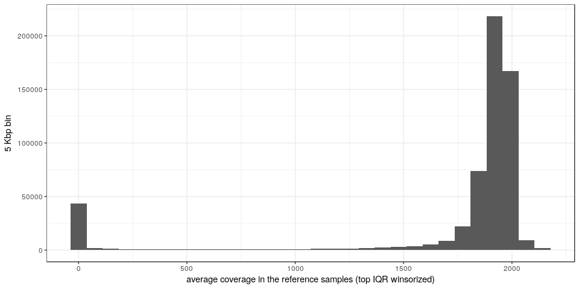
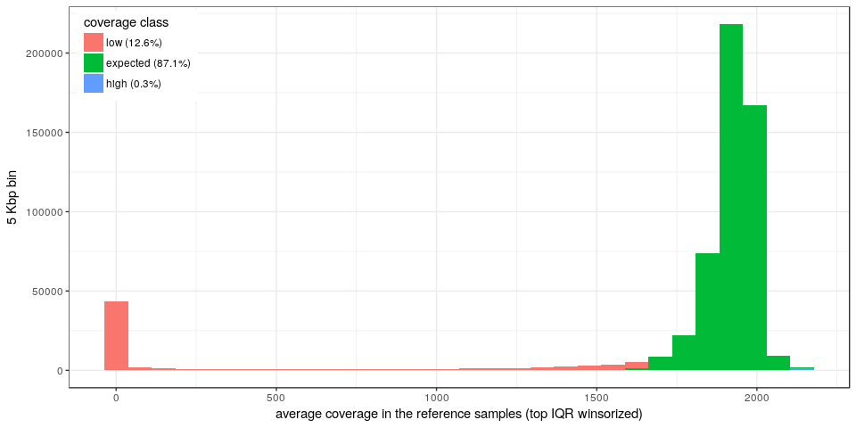
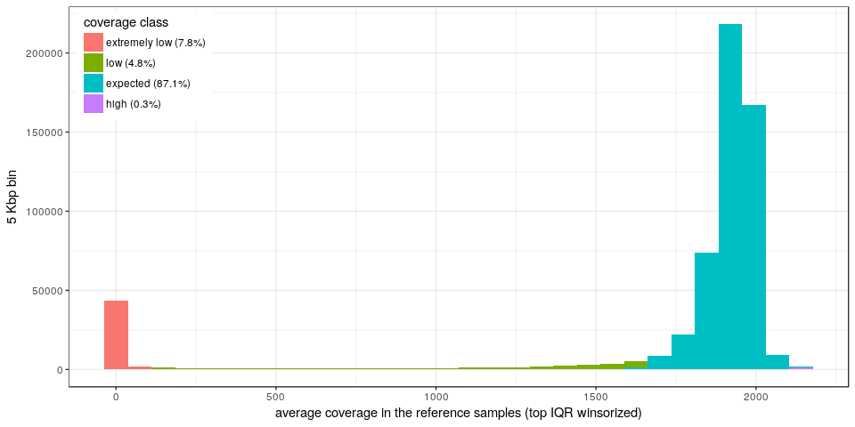
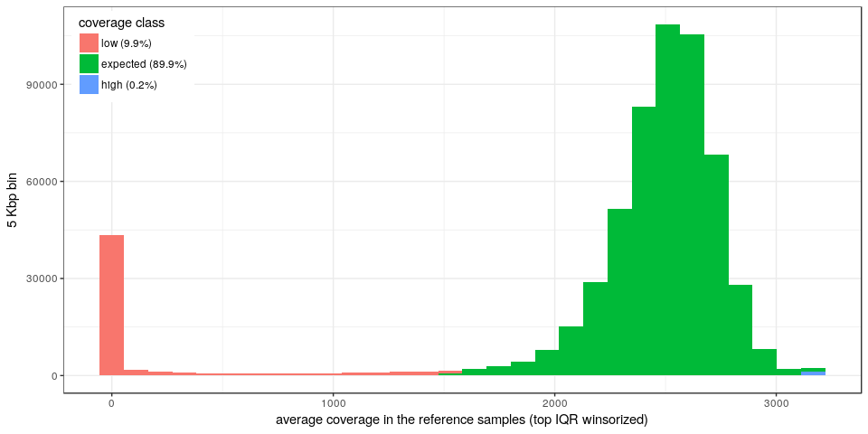
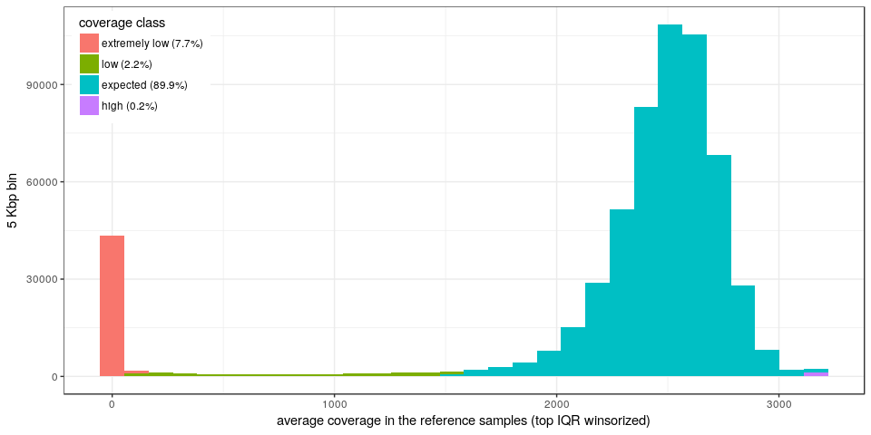
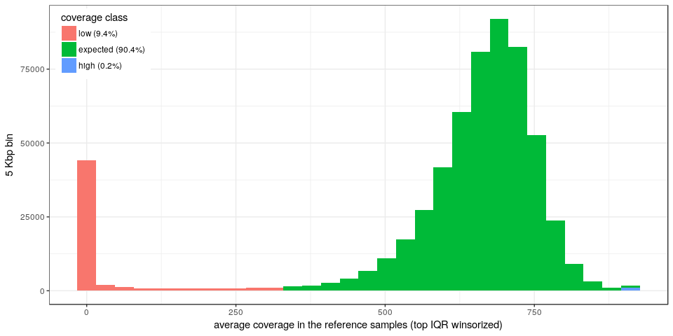
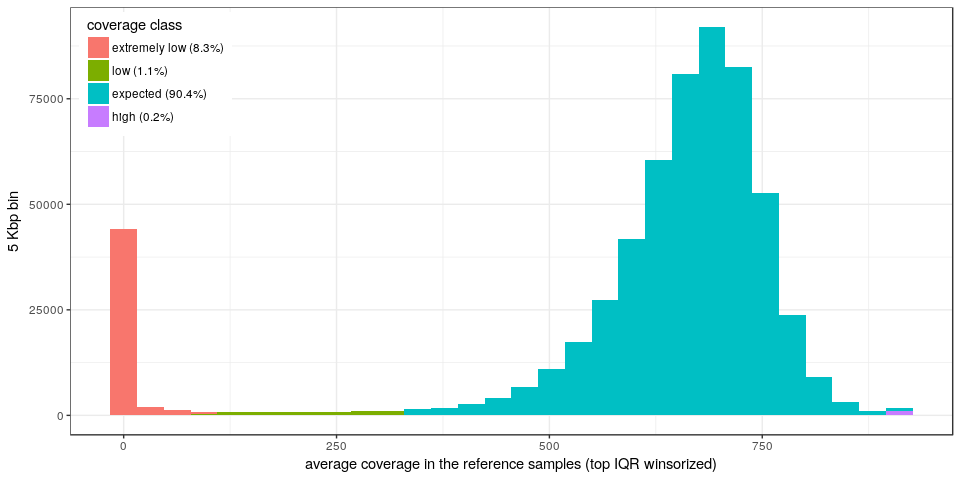

Coverage tracks
===============

Load packages, functions and data
---------------------------------

``` r
library(dplyr)
library(magrittr)
library(ggplot2)
library(tidyr)
library(GenomicRanges)
library(knitr)

winsor <- function(x, u = NULL, l = NULL, iqrU = 1.5) {
    if (is.null(u) & !is.null(iqrU)) 
        u = median(x, na.rm = TRUE) + IQR(x, na.rm = TRUE) * (0.5 + iqrU)
    if (!is.null(u) & any(x > u)) 
        x[x > u] = u
    if (!is.null(l) & any(x < l)) 
        x[x < l] = l
    x
}
```

Average inter-sample coverage in the Twins
------------------------------------------

``` r
ns.df = read.table("../data/twins-ref-msd.tsv.gz", as.is = TRUE, sep = "\t", 
    header = TRUE)
ns.df %<>% mutate(m = ifelse(is.na(m), 0, m)) %>% filter(chr %in% 1:22)
```

Average coverage distribution
-----------------------------

``` r
ggplot(ns.df, aes(x = winsor(m))) + geom_histogram() + theme_bw() + xlab("average coverage in the reference samples (top IQR winsorized)") + 
    ylab("5 Kbp bin")
```



Coverage classes
----------------

If `L=median-4*SD` and `U=median+4*SD` of the average coverage in the reference samples, then we define coverage classes as:

-   *low*: \[0, L\]
-   *expected*: \[L, U\]
-   *high*: \[U, Inf\]

We also define *extremely low* coverage regions if the mean coverage is lower than 100 reads.

``` r
sd.th = 4
exp.range = median(ns.df$m, na.rm = TRUE) + c(-sd.th, sd.th) * mad(ns.df$m, 
    na.rm = TRUE)

ns.df %<>% mutate(cov.class = cut(m, breaks = c(0, exp.range, Inf), include.lowest = TRUE, 
    labels = c("low", "expected", "high")), cov.class2 = cut(m, breaks = c(0, 
    100, exp.range, Inf), include.lowest = TRUE, labels = c("extremely low", 
    "low", "expected", "high")))

## Adding the % in the labels
ns.df %<>% mutate(cov.class.p = cov.class, cov.class2.p = cov.class2)
levels(ns.df$cov.class.p) = sapply(levels(ns.df$cov.class.p), function(name) paste0(name, 
    " (", round(mean(ns.df$cov.class.p == name), 3) * 100, "%)"))
levels(ns.df$cov.class2.p) = sapply(levels(ns.df$cov.class2.p), function(name) paste0(name, 
    " (", round(mean(ns.df$cov.class2.p == name), 3) * 100, "%)"))

ggplot(ns.df, aes(x = winsor(m), fill = cov.class.p)) + geom_histogram() + theme_bw() + 
    xlab("average coverage in the reference samples (top IQR winsorized)") + 
    ylab("5 Kbp bin") + theme(legend.position = c(0.01, 0.99), legend.justification = c(0, 
    1)) + scale_fill_hue(name = "coverage class")
```



``` r
ggplot(ns.df, aes(x = winsor(m), fill = cov.class2.p)) + geom_histogram() + 
    theme_bw() + xlab("average coverage in the reference samples (top IQR winsorized)") + 
    ylab("5 Kbp bin") + theme(legend.position = c(0.01, 0.99), legend.justification = c(0, 
    1)) + scale_fill_hue(name = "coverage class")
```



Characterization of low-mappability regions
-------------------------------------------

``` r
load("../data/rm.RData")
load("../data/centelgap.RData")
load("../data/segdup.RData")
load("../data/gencodev19-proteincoding-genes-exons.RData")

olProp <- function(qgr, sgr) {
    sgr = reduce(sgr)
    ol = findOverlaps(qgr, sgr) %>% as.data.frame %>% mutate(qw = width(qgr)[queryHits], 
        qsw = width(pintersect(qgr[queryHits], sgr[subjectHits]))) %>% group_by(queryHits) %>% 
        summarize(prop = sum(qsw/qw))
    res = rep(0, length(qgr))
    res[ol$queryHits] = ol$prop
    res
}

ns.gr = makeGRangesFromDataFrame(ns.df, keep.extra.columns = TRUE)
ns.df$gene = overlapsAny(ns.gr, genes)
ns.df$exon = overlapsAny(ns.gr, exons)
ns.df$rep.prop = olProp(ns.gr, rm)
ns.df$segdup = overlapsAny(ns.gr, segdup)
ns.df$centelgap.d = distanceToNearest(ns.gr, centelgap) %>% as.data.frame %>% 
    .$distance

ns.df %>% group_by(cov.class) %>% summarize(gene.prop = mean(gene), exon.prop = mean(exon), 
    rep.prop = mean(rep.prop), segdup.prop = mean(segdup), centelgap.1mb = mean(centelgap.d < 
        1e+06)) %>% kable(digits = 3)
```

| cov.class |  gene.prop|  exon.prop|  rep.prop|  segdup.prop|  centelgap.1mb|
|:----------|----------:|----------:|---------:|------------:|--------------:|
| low       |      0.153|      0.063|     0.298|        0.232|          0.691|
| expected  |      0.488|      0.229|     0.490|        0.029|          0.088|
| high      |      0.259|      0.156|     0.568|        0.593|          0.728|

``` r
genes$lowmap = overlapsAny(genes, subset(ns.gr, cov.class == "low"))
genes %>% as.data.frame %>% group_by(lowmap) %>% summarize(genes = length(unique(gene_name))) %>% 
    kable
```

| lowmap |  genes|
|:-------|------:|
| FALSE  |  16207|
| TRUE   |   4044|

Save coverage track
-------------------

``` r
ns.df %<>% select(chr, start, end, m, cov.class, cov.class2)
save(ns.df, file = "../data/twins-coverage-tracks-5kbp.RData")
```

Other cohorts
-------------

### CageKid

``` r
ns.df = read.table("../data/cagekid-ref-msd.tsv.gz", as.is = TRUE, sep = "\t", 
    header = TRUE)
ns.df %<>% mutate(m = ifelse(is.na(m), 0, m)) %>% filter(chr %in% 1:22)
exp.range = median(ns.df$m, na.rm = TRUE) + c(-sd.th, sd.th) * mad(ns.df$m, 
    na.rm = TRUE)

ns.df %<>% mutate(cov.class = cut(m, breaks = c(0, exp.range, Inf), include.lowest = TRUE, 
    labels = c("low", "expected", "high")), cov.class2 = cut(m, breaks = c(0, 
    100, exp.range, Inf), include.lowest = TRUE, labels = c("extremely low", 
    "low", "expected", "high")))
## Adding the % in the labels
ns.df %<>% mutate(cov.class.p = cov.class, cov.class2.p = cov.class2)
levels(ns.df$cov.class.p) = sapply(levels(ns.df$cov.class.p), function(name) paste0(name, 
    " (", round(mean(ns.df$cov.class.p == name), 3) * 100, "%)"))
levels(ns.df$cov.class2.p) = sapply(levels(ns.df$cov.class2.p), function(name) paste0(name, 
    " (", round(mean(ns.df$cov.class2.p == name), 3) * 100, "%)"))

ggplot(ns.df, aes(x = winsor(m), fill = cov.class.p)) + geom_histogram() + theme_bw() + 
    xlab("average coverage in the reference samples (top IQR winsorized)") + 
    ylab("5 Kbp bin") + theme(legend.position = c(0.01, 0.99), legend.justification = c(0, 
    1)) + scale_fill_hue(name = "coverage class")
```



``` r
ggplot(ns.df, aes(x = winsor(m), fill = cov.class2.p)) + geom_histogram() + 
    theme_bw() + xlab("average coverage in the reference samples (top IQR winsorized)") + 
    ylab("5 Kbp bin") + theme(legend.position = c(0.01, 0.99), legend.justification = c(0, 
    1)) + scale_fill_hue(name = "coverage class")
```



``` r
ns.df %<>% select(chr, start, end, m, cov.class, cov.class2)
save(ns.df, file = "../data/cagekid-coverage-tracks-5kbp.RData")
```

### GoNL

``` r
ns.df = read.table("../data/gonl-ref-msd.tsv.gz", as.is = TRUE, sep = "\t", 
    header = TRUE)
ns.df %<>% mutate(m = ifelse(is.na(m), 0, m)) %>% filter(chr %in% 1:22)
exp.range = median(ns.df$m, na.rm = TRUE) + c(-sd.th, sd.th) * mad(ns.df$m, 
    na.rm = TRUE)

ns.df %<>% mutate(cov.class = cut(m, breaks = c(0, exp.range, Inf), include.lowest = TRUE, 
    labels = c("low", "expected", "high")), cov.class2 = cut(m, breaks = c(0, 
    100, exp.range, Inf), include.lowest = TRUE, labels = c("extremely low", 
    "low", "expected", "high")))
## Adding the % in the labels
ns.df %<>% mutate(cov.class.p = cov.class, cov.class2.p = cov.class2)
levels(ns.df$cov.class.p) = sapply(levels(ns.df$cov.class.p), function(name) paste0(name, 
    " (", round(mean(ns.df$cov.class.p == name), 3) * 100, "%)"))
levels(ns.df$cov.class2.p) = sapply(levels(ns.df$cov.class2.p), function(name) paste0(name, 
    " (", round(mean(ns.df$cov.class2.p == name), 3) * 100, "%)"))

ggplot(ns.df, aes(x = winsor(m), fill = cov.class.p)) + geom_histogram() + theme_bw() + 
    xlab("average coverage in the reference samples (top IQR winsorized)") + 
    ylab("5 Kbp bin") + theme(legend.position = c(0.01, 0.99), legend.justification = c(0, 
    1)) + scale_fill_hue(name = "coverage class")
```



``` r
ggplot(ns.df, aes(x = winsor(m), fill = cov.class2.p)) + geom_histogram() + 
    theme_bw() + xlab("average coverage in the reference samples (top IQR winsorized)") + 
    ylab("5 Kbp bin") + theme(legend.position = c(0.01, 0.99), legend.justification = c(0, 
    1)) + scale_fill_hue(name = "coverage class")
```



``` r
ns.df %<>% select(chr, start, end, m, cov.class, cov.class2)
save(ns.df, file = "../data/gonl-coverage-tracks-5kbp.RData")
```
