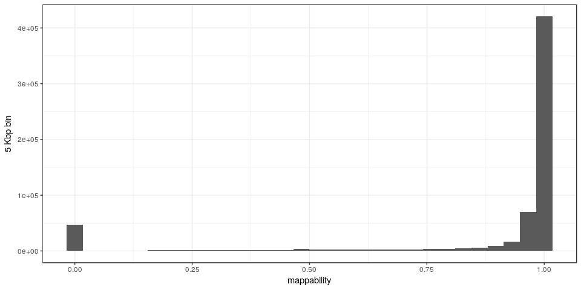
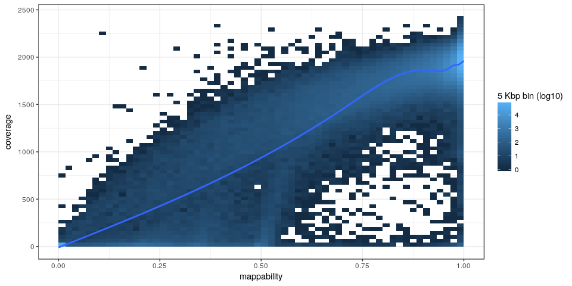
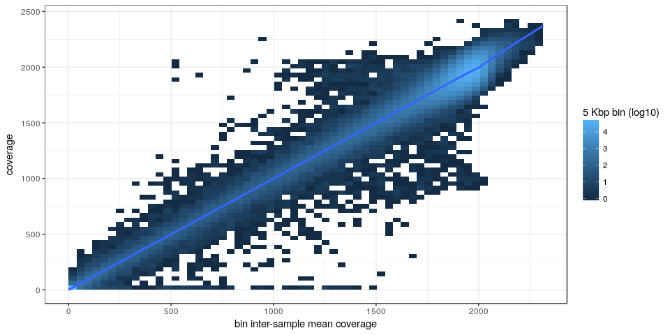
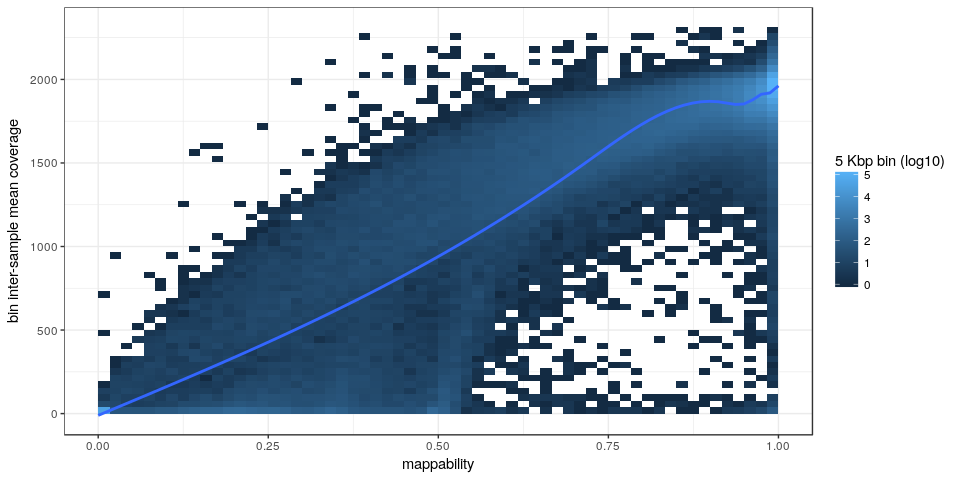
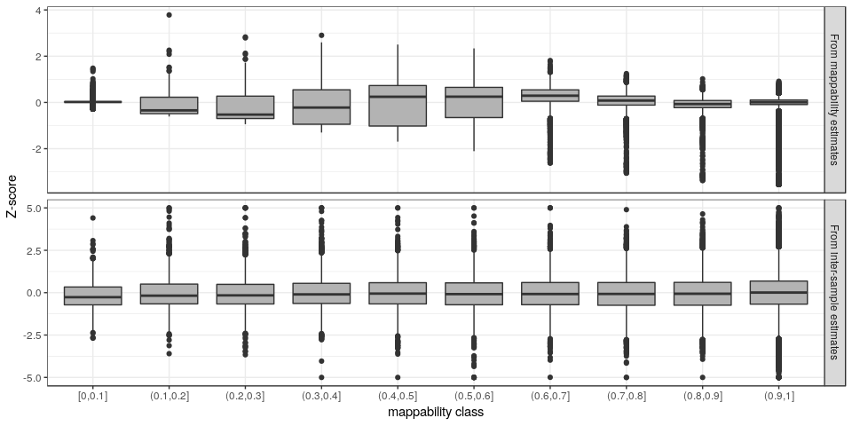
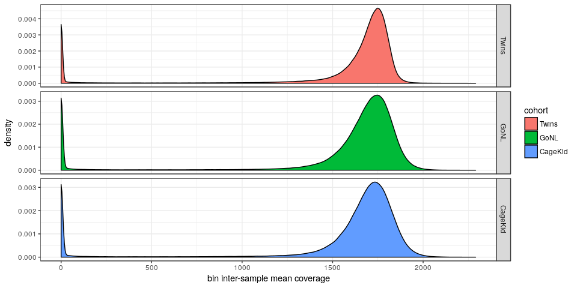
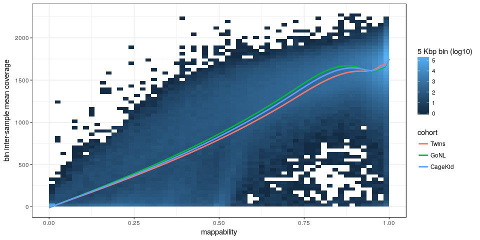
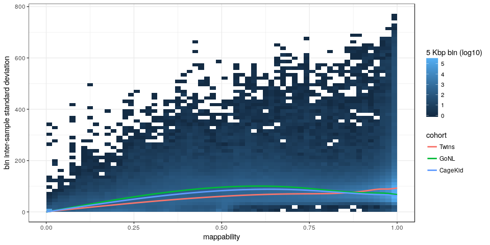

Mappability and read coverage in Whole-Genome Sequencing
========================================================

Load packages, functions and data
---------------------------------

``` r
library(dplyr)
library(magrittr)
library(ggplot2)
library(tidyr)
library(mgcv)
library(moments)

plot.bc <- function(df, sample.names, max.quant = 0.99, log10 = FALSE) {
    df.tp = df[, sample.names]
    df.tp = gather(df.tp, "sample", "coverage")
    max.bc = quantile(df.tp$coverage, probs = max.quant, na.rm = TRUE)
    gp = ggplot(df.tp, aes(x = coverage)) + geom_density(aes(colour = sample)) + 
        xlab("number of reads in window") + theme_bw() + ggplot2::xlim(min(df.tp$coverage, 
        na.rm = TRUE), max.bc) + scale_colour_hue(name = "sample")
    if (log10) 
        gp = gp + scale_x_log10()
    gp
}
winsor <- function(x, u = NULL, l = NULL) {
    if (!is.null(u) & any(x > u)) 
        x[x > u] = u
    if (!is.null(l) & any(x < l)) 
        x[x < l] = l
    x
}
```

Coverage in the Twins study
---------------------------

``` r
bc.df = read.table("../data/twin-5kbp-bc-gcCor.tsv.bgz", as.is = TRUE, sep = "\t", 
    header = TRUE)
samples = colnames(bc.df)[-(1:3)]
```

Remove bins with extremely high coverage in a sample
----------------------------------------------------

``` r
sdOutlier <- function(vec, sd.cutoff = 5) {
    vec - median(vec, na.rm = TRUE) > sd.cutoff * mad(vec, na.rm = TRUE)
}
bins.sd.ol = apply(bc.df[, samples], 2, sdOutlier, sd.cutoff = 5)
bc.df = bc.df[which(!apply(bins.sd.ol, 1, any)), ]
```

Load the mappability track
--------------------------

``` r
map.df = read.table("../data/map100mer-5kbp.bed.gz", as.is = TRUE)
colnames(map.df) = c("chr", "start", "end", "mappability")
map.df %<>% mutate(chr = gsub("chr", "", chr))
ggplot(map.df, aes(x = mappability)) + geom_histogram() + theme_bw() + ylab("5 Kbp bin")
```



Global normalization : Quantile Normalization
---------------------------------------------

``` r
normQN <- function(df, sample.names) {
    rownames(df) = NULL
    quant.o = apply(apply(df[, sample.names], 2, sort, na.last = TRUE), 1, mean, 
        na.rm = TRUE)
    df[, sample.names] = apply(df[, sample.names], 2, function(ee) quant.o[rank(ee)])
    df
}
bc.norm = normQN(bc.df, samples)
plot.bc(bc.norm, sample(samples, 6)) + ggtitle("Normalized bin counts")
```


One sample: mappability vs coverage
-----------------------------------

``` r
samp = sample(samples, 1)
bc.samp = bc.norm[, c("chr", "start", samp)]
colnames(bc.samp)[3] = "coverage"
bc.samp %<>% merge(map.df)

ggplot(bc.samp, aes(x = mappability, y = coverage)) + geom_bin2d(aes(fill = log10(..count..)), 
    bins = 60) + theme_bw() + geom_smooth(se = FALSE) + ylab("coverage") + scale_fill_gradient(name = "5 Kbp bin (log10)")
```



Coverage variation across other samples
---------------------------------------

``` r
interSampleVariation <- function(df, sample.names) {
    df.s = df[, sample.names]
    sd.s = apply(df.s, 1, function(r) c(sd(r, na.rm = TRUE), mean(r, na.rm = TRUE)))
    return(data.frame(df[, c("chr", "start", "end")], sd.inter.samp = sd.s[1, 
        ], mean.inter.samp = sd.s[2, ]))
}
var.is = interSampleVariation(bc.norm, setdiff(samples, samp))
var.is %<>% filter(!is.na(sd.inter.samp)) %>% merge(map.df)
bc.samp %<>% merge(var.is)

ggplot(bc.samp, aes(x = mean.inter.samp, y = coverage)) + geom_bin2d(aes(fill = log10(..count..)), 
    bins = 60) + theme_bw() + geom_smooth(se = FALSE) + ylab("coverage") + xlab("bin inter-sample mean coverage") + 
    scale_fill_gradient(name = "5 Kbp bin (log10)")
```



Inter-sample coverage metrics and mappability
---------------------------------------------

``` r
ggplot(var.is, aes(x = mappability, y = mean.inter.samp)) + theme_bw() + geom_bin2d(aes(fill = log10(..count..)), 
    bins = 60) + theme_bw() + geom_smooth(se = FALSE) + ylab("bin inter-sample mean coverage") + 
    scale_fill_gradient(name = "5 Kbp bin (log10)")
```



Z-score comparison
------------------

``` r
gam.o = gam(coverage ~ s(mappability, bs = "cs"), data = bc.samp)
bc.samp$coverage.map = predict(gam.o)
sd.samp = sd(bc.samp$coverage)

z.df = rbind(data.frame(method = "From mappability estimates", z = (bc.samp$coverage - 
    bc.samp$coverage.map)/sd.samp, mappability = bc.samp$mappability), data.frame(method = "From inter-sample estimates", 
    z = (bc.samp$coverage - bc.samp$mean.inter.samp)/bc.samp$sd.inter.samp, 
    mappability = bc.samp$mappability))

norm.df = z.df %>% filter(!is.na(z), abs(z) < 10) %>% group_by(method) %>% summarize(ex.kurtosis = kurtosis(z) - 
    3, skewness = skewness(z), label = paste0("excess kurtosis: ", round(ex.kurtosis, 
    3), "\nskewness: ", round(skewness, 3), "\n"), x = 5, y = 0)
ggplot(subset(z.df, !is.na(z))) + geom_density(aes(x = winsor(z, 5, -5)), fill = "grey70") + 
    theme_bw() + facet_grid(method ~ ., scales = "free") + geom_text(aes(x = x, 
    y = y, label = label), data = norm.df, vjust = 0, hjust = 1) + xlab("Z-score (winsorized at +-5)")
```


``` r
ggplot(subset(z.df, !is.na(z)), aes(x = cut(mappability, seq(0, 1, 0.1), include.lowest = TRUE), 
    y = winsor(z, 5, -5))) + geom_boxplot(fill = "grey70") + theme_bw() + facet_grid(method ~ 
    ., scales = "free") + xlab("mappability class") + ylab("Z-score")
```



Different profiles across cohorts
---------------------------------

The Twin dataset has 45 samples so the other two cohort are down-sampled to 45 randomly selected samples.

``` r
twin.df = read.table("../data/twin-5kbp-bc-gcCor.tsv.bgz", as.is = TRUE, sep = "\t", 
    header = TRUE)
ck.df = read.table("../data/cagekid-5kbp-bc-gcCor.tsv.gz", as.is = TRUE, sep = "\t", 
    header = TRUE)
ck.df = ck.df[, c("chr", "start", "end", sample(colnames(ck.df)[-(1:3)], 45))]
gonl.df = read.table("../data/gonl-5kbp-bc-gcCor.tsv.gz", as.is = TRUE, sep = "\t", 
    header = TRUE)
gonl.df = gonl.df[, c("chr", "start", "end", sample(colnames(gonl.df)[-(1:3)], 
    45))]
info.df = rbind(data.frame(sample = colnames(twin.df)[-(1:3)], cohort = "Twins", 
    stringsAsFactors = FALSE), data.frame(sample = colnames(gonl.df)[-(1:3)], 
    cohort = "GoNL", stringsAsFactors = FALSE), data.frame(sample = colnames(ck.df)[-(1:3)], 
    cohort = "CageKid", stringsAsFactors = FALSE))
bc.df = merge(twin.df, ck.df)
bc.df = merge(bc.df, gonl.df)
bins.sd.ol = apply(bc.df[, info.df$sample], 2, sdOutlier, sd.cutoff = 5)
bc.df = bc.df[which(!apply(bins.sd.ol, 1, any)), ]
bc.norm = normQN(bc.df, info.df$sample)

var.is.c = lapply(unique(info.df$cohort), function(co) {
    info.df = subset(info.df, cohort == co)
    data.frame(cohort = co, interSampleVariation(bc.norm, info.df$sample))
})
var.is.c = do.call(rbind, var.is.c)
var.is.c %<>% filter(!is.na(sd.inter.samp)) %>% merge(map.df)

ggplot(var.is.c, aes(x = mean.inter.samp, fill = cohort)) + geom_density() + 
    xlab("bin inter-sample mean coverage") + theme_bw() + facet_grid(cohort ~ 
    ., scales = "free")
```



``` r
ggplot(var.is.c, aes(x = winsor(sd.inter.samp, 250), fill = cohort)) + geom_density() + 
    xlab("bin inter-sample standard deviation") + theme_bw() + facet_grid(cohort ~ 
    ., scales = "free")
```


``` r
ggplot(var.is.c, aes(x = mappability, y = mean.inter.samp)) + geom_bin2d(aes(fill = log10(..count..)), 
    bins = 60) + theme_bw() + geom_smooth(aes(colour = cohort), se = FALSE) + 
    scale_fill_gradient(name = "5 Kbp bin (log10)") + ylab("bin inter-sample mean coverage")
```



``` r
ggplot(var.is.c, aes(x = mappability, y = sd.inter.samp)) + geom_bin2d(aes(fill = log10(..count..)), 
    bins = 60) + theme_bw() + geom_smooth(aes(colour = cohort), se = FALSE) + 
    ylab("bin inter-sample standard deviation") + scale_fill_gradient(name = "5 Kbp bin (log10)")
```


